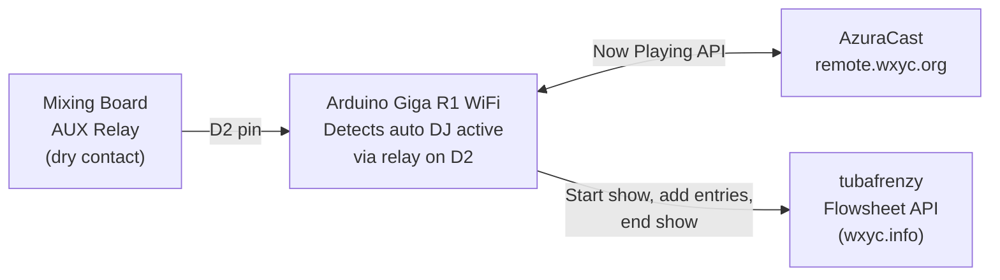
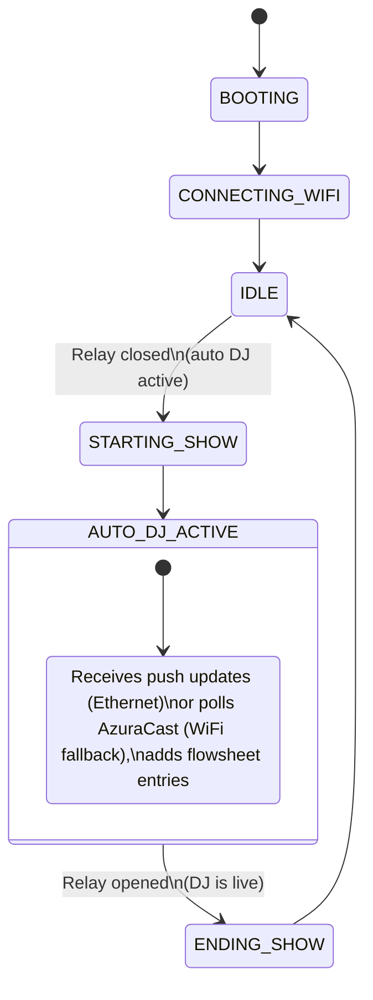

# Auto DJ Arduino Switch

An Arduino Giga R1 WiFi sketch that bridges the gap between WXYC's auto DJ system ([AzuraCast](https://remote.wxyc.org)) and the station's flowsheet ([tubafrenzy](https://www.wxyc.info)). When no live DJ is broadcasting, the Arduino detects this via a relay contact on the mixing board, polls AzuraCast for currently-playing track data, and writes entries to the tubafrenzy flowsheet. A planned management server will relay AzuraCast's real-time Centrifugo feed over Ethernet, replacing polling with push-based updates (see [roadmap](docs/remote-access-roadmap.md)).

## Why?

When auto DJ is playing and no DJ is logged into the flowsheet, those tracks are not recorded in WXYC's playback history. This device fills that gap automatically.

## Architecture



### Planned Architecture

A management server will sit between AzuraCast and the Arduino, subscribing to AzuraCast's Centrifugo real-time feed and relaying Now Playing updates over a single WebSocket that also carries management commands and heartbeat telemetry. An Ethernet shield provides the stable persistent connection required for WebSocket; WiFi remains as a fallback with direct AzuraCast polling.

```mermaid
flowchart LR
    MB["Mixing Board\nAUX Relay"] -->|D2 pin| ARD

    subgraph Ethernet["Ethernet (primary)"]
        direction LR
        AZ["AzuraCast\nCentrifugo"] -->|Real-time\ntrack updates| MGT["Management\nServer"]
        MGT <-->|WebSocket:\nnow_playing,\ncommands,\nheartbeats,\nerror reports| ARD["Arduino\nGiga R1 WiFi +\nEthernet Shield"]
    end

    ARD -->|Start show,\nadd entries,\nend show| TF["tubafrenzy\nFlowsheet API"]

    subgraph WiFi["WiFi (fallback)"]
        direction LR
        ARD -.->|Direct polling\n(20s interval)| AZ2["AzuraCast\nJSON API"]
        ARD -.->|HTTP heartbeat +\ncommand poll| MGT2["Management\nServer"]
    end
```

See [docs/networking-spec.md](docs/networking-spec.md) for the comprehensive networking specification (all protocols, both backends, credentials, shared types, and implementation phases). The [original roadmap](docs/remote-access-roadmap.md) is preserved for git history.

## State Machine



- **IDLE:** Relay open (DJ is live). Waiting for auto DJ activation.
- **STARTING_SHOW:** Relay closed. Creating a new show on tubafrenzy.
- **AUTO_DJ_ACTIVE:** Receiving push updates (Ethernet) or polling AzuraCast (WiFi fallback), writing flowsheet entries. Server handles hourly breakpoints via `autoBreakpoint=true`.
- **ENDING_SHOW:** Relay opened. Signing off the show on tubafrenzy.

## Hardware

- Arduino Giga R1 WiFi
- Dry contact relay from mixing board AUX channel
- 220 ohm resistor + LED (optional status indicator)

See [docs/wiring.md](docs/wiring.md) for wiring details.

## Required Libraries

Install via Arduino Library Manager:

| Library | Version | Purpose |
|---------|---------|---------|
| ArduinoHttpClient | latest | HTTP GET/POST requests |
| ArduinoJson | v7+ | JSON parsing with filter documents |

The WiFi and WiFiSSLClient libraries are built into the Arduino Mbed OS GIGA board package.

## Setup

### 1. Install board support

In Arduino IDE, install **Arduino Mbed OS GIGA Boards** via Boards Manager.

### 2. Register the Arduino's MAC address

The Arduino connects to UNC-PSK WiFi. Register its MAC address at [UNC ITS](https://unc.edu/mydevices). To find the MAC address, upload a sketch that prints `WiFi.macAddress()` to Serial, or check the Serial output at boot (this sketch prints it during WiFi setup).

### 3. Configure secrets

```bash
cp auto-dj-arduino-switch/secrets.h.example auto-dj-arduino-switch/secrets.h
```

Edit `secrets.h` with:
- UNC-PSK WiFi password
- Auto DJ API key (must match the `AUTO_DJ_API_KEY` env var on the tubafrenzy server)

### 4. Server-side configuration

Set the `AUTO_DJ_API_KEY` environment variable on the tubafrenzy server (wxyc.info). The Arduino authenticates via the `X-Auto-DJ-Key` HTTP header, which is checked by `XYCCatalogServlet.validateControlRoomAccess()`.

### 5. Upload

Open `auto-dj-arduino-switch/auto-dj-arduino-switch.ino` in Arduino IDE, select the Giga R1 WiFi board, and upload.

### 6. Wire the relay

Connect the mixing board's AUX relay contact to pin D2 and GND. See [docs/wiring.md](docs/wiring.md).

## Configuration

Edit `config.h` to change:

- Pin assignments
- Polling interval (default 20s)
- Server hostnames and ports
- Auto DJ identity (DJ name, handle)
- NTP server and timezone offset

## Serial Monitor

The sketch logs state transitions, track detections, and API calls to Serial at 115200 baud. Connect via Arduino IDE Serial Monitor for debugging.

## Maintenance

### Annual UNC-PSK password change

The UNC-PSK password changes yearly. Update `secrets.h` and re-upload the sketch. The Arduino's MAC address may also need re-registration.

### API key rotation

To rotate the API key, update both:
1. `secrets.h` on the Arduino
2. `AUTO_DJ_API_KEY` env var on the tubafrenzy server

## Running Tests

Pure logic functions are extracted into testable modules and tested on desktop using GoogleTest with a minimal Arduino `String` shim. No Arduino hardware or SDK required.

- **`utils.h`/`utils.cpp`** -- `urlEncode`, `parseRadioShowID`, `currentHourMs`
- **`state_machine.h`/`state_machine.cpp`** -- `tick()` (state transitions, retry logic, polling decisions)

The state machine `tick()` function is a pure function: it takes a `Context` (persisted state) and `Inputs` (sensor snapshot + I/O results) and returns a `TickResult` (updated context + actions for the orchestrator). The `.ino` `loop()` is a thin orchestrator that performs I/O and delegates all decision logic to `tick()`.

```bash
cmake -B test/build test/
cmake --build test/build
cd test/build && ctest --output-on-failure
```

Tests run automatically on push and PR via GitHub Actions (`.github/workflows/test.yml`).

## Documentation

| Document | Scope |
|----------|-------|
| [docs/networking-spec.md](docs/networking-spec.md) | All network traffic, both flowsheet backends, credentials, management protocol, `wxyc-shared` types, implementation phases |
| [docs/remote-administration.md](docs/remote-administration.md) | Parameter inventory: every configurable value and why it might change |
| [docs/remote-access-roadmap.md](docs/remote-access-roadmap.md) | Original phased plan (superseded by networking-spec.md) |
| [docs/wiring.md](docs/wiring.md) | Hardware wiring: relay, LED, pin assignments |

## Known Limitations

- **WiFi reconnection blocks for ~36 seconds** (known Giga R1 firmware limitation). During this time, the state machine is frozen. Track changes during a WiFi outage are not logged retroactively.
- **No watchdog timer** yet. Long-running reliability depends on the Giga R1's stability. A hardware watchdog could be added for 24/7 operation.
- **NTP dependency:** If NTP time sync fails, the show cannot start (the `startingHour` and `workingHour` parameters require epoch milliseconds).
