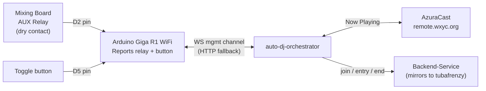
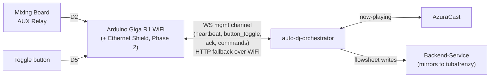
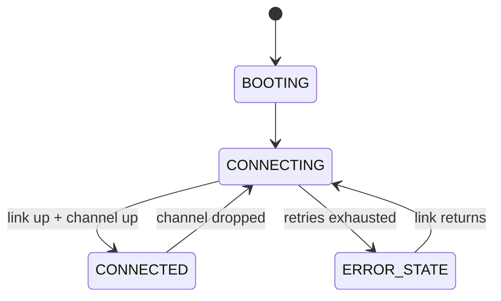

# Auto DJ Arduino Switch

An Arduino Giga R1 WiFi sketch that **reports** the mixing board's AUX relay state and a manual toggle button to the [auto-dj-orchestrator](https://github.com/WXYC/auto-dj-orchestrator) over a WebSocket management channel (HTTP fallback over WiFi). The orchestrator owns all activation logic — it subscribes to AzuraCast and writes the flowsheet (to Backend-Service, which mirrors to tubafrenzy). This board is a "dumb" reporter: it reports inputs and drives a status LED.

> **Note:** Earlier firmware wrote tracks to tubafrenzy directly. That responsibility now lives in the orchestrator; the Arduino no longer polls AzuraCast or writes flowsheets. See [docs/networking-spec.md](docs/networking-spec.md).

## Why?

When auto DJ is playing and no DJ is logged into the flowsheet, those tracks are not recorded in WXYC's playback history. The orchestrator fills that gap; this device tells it when the auto DJ is on the air (relay) and lets an operator toggle it manually (button).

## Architecture


```mermaid
flowchart LR
    MB["Mixing Board<br>AUX Relay<br>(dry contact)"] -->|D2 pin| ARD["Arduino Giga R1 WiFi<br>Reports relay + button"]
    BTN["Toggle button"] -->|D5 pin| ARD
    ARD <-->|"WS mgmt channel<br>(HTTP fallback)"| ORCH["auto-dj-orchestrator"]
    ORCH <-->|Now Playing| AZ["AzuraCast<br>remote.wxyc.org"]
    ORCH -->|join / entry / end| BS["Backend-Service<br>(mirrors to tubafrenzy)"]
```

### Planned Architecture

A management server will sit between AzuraCast and the Arduino, subscribing to AzuraCast's Centrifugo real-time feed and relaying Now Playing updates over a single WebSocket that also carries management commands and heartbeat telemetry. An Ethernet shield provides the stable persistent connection required for WebSocket; WiFi remains as a fallback with direct AzuraCast polling.


```mermaid
flowchart LR
    MB["Mixing Board<br>AUX Relay"] -->|D2| ARD
    BTN["Toggle button"] -->|D5| ARD
    ARD["Arduino Giga R1 WiFi<br>(+ Ethernet Shield, Phase 2)"]
    ARD <-->|"WS mgmt channel<br>(heartbeat, button_toggle,<br>ack, commands)<br>HTTP fallback over WiFi"| ORCH["auto-dj-orchestrator"]
    ORCH <-->|now-playing| AZ["AzuraCast"]
    ORCH -->|flowsheet writes| BS["Backend-Service<br>(mirrors to tubafrenzy)"]
```

See [docs/networking-spec.md](docs/networking-spec.md) for the comprehensive networking specification (all protocols, authentication, shared types, and implementation phases). The [original roadmap](docs/remote-access-roadmap.md) is preserved for git history.

## State Machine

In the reporter model the state machine tracks connectivity only (it no longer runs a show lifecycle). It reports the relay level + button presses to the orchestrator and drives the status LED; `tick()` stays pure.


```mermaid
stateDiagram-v2
    [*] --> BOOTING
    BOOTING --> CONNECTING
    CONNECTING --> CONNECTED : link up + channel up
    CONNECTING --> ERROR_STATE : retries exhausted
    CONNECTED --> CONNECTING : channel dropped
    ERROR_STATE --> CONNECTING : link returns
```

- **BOOTING:** Pre-transport.
- **CONNECTING:** Bringing up a transport (Ethernet WS primary, WiFi fallback) and the management channel; covers the WiFi reconnect window.
- **CONNECTED:** A transport + the management channel are up. Reports relay changes and button presses, sends periodic heartbeats, handles commands (pause/resume/ping/restart), and drives the LED from the orchestrator-reported active flag.
- **ERROR_STATE:** Transport setup failed repeatedly; back off and retry.

## Hardware

- Arduino Giga R1 WiFi
- Arduino Ethernet Shield Rev2 (W5500 + SD)
- Dry contact relay from mixing board AUX channel
- 220 ohm resistor + LED (optional status indicator)

See [docs/wiring.md](docs/wiring.md) for wiring details.

## Enclosure

A modified 3D-printed enclosure based on the [GIGA Display Shield case](https://www.printables.com/model/605051), adapted for the Ethernet Shield Rev2. The enclosure is a sealed three-piece design (base, shield shelf, lid) with cutouts for RJ45, SD card, and a 4-position Euroblock screw terminal for the relay interface.

See [enclosure/README.md](enclosure/README.md) for build instructions, BOM, and assembly guide. The full mechanical specification is in [docs/enclosure-specification.md](docs/enclosure-specification.md).

## Required Libraries

Install via Arduino Library Manager:

| Library | Version | Purpose |
|---------|---------|---------|
| ArduinoHttpClient | latest | HTTP GET/POST requests |
| ArduinoJson | v7+ | JSON parsing with filter documents |

The WiFi and WiFiSSLClient libraries are built into the Arduino Mbed OS GIGA board package.

## Setup

### 1. Install board support

In Arduino IDE, install **Arduino Mbed OS GIGA Boards** via Boards Manager.

### 2. Register the Arduino's MAC address

The Arduino connects to UNC-PSK WiFi. Register its MAC address at [UNC ITS](https://unc.edu/mydevices). To find the MAC address, upload a sketch that prints `WiFi.macAddress()` to Serial, or check the Serial output at boot (this sketch prints it during WiFi setup).

### 3. Configure secrets

```bash
cp auto-dj-arduino-switch/secrets.h.example auto-dj-arduino-switch/secrets.h
```

Edit `secrets.h` with:
- UNC-PSK WiFi password
- `AUTO_DJ_KEY` (must match the orchestrator's `AUTO_DJ_KEY` env var)

### 4. Orchestrator-side configuration

Set the `AUTO_DJ_KEY` environment variable on the [auto-dj-orchestrator](https://github.com/WXYC/auto-dj-orchestrator). The Arduino sends it as the `X-Auto-DJ-Key` header on the WebSocket upgrade (and the HTTP fallback), which the orchestrator validates with a timing-safe compare.

### 5. Upload

Open `auto-dj-arduino-switch/auto-dj-arduino-switch.ino` in Arduino IDE, select the Giga R1 WiFi board, and upload.

### 6. Wire the relay

Connect the mixing board's AUX relay contact to pin D2 and GND. See [docs/wiring.md](docs/wiring.md).

## Configuration

Edit `config.h` to change:

- Pin assignments (`RELAY_PIN`, `STATUS_LED_PIN`, `BUTTON_PIN`)
- Heartbeat / poll intervals
- Orchestrator host, port, paths, and `ORCHESTRATOR_USE_TLS`
- NTP server and timezone offset

## Serial Monitor

The sketch logs state transitions, track detections, and API calls to Serial at 115200 baud. Connect via Arduino IDE Serial Monitor for debugging.

## Maintenance

### Annual UNC-PSK password change

The UNC-PSK password changes yearly. Update `secrets.h` and re-upload the sketch. The Arduino's MAC address may also need re-registration.

### API key rotation

To rotate the key, update both:
1. `AUTO_DJ_KEY` in `secrets.h` on the Arduino
2. `AUTO_DJ_KEY` env var on the orchestrator

## Running Tests

Sketch modules are tested on desktop using GoogleTest with an Arduino shim layer. No Arduino hardware or SDK required. The shim provides `String`, `Print`, `Stream`, `Client`, GPIO stubs, and controllable `millis()`. Real ArduinoHttpClient and ArduinoJson libraries are compiled against the shim via CMake FetchContent.

**49 tests** cover:

| Module | Technique |
|--------|-----------|
| `state_machine.h` | Pure `tick()`: connectivity transitions, retries/backoff, command handling, LED policy, heartbeat timing |
| `button_monitor.h` | Parameterized `update(millis, reading)` debounce (press-edge), bypasses GPIO |
| `relay_monitor.h` | Parameterized `update(millis, reading)` debounce, bypasses GPIO |
| `mgmt_protocol.h` | Pure ArduinoJson assembly (heartbeat/button_toggle/ack) + parsing (command, ack-result) |

`mgmt_client.cpp` (the WebSocket / HTTP-fallback I/O) is excluded from the desktop build — it `#include <ArduinoWebsockets.h>`, which is not available in CI — so all assembly/parsing lives in the pure `mgmt_protocol` module above.

```bash
cmake -B test/build test/
cmake --build test/build
cd test/build && ctest --output-on-failure
```

Tests run automatically on push and PR via GitHub Actions (`.github/workflows/test.yml`).

## Documentation

| Document | Scope |
|----------|-------|
| [docs/networking-spec.md](docs/networking-spec.md) | All network traffic, both flowsheet backends, credentials, management protocol, `wxyc-shared` types, implementation phases |
| [docs/remote-administration.md](docs/remote-administration.md) | Parameter inventory: every configurable value and why it might change |
| [docs/remote-access-roadmap.md](docs/remote-access-roadmap.md) | Original phased plan (superseded by networking-spec.md) |
| [docs/wiring.md](docs/wiring.md) | Hardware wiring: relay, LED, pin assignments |

## Known Limitations

- **WiFi reconnection blocks for ~36 seconds** (known Giga R1 firmware limitation). During this time, the state machine is frozen. Track changes during a WiFi outage are not logged retroactively.
- **No watchdog timer** yet. Long-running reliability depends on the Giga R1's stability. A hardware watchdog could be added for 24/7 operation.
- **NTP dependency:** If NTP time sync fails, the show cannot start (the `startingHour` and `workingHour` parameters require epoch milliseconds).
