# Networking Specification

This document specifies all network communication for the Auto DJ Arduino Switch -- every outbound HTTP call, every WebSocket message, every credential, and every server-side endpoint the device depends on or that depends on it.

## 1. Overview

### 1.1 Purpose

The Auto DJ Arduino Switch is a networked embedded device that bridges WXYC's auto DJ system (AzuraCast) with the station's flowsheet. It makes outbound HTTPS calls to two different servers, and will eventually maintain a persistent WebSocket connection to a management server. This document is the single source of truth for all of that network traffic.

### 1.2 Problem Statement

The device sits inside the WXYC studio, wired into the mixing board. Today, every configuration change -- including the annual UNC-PSK password rotation -- requires someone to walk to the studio with a laptop, connect via USB, and reflash the firmware. There is no way to check whether the device is alive, inspect its state, or intervene remotely. For a device designed to run unattended, this is untenable.

Beyond remote access, the device currently only writes to one flowsheet backend (tubafrenzy). WXYC is migrating its flowsheet infrastructure to Backend-Service, and the Arduino must support both targets during the transition and afterward.

### 1.3 Document Scope

This document covers:

- All network traffic to and from the Arduino (HTTP, WebSocket, UDP)
- Both flowsheet backends (tubafrenzy and Backend-Service)
- Shared type contracts via `wxyc-shared` (`api.yaml`)
- Authentication and credential management for all connections
- The management server protocol (WebSocket + HTTP fallback)
- AzuraCast real-time now-playing via direct WebSocket (Centrifugo)
- Implementation phases (a restructured and expanded version of the original roadmap)

Related documents:

| Document | Scope |
|----------|-------|
| [remote-administration.md](remote-administration.md) | Parameter inventory: every configurable value, its current default, and why it might change |
| [remote-access-roadmap.md](remote-access-roadmap.md) | Original phased plan for remote management (superseded by Sections 3-7 of this document) |
| [wiring.md](wiring.md) | Hardware wiring: relay, LED, pin assignments |

### 1.4 Terminology

| Term | Definition |
|------|-----------|
| **tubafrenzy** | The legacy Java/Tomcat flowsheet system at `www.wxyc.info`. Form-encoded API, 302 redirect responses, `radioShowID` extracted from the Location header. |
| **Backend-Service** | The new Express/Node.js API at `api.wxyc.org`. JSON API, 200 JSON responses, `Show.id` from the response body. Uses Better Auth for authentication. |
| **AzuraCast** | The auto DJ and streaming software at `remote.wxyc.org`. Provides a now-playing API. |
| **Centrifugo** | The real-time messaging server embedded in AzuraCast. Publishes now-playing updates over WebSocket. |
| **management server** | The server that hosts the WebSocket management channel, heartbeat endpoints, and admin API. Could be Backend-Service or a standalone service. |
| **flowsheet** | The station's playback log -- a record of every song played during a show. |
| **`sh_id`** | AzuraCast's song history ID. A monotonically increasing integer unique per play event. Used to detect track changes. |
| **`radioShowID`** | tubafrenzy's show identifier. An integer extracted from the Location header after starting a show. |
| **`Show.id`** | Backend-Service's show identifier. An integer returned in the JSON response body after joining a show. |

---

## 2. System Architecture

### 2.1 Network Topology

All traffic flows are outbound from the Arduino. UNC campus networks are behind NAT with no inbound port access.

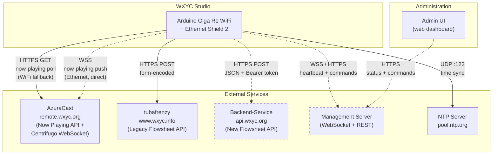

Dashed lines indicate planned connections not yet implemented. Solid lines are in production today.

**Ethernet mode** (primary): All traffic flows through the W5500 Ethernet Shield with software TLS (SSLClient + BearSSL). The WebSocket to the management server stays open persistently.

**WiFi mode** (fallback): All traffic uses per-call `WiFiSSLClient` instances (destroyed after each request to avoid the Giga R1 global WiFiClient crash bug). No persistent connections. The management channel degrades to HTTP short polling.

### 2.2 Transport Strategy: Ethernet Primary, WiFi Fallback

Ethernet eliminates the WiFi stack's instability problems and enables persistent connections (WebSocket) that are impractical over WiFi. WiFi remains as a fallback if the Ethernet cable is unplugged or the jack goes dead.

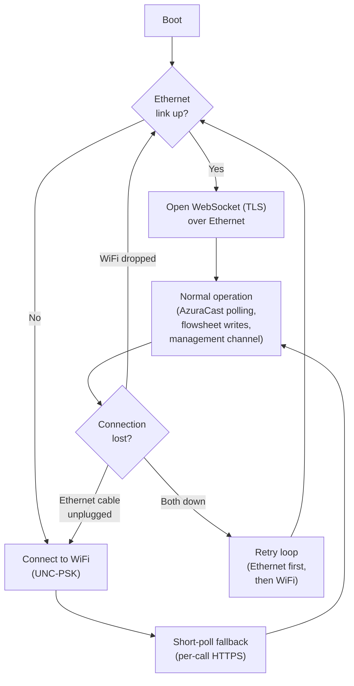

This means:

- **Ethernet + WebSocket** is the primary path. Persistent bidirectional connection. Commands arrive instantly. Heartbeats flow continuously.
- **WiFi + short polling** is the fallback. Uses the proven per-call `WiFiSSLClient` pattern that avoids the crash bug. Higher latency (up to 60 seconds) but reliable within the constraints of the WiFi stack.
- **WiFi password rotation** drops from "device is bricked" to "fallback path is degraded." The primary transport (Ethernet) doesn't use credentials that rotate.

#### Constraints

| Constraint | Detail |
|-----------|--------|
| **Network** | UNC campus networks are behind NAT with no inbound port access. The Arduino cannot host a server reachable from outside campus. All remote access must be outbound-initiated. |
| **Hardware** | Arduino Giga R1 WiFi (STM32H747XI). 1 MB SRAM, 2 MB internal flash, 16 MB QSPI flash. No persistent storage is used today. |
| **Ethernet** | An Arduino Ethernet Shield 2 (W5500, SPI-based) can be mounted on the Giga R1's Mega-compatible headers. The W5500 has a hardware TCP/IP stack. The studio needs a live Ethernet jack (verify with UNC ITS). |
| **WiFi** | Built-in WiFi (UNC-PSK, WPA2). `WiFi.begin()` blocks for up to 36 seconds on reconnection (known Giga R1 firmware bug). A global `WiFiSSLClient` crashes the board; the current code creates and destroys one per HTTP call as a workaround. |
| **TLS** | The W5500 handles TCP but not TLS. Software TLS is required for HTTPS over Ethernet (via `SSLClient` + BearSSL or Mbed TLS). The STM32H747's Cortex-M7 at 480 MHz has ample power for this. `WiFiSSLClient` handles TLS in the WiFi module's firmware and is unaffected. |
| **Existing infra** | The device already makes outbound HTTPS calls to `remote.wxyc.org` (AzuraCast) and `www.wxyc.info` (tubafrenzy). |

**NTP**: When Ethernet is the active transport, `WiFi.getTime()` is unavailable. The `NTPClient` library (Fabrice Weinberg) provides NTP over `EthernetUDP`. The `NetworkManager` exposes a `getTime()` method that delegates to `WiFi.getTime()` or `NTPClient::getEpochTime()` depending on the active transport. See Section 3.5.

### 2.3 Dual-Backend Architecture

The Arduino supports both tubafrenzy and Backend-Service as flowsheet targets. A `FLOWSHEET_BACKEND` config flag controls which backend is active.

| | tubafrenzy | Backend-Service |
|--|-----------|----------------|
| **Content type** | `application/x-www-form-urlencoded` | `application/json` |
| **Auth** | `X-Auto-DJ-Key` header | `Authorization: Bearer <PAT>` |
| **Start show** | POST `/playlists/startRadioShow` -> 302, `radioShowID` from Location header | POST `/flowsheet/join` -> 200 JSON, `Show.id` from response body |
| **Add entry** | POST `/playlists/flowsheetEntryAdd` -> 302 | POST `/flowsheet` -> 200 JSON |
| **End show** | POST `/playlists/finishRadioShow` -> 302 | POST `/flowsheet/end` -> 200 JSON |
| **Breakpoints** | Server auto-inserts via `autoBreakpoint=true` | Client must POST explicit breakpoint entry |
| **DJ ID** | `"0"` (string, no DJ table) | Auto-incremented integer from DJ table |

**Configuration**: In `config.h`, `FLOWSHEET_BACKEND` is `TUBAFRENZY` or `BACKEND_SERVICE`. After Phase 1 (KVStore), this becomes a runtime parameter switchable via the management channel. The flag also determines which credentials and host/port to use.

See Section 6 for the full dual-backend client specification.

### 2.4 Management Server

The management server provides:

- A WebSocket endpoint for real-time bidirectional communication (Ethernet mode)
- HTTP fallback endpoints for heartbeat and command polling (WiFi mode)
- An admin API for viewing device status and issuing commands

Note: The now-playing feed does **not** flow through the management server. The Arduino subscribes directly to AzuraCast's Centrifugo WebSocket (Section 3.9). The management server handles only device management (heartbeats, commands, status).

**Server choice**: Backend-Service (Express/Node.js) is a natural fit -- it already has WebSocket infrastructure via the `ws` package, uses Better Auth for admin authentication, and is the actively maintained backend. A standalone lightweight service (Hono or Fastify on Railway) is an alternative that keeps the management concern decoupled. See Appendix A for the full comparison.

---

## 3. Protocol Reference

### 3.1 Traffic Summary Table

| # | Direction | Protocol | Endpoint / Channel | Auth | Content Type | Transport | Status |
|---|-----------|----------|-------------------|------|-------------|-----------|--------|
| 1 | Arduino -> AzuraCast | HTTPS GET | `/api/nowplaying_static/main.json` | None (public) | JSON response | Both | **Live** |
| 2 | Arduino -> tubafrenzy | HTTPS POST | `/playlists/startRadioShow` | `X-Auto-DJ-Key` | Form-encoded | Both | **Live** |
| 3 | Arduino -> tubafrenzy | HTTPS POST | `/playlists/flowsheetEntryAdd` | `X-Auto-DJ-Key` | Form-encoded | Both | **Live** |
| 4 | Arduino -> tubafrenzy | HTTPS POST | `/playlists/finishRadioShow` | `X-Auto-DJ-Key` | Form-encoded | Both | **Live** |
| 5 | Arduino -> Backend-Service | HTTPS POST | `/flowsheet/join` | Bearer token | JSON | Both | Planned |
| 6 | Arduino -> Backend-Service | HTTPS POST | `/flowsheet` | Bearer token | JSON | Both | Planned |
| 7 | Arduino -> Backend-Service | HTTPS POST | `/flowsheet/end` | Bearer token | JSON | Both | Planned |
| 8 | Arduino <-> AzuraCast | WSS | `/api/live/nowplaying/websocket` | None (public) | JSON frames | Ethernet | Planned |
| 9 | Arduino -> NTP | UDP | `pool.ntp.org:123` | None | NTP packet | Ethernet | Planned |
| 10 | Arduino <-> Mgmt Server | WSS | `/api/auto-dj/ws` | `X-Auto-DJ-Key` | JSON frames | Ethernet | Planned |
| 11 | Arduino -> Mgmt Server | HTTPS POST | `/api/auto-dj/heartbeat` | `X-Auto-DJ-Key` | JSON | WiFi (fallback) | Planned |
| 12 | Arduino -> Mgmt Server | HTTPS GET | `/api/auto-dj/commands` | `X-Auto-DJ-Key` | JSON response | WiFi (fallback) | Planned |
| 13 | Admin UI -> Mgmt Server | HTTPS POST | `/api/auto-dj/commands` | Better Auth session | JSON | N/A | Planned |
| 14 | Admin UI -> Mgmt Server | HTTPS GET | `/api/auto-dj/status` | Better Auth session | JSON response | N/A | Planned |
| 15 | Arduino -> NTP | WiFi.getTime() | (internal to WiFi module) | None | NTP | WiFi | **Live** |

### 3.2 Outbound HTTP: AzuraCast Now Playing

**Status**: Live (implemented in `azuracast_client.cpp`)

The Arduino polls AzuraCast's static now-playing endpoint to detect track changes.

| Field | Value |
|-------|-------|
| **Method** | GET |
| **URL** | `https://remote.wxyc.org/api/nowplaying_static/main.json` |
| **Auth** | None (public endpoint) |
| **Response** | ~10 KB JSON, Nginx-cached |
| **Poll interval** | 20 seconds (`POLL_INTERVAL_MS`) |

**ArduinoJson filter document** (parses only needed fields, keeping memory under 1 KB):

```cpp
JsonDocument filter;
filter["now_playing"]["sh_id"] = true;
filter["now_playing"]["song"]["artist"] = true;
filter["now_playing"]["song"]["title"] = true;
filter["now_playing"]["song"]["album"] = true;
filter["live"]["is_live"] = true;
```

**Parsed fields**:

| JSON Path | Type | Purpose |
|-----------|------|---------|
| `now_playing.sh_id` | `int` | Song history ID. Monotonically increasing. A new value means a new track. |
| `now_playing.song.artist` | `string` | Artist name for the flowsheet entry. |
| `now_playing.song.title` | `string` | Track title for the flowsheet entry. |
| `now_playing.song.album` | `string` | Album title for the flowsheet entry. |
| `live.is_live` | `bool` | `true` when a live DJ is broadcasting (the Arduino ignores this state -- the relay contact is the primary signal). |

**Track change detection**: Compare `sh_id` to the previous value. If different, a new track is playing. The first poll after boot always triggers (previous `sh_id` is 0).

### 3.3 Outbound HTTP: tubafrenzy Flowsheet Operations

**Status**: Live (implemented in `flowsheet_client.cpp`)

All tubafrenzy requests are form-encoded POSTs authenticated by the `X-Auto-DJ-Key` header. The server responds with 302 redirects on success (the servlet redirects to a JSP page, but the Arduino does not follow the redirect). `ArduinoHttpClient` does not follow redirects by default, which is the desired behavior.

#### 3.3.1 Start Show

| Field | Value |
|-------|-------|
| **Method** | POST |
| **URL** | `https://www.wxyc.info/playlists/startRadioShow` |
| **Content-Type** | `application/x-www-form-urlencoded` |
| **Auth** | `X-Auto-DJ-Key: <key>` |
| **Success response** | 302 with Location header containing the new `radioShowID` |

**Request body parameters**:

| Parameter | Value | Source |
|-----------|-------|--------|
| `djID` | `"0"` | `AUTO_DJ_ID` in `config.h` |
| `djName` | `"Auto DJ"` | `AUTO_DJ_NAME` in `config.h` (URL-encoded) |
| `djHandle` | `"AutoDJ"` | `AUTO_DJ_HANDLE` in `config.h` (URL-encoded) |
| `showName` | `"Auto DJ"` | `AUTO_DJ_SHOW_NAME` in `config.h` (URL-encoded) |
| `startingHour` | epoch milliseconds | `currentHourMs()` from `utils.cpp` |

**Response handling**: Parse `radioShowID` from the Location header using `parseRadioShowID()` (in `utils.cpp`). Returns -1 on failure.

#### 3.3.2 Add Flowsheet Entry

| Field | Value |
|-------|-------|
| **Method** | POST |
| **URL** | `https://www.wxyc.info/playlists/flowsheetEntryAdd` |
| **Content-Type** | `application/x-www-form-urlencoded` |
| **Auth** | `X-Auto-DJ-Key: <key>` |
| **Success response** | 302 |

**Request body parameters**:

| Parameter | Value | Source |
|-----------|-------|--------|
| `radioShowID` | integer | From `startShow()` response |
| `workingHour` | epoch milliseconds | `currentHourMs()` from `utils.cpp` |
| `artistName` | string | From AzuraCast `now_playing.song.artist` (URL-encoded) |
| `songTitle` | string | From AzuraCast `now_playing.song.title` (URL-encoded) |
| `releaseTitle` | string | From AzuraCast `now_playing.song.album` (URL-encoded) |
| `releaseType` | `"otherRelease"` | Hardcoded |
| `autoBreakpoint` | `"true"` | Tells the server to auto-insert hourly breakpoints via `FlowsheetEntryService.createEntryWithAutoBreakpoints()` |

#### 3.3.3 End Show

| Field | Value |
|-------|-------|
| **Method** | POST |
| **URL** | `https://www.wxyc.info/playlists/finishRadioShow` |
| **Content-Type** | `application/x-www-form-urlencoded` |
| **Auth** | `X-Auto-DJ-Key: <key>` |
| **Success response** | 302 |

**Request body parameters**:

| Parameter | Value | Source |
|-----------|-------|--------|
| `radioShowID` | integer | From `startShow()` response |
| `mode` | `"signoffConfirm"` | Skips the interactive JSP confirmation page |

### 3.4 Outbound HTTP: Backend-Service Flowsheet Operations

**Status**: Planned

All Backend-Service requests are JSON POSTs authenticated by a Bearer token (Better Auth Personal Access Token). Responses are 200 with JSON bodies.

#### 3.4.1 Join Show

| Field | Value |
|-------|-------|
| **Method** | POST |
| **URL** | `https://api.wxyc.org/flowsheet/join` |
| **Content-Type** | `application/json` |
| **Auth** | `Authorization: Bearer <PAT>` |
| **Success response** | 200 JSON (`Show` or `ShowDJ`) |

**Request body**:

```json
{
    "dj_id": 42,
    "show_name": "Auto DJ"
}
```

| Field | Type | Source |
|-------|------|--------|
| `dj_id` | `integer` | The Auto DJ's DJ record ID in Backend-Service (stored in `secrets.h` / KVStore) |
| `show_name` | `string` | `AUTO_DJ_SHOW_NAME` from `config.h` |

**Response** (`Show` schema):

```json
{
    "id": 789,
    "primary_dj_id": 42,
    "show_name": "Auto DJ",
    "start_time": "2026-02-20T03:00:00.000Z",
    "end_time": null
}
```

The `id` field is the show identifier used for subsequent operations (equivalent to tubafrenzy's `radioShowID`).

#### 3.4.2 Add Flowsheet Entry

| Field | Value |
|-------|-------|
| **Method** | POST |
| **URL** | `https://api.wxyc.org/flowsheet` |
| **Content-Type** | `application/json` |
| **Auth** | `Authorization: Bearer <PAT>` |
| **Success response** | 200 JSON (`FlowsheetEntryResponse`) |

**Request body** (freeform song entry):

```json
{
    "artist_name": "Yo La Tengo",
    "album_title": "I Can Hear the Heart Beating as One",
    "track_title": "Autumn Sweater",
    "request_flag": false,
    "record_label": ""
}
```

| Field | Type | Required | Source |
|-------|------|----------|--------|
| `artist_name` | `string` | Yes | From AzuraCast `now_playing.song.artist` |
| `album_title` | `string` | Yes | From AzuraCast `now_playing.song.album` |
| `track_title` | `string` | Yes | From AzuraCast `now_playing.song.title` |
| `request_flag` | `boolean` | Yes | Always `false` for auto DJ |
| `record_label` | `string` | No | Empty string (not available from AzuraCast) |

Note: The `show_id` is implicit -- Backend-Service tracks the active show for each DJ via the `/flowsheet/join` state.

#### 3.4.3 End Show

| Field | Value |
|-------|-------|
| **Method** | POST |
| **URL** | `https://api.wxyc.org/flowsheet/end` |
| **Content-Type** | `application/json` |
| **Auth** | `Authorization: Bearer <PAT>` |
| **Success response** | 200 JSON (`Show` or `ShowDJ`) |

**Request body**:

```json
{
    "dj_id": 42
}
```

#### 3.4.4 Add Breakpoint (Backend-Service only)

Unlike tubafrenzy (which auto-inserts breakpoints via `autoBreakpoint=true`), Backend-Service requires the client to explicitly POST a breakpoint entry at the top of each hour. See Section 6.6 for the abstraction that normalizes this.

**Request body** (message entry with breakpoint content):

```json
{
    "message": "BREAKPOINT"
}
```

### 3.5 Outbound UDP: NTP Time Sync

**Status**: Live over WiFi (`WiFi.getTime()`), planned over Ethernet (`NTPClient`)

| Field | Value |
|-------|-------|
| **Protocol** | UDP |
| **Server** | `pool.ntp.org` |
| **Port** | 123 |
| **Purpose** | Epoch time for flowsheet timestamps (`startingHour`, `workingHour`) |

**WiFi transport**: `WiFi.getTime()` handles NTP internally within the WiFi module firmware. No explicit UDP required.

**Ethernet transport**: The `NTPClient` library (Fabrice Weinberg) sends NTP requests over `EthernetUDP`. API: `ntpClient.getEpochTime()`.

The `NetworkManager` exposes a unified `getTime()` method:

```cpp
unsigned long NetworkManager::getTime() {
    if (activeTransport == ETHERNET) {
        ntpClient.update();
        return ntpClient.getEpochTime();
    }
    return WiFi.getTime();  // WiFi module handles NTP internally
}
```

### 3.6 WebSocket: Management Channel

**Status**: Planned (Phase 3)

The WebSocket management channel provides real-time bidirectional communication between the Arduino and the management server. It carries heartbeats, commands, acknowledgments, now-playing relay data, and error reports.

#### 3.6.1 Connection Lifecycle

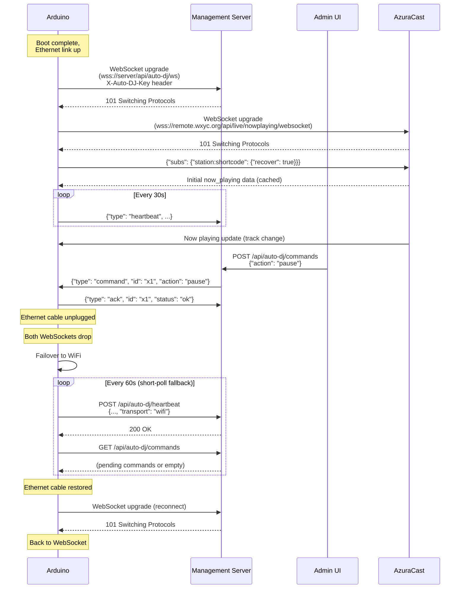

#### 3.6.2 Message Types

All WebSocket messages are JSON objects with a `type` discriminator field.

**Heartbeat** (Arduino -> Server):

```json
{
    "type": "heartbeat",
    "state": "AUTO_DJ_ACTIVE",
    "transport": "ethernet",
    "uptime_s": 86402,
    "wifi_rssi": null,
    "free_ram": 524288,
    "radio_show_id": 12345,
    "last_track": {
        "artist": "Yo La Tengo",
        "title": "Autumn Sweater",
        "posted_at": 1708400000
    },
    "last_error": null,
    "firmware_version": "1.2.0",
    "config_hash": "a3f2c8",
    "loop_max_ms": 45,
    "reconnect_count": 0,
    "tracks_detected": 142,
    "tracks_posted": 140,
    "errors_since_boot": 2
}
```

| Field | Type | Description |
|-------|------|-------------|
| `type` | `"heartbeat"` | Message discriminator |
| `state` | `string` | Current state machine state (`BOOTING`, `IDLE`, `STARTING_SHOW`, `AUTO_DJ_ACTIVE`, `ENDING_SHOW`) |
| `transport` | `string` | Active transport (`"ethernet"` or `"wifi"`) |
| `uptime_s` | `integer` | Seconds since boot |
| `wifi_rssi` | `integer \| null` | WiFi signal strength in dBm, or `null` if on Ethernet |
| `free_ram` | `integer` | Free heap bytes |
| `radio_show_id` | `integer \| null` | Active show ID, or `null` if no show is in progress |
| `last_track` | `object \| null` | Last track posted to the flowsheet |
| `last_track.artist` | `string` | Artist name |
| `last_track.title` | `string` | Track title |
| `last_track.posted_at` | `integer` | Unix timestamp of when the entry was posted |
| `last_error` | `string \| null` | Last error message, or `null` |
| `firmware_version` | `string` | Semantic version of the running firmware |
| `config_hash` | `string` | Short hash of the active runtime config (for detecting stale config) |
| `loop_max_ms` | `integer` | Maximum `loop()` duration since last heartbeat (performance metric) |
| `reconnect_count` | `integer` | Number of network reconnections since boot |
| `tracks_detected` | `integer` | Total track changes detected from AzuraCast since boot |
| `tracks_posted` | `integer` | Total entries successfully posted to the flowsheet since boot |
| `errors_since_boot` | `integer` | Total errors since boot |

**Command** (Server -> Arduino):

```json
{
    "type": "command",
    "id": "abc123",
    "action": "set_config",
    "key": "poll_interval_ms",
    "value": "30000"
}
```

| Field | Type | Description |
|-------|------|-------------|
| `type` | `"command"` | Message discriminator |
| `id` | `string` | Unique command ID for acknowledgment correlation |
| `action` | `string` | One of: `set_config`, `pause`, `resume`, `end_show`, `restart`, `ping` |
| `key` | `string \| undefined` | Config key (only for `set_config`) |
| `value` | `string \| undefined` | Config value (only for `set_config`) |

**Acknowledgment** (Arduino -> Server):

```json
{
    "type": "ack",
    "id": "abc123",
    "status": "ok"
}
```

| Field | Type | Description |
|-------|------|-------------|
| `type` | `"ack"` | Message discriminator |
| `id` | `string` | The `id` from the command being acknowledged |
| `status` | `string` | One of: `ok`, `error`, `unknown_command` |
| `error` | `string \| undefined` | Error message (only when `status` is `"error"`) |

**Now Playing Relay** (Server -> Arduino):

```json
{
    "type": "now_playing",
    "sh_id": 98765,
    "artist": "Yo La Tengo",
    "title": "Autumn Sweater",
    "album": "I Can Hear the Heart Beating as One",
    "is_live": false
}
```

| Field | Type | Description |
|-------|------|-------------|
| `type` | `"now_playing"` | Message discriminator |
| `sh_id` | `integer` | AzuraCast song history ID |
| `artist` | `string` | Artist name |
| `title` | `string` | Track title |
| `album` | `string` | Album title |
| `is_live` | `boolean` | Whether a live DJ is streaming |

This is a flat structure designed for efficient ArduinoJson parsing. If the relay architecture is used (Appendix B), the management server extracts these fields from AzuraCast's Centrifugo feed and sends this simplified format. If the Arduino subscribes directly to Centrifugo (Section 3.9, recommended), this message type is not used -- the Arduino parses the Centrifugo payload itself.

**Error Report** (Arduino -> Server):

```json
{
    "type": "error",
    "level": "error",
    "module": "flowsheet_client",
    "code": "HTTP_TIMEOUT",
    "message": "POST /playlists/flowsheetEntryAdd timed out after 10000ms",
    "state": "AUTO_DJ_ACTIVE",
    "uptime_s": 86402,
    "free_ram": 524288,
    "count": 3
}
```

| Field | Type | Description |
|-------|------|-------------|
| `type` | `"error"` | Message discriminator |
| `level` | `string` | One of: `warning`, `error`, `fatal` |
| `module` | `string` | Source module (e.g., `flowsheet_client`, `azuracast_client`, `network_manager`) |
| `code` | `string` | Error code (e.g., `HTTP_TIMEOUT`, `JSON_PARSE`, `WIFI_DISCONNECT`, `WS_DISCONNECT`, `TLS_HANDSHAKE`, `NTP_FAIL`) |
| `message` | `string` | Human-readable error description |
| `state` | `string` | State machine state when the error occurred |
| `uptime_s` | `integer` | Seconds since boot |
| `free_ram` | `integer` | Free heap bytes at time of error |
| `count` | `integer` | Number of times this error has occurred since last report |

The management server can relay these to Sentry or another error tracking service.

#### 3.6.3 Supported Commands

| Action | Parameters | Effect | Hot-reload? |
|--------|-----------|--------|-------------|
| `set_config` | `key`, `value` | Write a config parameter to KVStore | Depends on key (see below) |
| `pause` | -- | Suspend flowsheet posting; state machine stays in IDLE | Yes |
| `resume` | -- | Resume normal operation | Yes |
| `end_show` | -- | Force-end the current show | Yes |
| `restart` | -- | Software reset via `NVIC_SystemReset()` | N/A |
| `ping` | -- | Arduino sends an immediate heartbeat in response | Yes |

#### 3.6.4 Hot-Reload Behavior

| Config key | Hot-reloadable? | Notes |
|-----------|----------------|-------|
| `poll_interval_ms` | Yes | Takes effect on next poll cycle |
| `wifi_ssid` / `wifi_pass` | No | Requires restart; only affects the WiFi fallback transport |
| `api_key` | Yes | Takes effect on next HTTP request |
| `utc_offset` | Yes | Takes effect on next `currentHourMs()` call |
| `flowsheet_backend` | No | Requires restart; changes which client and credentials are used |
| `backend_service_token` | Yes | Takes effect on next Backend-Service request |

#### 3.6.5 Keepalive Strategy

NAT gateways and campus firewalls kill idle TCP connections, typically after 60-300 seconds. The WebSocket must stay active:

- **Heartbeat interval (30s)** acts as an application-level keepalive. The server expects a heartbeat at least this often; absence triggers a "device offline" alert.
- **WebSocket ping/pong frames** as a transport-level keepalive. Most WebSocket libraries handle these automatically. If the server doesn't receive a pong within 10 seconds, it considers the connection dead.

### 3.7 HTTP Fallback: Management Polling (WiFi)

**Status**: Planned (Phase 3)

When the Arduino is on WiFi (no persistent connections), the management channel degrades to HTTP short polling on a 60-second interval.

**Heartbeat** (Arduino -> Server):

| Field | Value |
|-------|-------|
| **Method** | POST |
| **URL** | `https://<management-server>/api/auto-dj/heartbeat` |
| **Auth** | `X-Auto-DJ-Key: <key>` |
| **Content-Type** | `application/json` |
| **Body** | Same JSON as the WebSocket heartbeat message (Section 3.6.2) |
| **Response** | 200 OK |

**Command poll** (Arduino -> Server):

| Field | Value |
|-------|-------|
| **Method** | GET |
| **URL** | `https://<management-server>/api/auto-dj/commands` |
| **Auth** | `X-Auto-DJ-Key: <key>` |
| **Response** | 200 JSON array of pending commands, or empty array |

The Arduino processes each command and sends acknowledgments as separate POST requests.

### 3.8 Server-Side Endpoints

| Method | Path | Purpose | Auth | Transport |
|--------|------|---------|------|-----------|
| `GET` (upgrade) | `/api/auto-dj/ws` | WebSocket management channel | `X-Auto-DJ-Key` | Ethernet primary |
| `POST` | `/api/auto-dj/heartbeat` | Heartbeat (fallback) | `X-Auto-DJ-Key` | WiFi fallback |
| `GET` | `/api/auto-dj/commands` | Command poll (fallback) | `X-Auto-DJ-Key` | WiFi fallback |
| `POST` | `/api/auto-dj/commands` | Admin enqueues a command | Better Auth session/JWT | Admin UI |
| `GET` | `/api/auto-dj/status` | Latest heartbeat + connection state | Better Auth session/JWT | Admin UI |

All Arduino-facing endpoints authenticate via the `X-Auto-DJ-Key` header. All admin-facing endpoints authenticate via Better Auth session cookies or JWT.

### 3.9 AzuraCast Centrifugo: Direct WebSocket

**Status**: Planned (Phase 2/3)

AzuraCast embeds a [Centrifugo](https://centrifugal.dev/) real-time messaging server and exposes a public WebSocket endpoint for now-playing updates. The Arduino can subscribe directly -- no relay server needed.

#### 3.9.1 Protocol

| Field | Value |
|-------|-------|
| **Endpoint** | `wss://remote.wxyc.org/api/live/nowplaying/websocket` |
| **Auth** | None (public, no token required) |
| **Transport** | Ethernet only (persistent WebSocket) |
| **Fallback** | HTTP polling (Section 3.2) over WiFi or when WebSocket is unavailable |

**Connection sequence**:

1. Open WebSocket to `wss://remote.wxyc.org/api/live/nowplaying/websocket`
2. Send subscription message:
   ```json
   {"subs": {"station:<shortcode>": {"recover": true}}}
   ```
   The `recover: true` flag enables Centrifugo's connection recovery (missed messages are replayed on reconnect). The station shortcode must be verified -- see Open Question 9.
3. Receive initial cached data immediately on connect (no waiting for next track change):
   ```json
   {
       "connect": {
           "subs": {
               "station:<shortcode>": {
                   "publications": [{"data": {"np": { ... }}}]
               }
           }
       }
   }
   ```
4. Receive subsequent updates as they occur:
   ```json
   {"channel": "station:<shortcode>", "pub": {"data": {"np": { ... }}}}
   ```

**Relevant fields in `np`**:

| JSON Path | Type | Arduino Usage |
|-----------|------|--------------|
| `np.now_playing.sh_id` | `int` | Track change detection (same as HTTP polling) |
| `np.now_playing.song.artist` | `string` | Flowsheet entry |
| `np.now_playing.song.title` | `string` | Flowsheet entry |
| `np.now_playing.song.album` | `string` | Flowsheet entry |
| `np.live.is_live` | `bool` | Live DJ detection |

These are the same fields extracted by the HTTP polling endpoint (Section 3.2). The ArduinoJson filter document is identical.

**Sources**: [AzuraCast Now Playing Data APIs](https://www.azuracast.com/docs/developers/now-playing-data/), [AzuraCast HPNP SSE example](https://gist.github.com/Moonbase59/d42f411e10aff6dc58694699010307aa)

#### 3.9.2 Dual-Mode Architecture

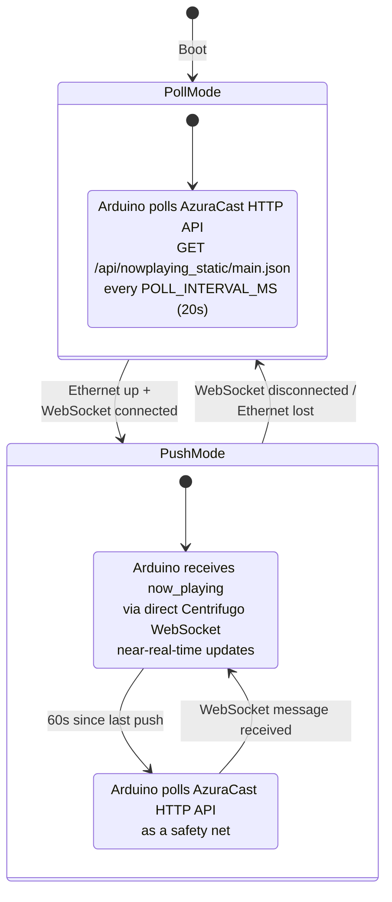

- **Ethernet (push mode)**: The Arduino opens a WebSocket directly to AzuraCast's Centrifugo endpoint. Track updates arrive in near-real-time. A 60-second safety-net poll to the HTTP API catches any missed messages (Centrifugo is best-effort; the HTTP endpoint is Nginx-cached and authoritative).
- **WiFi (poll mode)**: The Arduino polls the AzuraCast HTTP API on the existing `POLL_INTERVAL_MS` timer. No persistent connections (to avoid the Giga R1 crash bug). No change from current behavior.

#### 3.9.3 Why Direct (Not Relayed)

The original design (see Appendix B) assumed the Arduino could not subscribe to Centrifugo directly, requiring the management server to act as a relay. This assumption was wrong: AzuraCast's Centrifugo endpoint uses standard WebSocket with a simple JSON subscription message and no authentication. The Arduino can connect directly using the `ArduinoWebsockets` library.

Direct subscription is simpler:

| | Direct (recommended) | Relay via management server |
|--|---------------------|---------------------------|
| **Dependencies** | Arduino + AzuraCast only | Arduino + management server + AzuraCast |
| **Latency** | Single hop | Two hops (Centrifugo -> server -> Arduino) |
| **Failure modes** | AzuraCast down | AzuraCast down OR management server down |
| **Phase dependency** | Phase 2 (Ethernet) | Phase 3 (management server) |
| **Arduino complexity** | WebSocket client + JSON parsing | Same (receives JSON either way) |

The relay architecture remains a fallback option if direct connection proves problematic (e.g., ArduinoJson memory limits on the full Centrifugo payload, or reconnection complexity). The management server can always be interposed later without changing the Arduino's internal data flow -- the `AzuraCastClient` consumes the same fields regardless of source.

#### 3.9.4 ArduinoJson Memory Considerations

The Centrifugo now-playing payload is larger than the static HTTP endpoint response (~10 KB) because it includes the full Centrifugo envelope. An ArduinoJson filter document keeps memory usage bounded:

```cpp
JsonDocument filter;
filter["connect"]["subs"]["station:*"]["publications"][0]["data"]["np"]["now_playing"]["sh_id"] = true;
filter["connect"]["subs"]["station:*"]["publications"][0]["data"]["np"]["now_playing"]["song"]["artist"] = true;
filter["connect"]["subs"]["station:*"]["publications"][0]["data"]["np"]["now_playing"]["song"]["title"] = true;
filter["connect"]["subs"]["station:*"]["publications"][0]["data"]["np"]["now_playing"]["song"]["album"] = true;
filter["connect"]["subs"]["station:*"]["publications"][0]["data"]["np"]["live"]["is_live"] = true;
// Same filter pattern for "pub" messages
```

If the Centrifugo payload exceeds ArduinoJson's practical parsing limits on the Giga R1 (~16 KB with filter), the relay approach (Appendix B) becomes necessary -- the management server would extract the relevant fields and send a flat ~200-byte `AutoDJNowPlaying` message.

See Appendix B for the relay alternative and detailed Centrifugo integration notes.

---

## 4. Authentication and Credentials

### 4.1 Credential Inventory

| Credential | Stored in | Authenticates to | Rotation frequency |
|-----------|----------|------------------|-------------------|
| WiFi password (`WIFI_PASS`) | `secrets.h` (compile-time), KVStore (runtime, after Phase 1) | UNC-PSK WiFi network | Annually (UNC policy) |
| tubafrenzy API key (`AUTO_DJ_API_KEY`) | `secrets.h` (compile-time), KVStore (runtime, after Phase 1) | tubafrenzy flowsheet API | Manual (operator-initiated) |
| Backend-Service PAT | `secrets.h` (compile-time), KVStore (runtime, after Phase 1) | Backend-Service flowsheet API | Manual (operator-initiated, or via management server push) |
| Management server key | Same as `AUTO_DJ_API_KEY` (shared) | Management server WebSocket + HTTP | Same as tubafrenzy API key |

### 4.2 tubafrenzy Authentication

**Status**: Live (implemented in `flowsheet_client.cpp`)

The Arduino authenticates to tubafrenzy by sending the `X-Auto-DJ-Key` header with every request. The server validates this via `XYCCatalogServlet.isAutoDJRequest()`:

```java
protected boolean isAutoDJRequest(HttpServletRequest request) {
    String apiKey = getAutoDJApiKey();  // System.getenv("AUTO_DJ_API_KEY")
    if (apiKey == null || apiKey.isEmpty()) {
        return false;
    }
    String headerKey = request.getHeader("X-Auto-DJ-Key");
    if (headerKey == null) {
        return false;
    }
    return MessageDigest.isEqual(
        apiKey.getBytes(StandardCharsets.UTF_8),
        headerKey.getBytes(StandardCharsets.UTF_8)
    );
}
```

Key details:

- **Timing-safe comparison**: `MessageDigest.isEqual()` is constant-time, preventing timing attacks.
- **Server-side config**: The `AUTO_DJ_API_KEY` environment variable on the tubafrenzy server (wxyc.info) must match the value in the Arduino's `secrets.h`.
- **Bypass of IP check**: A valid `X-Auto-DJ-Key` bypasses the normal control-room IP address check in `validateControlRoomAccess()`.

### 4.3 Backend-Service Authentication

**Status**: Planned

Backend-Service uses Better Auth for authentication. The Arduino authenticates as a dedicated service account using a Personal Access Token (PAT) issued by Better Auth's bearer plugin.

#### Set-up (one-time, by an admin)

1. **Create a Better Auth user** for the Auto DJ (email: `auto-dj@wxyc.org`, role: `dj`). This is a real user account in Better Auth, but it represents an automation system, not a person.

2. **Register a DJ record** via `POST /djs/register` with:
   - `dj_name`: `"Auto DJ"`
   - `is_automation`: `true`
   - The `dj_id` is auto-incremented by Backend-Service (not 0, to avoid conflicts with auto-increment conventions).

3. **Add `is_automation` to the `DJ` and `NewDJ` schemas in `api.yaml`**:
   - Type: `boolean`
   - Default: `false`
   - Purpose: Lets admin UIs filter automation DJs from human DJs without Backend-Service-specific logic. The column is part of the public schema and will propagate to all generated types.

4. **Mint a Personal Access Token (PAT)** via Better Auth's bearer plugin. This is a long-lived token that the Arduino sends as `Authorization: Bearer <PAT>`.

The Arduino cannot create its own account -- this is an admin provisioning step.

#### Arduino configuration

The PAT and `dj_id` are stored in:

- `secrets.h` (compile-time default)
- KVStore (runtime, after Phase 1, overridable via `set_config`)

The Arduino sends `Authorization: Bearer <PAT>` on all Backend-Service requests.

tubafrenzy continues to use `djID=0` independently -- the two backends have separate DJ identity systems.

#### Token refresh

The management server can push a new PAT via the `set_config` command:

```json
{
    "type": "command",
    "id": "tok-refresh-1",
    "action": "set_config",
    "key": "backend_service_token",
    "value": "<new-PAT>"
}
```

This takes effect immediately (hot-reloadable) on the next Backend-Service request.

### 4.4 Management Server Auth (Arduino-Facing)

The Arduino authenticates to the management server using the same `X-Auto-DJ-Key` header used for tubafrenzy. This applies to:

- WebSocket upgrade request (`wss://server/api/auto-dj/ws`)
- HTTP fallback heartbeat (`POST /api/auto-dj/heartbeat`)
- HTTP fallback command poll (`GET /api/auto-dj/commands`)

The management server validates the key using the same timing-safe comparison pattern.

### 4.5 Management Server Auth (Admin-Facing)

Admin-facing endpoints (`POST /api/auto-dj/commands`, `GET /api/auto-dj/status`) authenticate via Better Auth session cookies or JWT. Only users with the `stationManager` role (or a to-be-defined `admin` capability) can issue commands to the device.

### 4.6 Credential Rotation Protocol

With Ethernet as the primary transport, credential rotation is significantly less risky. The Ethernet connection does not use credentials that rotate externally (no WiFi password, no PSK).

#### Ethernet mitigates the chicken-and-egg problem

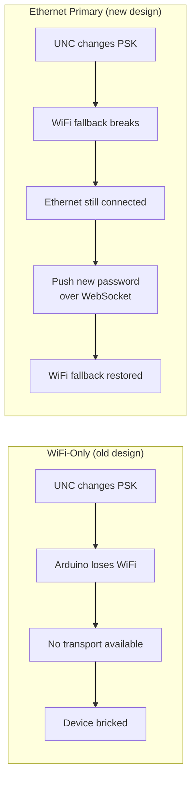

The only scenario that still requires physical access is if **both** the Ethernet jack goes dead **and** the WiFi password is stale.

#### API key rotation steps

1. Generate a new API key.
2. Update the server-side env var (e.g., `AUTO_DJ_API_KEY` on tubafrenzy) to accept **both** old and new keys temporarily.
3. Push the new key to the Arduino via `set_config` (over WebSocket or HTTP fallback).
4. After the Arduino acknowledges, remove the old key from the server.

#### Backend-Service token rotation

1. Mint a new PAT in Better Auth.
2. Push the new PAT to the Arduino via `set_config` with `key=backend_service_token`.
3. Arduino acknowledges; old PAT can be revoked.

### 4.7 Credential Fallback and Recovery

The firmware keeps **both** the KVStore credential and the compile-time default. On connection failure after N attempts with the stored credential, it falls back to the compile-time default:

```cpp
// Pseudocode
if (!connectWith(kvstore.wifi_pass, MAX_ATTEMPTS)) {
    Serial.println("[WiFi] Stored credential failed, trying compiled default");
    if (!connectWith(WIFI_PASS_DEFAULT, MAX_ATTEMPTS)) {
        Serial.println("[WiFi] Both credentials failed");
    }
}
```

This ensures that a bad credential push doesn't permanently brick the WiFi fallback -- a firmware reflash with the correct default can always restore access.

### 4.8 Security Considerations

- **Transport security**: All communication is over TLS (BearSSL via `SSLClient` on Ethernet, `WiFiSSLClient` on WiFi). Credentials are encrypted in transit.
- **Storage security**: KVStore writes to flash in plaintext. An attacker with physical access to the board could read the flash. This is acceptable -- physical access to the studio already implies access to the mixing board, network, and everything else.
- **Command authentication**: Commands are authenticated by the `X-Auto-DJ-Key` header (management server) or Bearer token (Backend-Service). A compromised key would allow unauthorized actions. Key rotation (Section 4.6) mitigates this.
- **Command validation**: The Arduino must validate all command payloads. Reject unknown actions, enforce maximum string lengths, and never execute arbitrary code from the server.

---

## 5. wxyc-shared Type Specification

### 5.1 Current Code Generation Pipeline

The `api.yaml` file in `wxyc-shared` is the single source of truth for API types. Code generation produces:

- **TypeScript** (`openapi-generator-cli` -> `src/generated/models/`): consumed by Backend-Service, dj-site, management server, admin UI
- **Python** (`datamodel-codegen` -> Pydantic v2): consumed by request-o-matic, library-metadata-lookup
- **Swift**: consumed by wxyc-ios-64 (via existing code generation pipeline)
- **Kotlin**: consumed by WXYC-Android (via existing code generation pipeline)

The `tsup` build produces independently importable entry points:

| Entry point | Import path | Contents |
|-------------|------------|----------|
| `src/index.ts` | `@wxyc/shared` | Root re-exports |
| `src/dtos/index.ts` | `@wxyc/shared/dtos` | DTOs + extensions (unions, type guards) |
| `src/auth-client/index.ts` | `@wxyc/shared/auth-client` | Auth client (React "use client") |
| `src/auth-client/auth.ts` | `@wxyc/shared/auth-client/auth` | Pure auth (server-side, no React) |
| `src/validation/index.ts` | `@wxyc/shared/validation` | Validation schemas |
| `src/test-utils/index.ts` | `@wxyc/shared/test-utils` | Test utilities |

Breaking change detection: `scripts/check-breaking-changes.js` compares the generated types against the previous version.

### 5.2 New Types for api.yaml

The following OpenAPI 3.0 schema blocks are designed to be added to `api.yaml` under `components/schemas`. They formalize the WebSocket message types from Section 3.6.2.

#### 5.2.1 WebSocket Message Envelope

```yaml
AutoDJWebSocketMessage:
  oneOf:
    - $ref: '#/components/schemas/AutoDJHeartbeat'
    - $ref: '#/components/schemas/AutoDJCommand'
    - $ref: '#/components/schemas/AutoDJAck'
    - $ref: '#/components/schemas/AutoDJNowPlaying'
    - $ref: '#/components/schemas/AutoDJErrorReport'
  discriminator:
    propertyName: type
    mapping:
      heartbeat: '#/components/schemas/AutoDJHeartbeat'
      command: '#/components/schemas/AutoDJCommand'
      ack: '#/components/schemas/AutoDJAck'
      now_playing: '#/components/schemas/AutoDJNowPlaying'
      error: '#/components/schemas/AutoDJErrorReport'
```

#### 5.2.2 AutoDJHeartbeat

```yaml
AutoDJHeartbeat:
  type: object
  required:
    - type
    - state
    - transport
    - uptime_s
    - free_ram
    - firmware_version
    - config_hash
    - loop_max_ms
    - reconnect_count
    - tracks_detected
    - tracks_posted
    - errors_since_boot
  properties:
    type:
      type: string
      enum: [heartbeat]
    state:
      type: string
      enum: [BOOTING, IDLE, STARTING_SHOW, AUTO_DJ_ACTIVE, ENDING_SHOW]
    transport:
      type: string
      enum: [ethernet, wifi]
    uptime_s:
      type: integer
    wifi_rssi:
      type: integer
      nullable: true
    free_ram:
      type: integer
    radio_show_id:
      type: integer
      nullable: true
    last_track:
      $ref: '#/components/schemas/AutoDJLastTrack'
    last_error:
      type: string
      nullable: true
    firmware_version:
      type: string
    config_hash:
      type: string
    loop_max_ms:
      type: integer
    reconnect_count:
      type: integer
    tracks_detected:
      type: integer
    tracks_posted:
      type: integer
    errors_since_boot:
      type: integer

AutoDJLastTrack:
  type: object
  required:
    - artist
    - title
    - posted_at
  properties:
    artist:
      type: string
    title:
      type: string
    posted_at:
      type: integer
      description: Unix timestamp
```

#### 5.2.3 AutoDJCommand

```yaml
AutoDJCommand:
  type: object
  required:
    - type
    - id
    - action
  properties:
    type:
      type: string
      enum: [command]
    id:
      type: string
      description: Unique command ID for ack correlation
    action:
      $ref: '#/components/schemas/AutoDJCommandAction'
    key:
      type: string
      description: Config key (only for set_config)
    value:
      type: string
      description: Config value (only for set_config)
```

#### 5.2.4 AutoDJAck

```yaml
AutoDJAck:
  type: object
  required:
    - type
    - id
    - status
  properties:
    type:
      type: string
      enum: [ack]
    id:
      type: string
      description: The id from the command being acknowledged
    status:
      type: string
      enum: [ok, error, unknown_command]
    error:
      type: string
      description: Error message (only when status is error)
```

#### 5.2.5 AutoDJNowPlaying

```yaml
AutoDJNowPlaying:
  type: object
  required:
    - type
    - sh_id
    - artist
    - title
    - album
    - is_live
  properties:
    type:
      type: string
      enum: [now_playing]
    sh_id:
      type: integer
      description: AzuraCast song history ID
    artist:
      type: string
    title:
      type: string
    album:
      type: string
    is_live:
      type: boolean
      description: Whether a live DJ is streaming
```

#### 5.2.6 AutoDJErrorReport

```yaml
AutoDJErrorReport:
  type: object
  required:
    - type
    - level
    - module
    - code
    - message
    - state
    - uptime_s
    - free_ram
    - count
  properties:
    type:
      type: string
      enum: [error]
    level:
      $ref: '#/components/schemas/AutoDJErrorLevel'
    module:
      type: string
      description: Source module (e.g., flowsheet_client, azuracast_client)
    code:
      $ref: '#/components/schemas/AutoDJErrorCode'
    message:
      type: string
    state:
      type: string
      enum: [BOOTING, IDLE, STARTING_SHOW, AUTO_DJ_ACTIVE, ENDING_SHOW]
    uptime_s:
      type: integer
    free_ram:
      type: integer
    count:
      type: integer
      description: Occurrences since last report

AutoDJErrorLevel:
  type: string
  enum: [warning, error, fatal]

AutoDJErrorCode:
  type: string
  enum:
    - HTTP_TIMEOUT
    - JSON_PARSE
    - WIFI_DISCONNECT
    - WS_DISCONNECT
    - TLS_HANDSHAKE
    - NTP_FAIL
    - KVSTORE_WRITE
    - FLOWSHEET_POST
    - AZURACAST_POLL
```

#### 5.2.7 AutoDJDeviceStatus

For the admin API -- aggregates the latest heartbeat with connection state and device identity.

```yaml
AutoDJDeviceStatus:
  type: object
  required:
    - connected
    - transport
    - last_heartbeat_at
    - firmware_version
  properties:
    connected:
      type: boolean
    transport:
      type: string
      enum: [ethernet, wifi, none]
    last_heartbeat_at:
      type: string
      format: date-time
      nullable: true
    last_heartbeat:
      $ref: '#/components/schemas/AutoDJHeartbeat'
    pending_commands:
      type: integer
      description: Number of unacknowledged commands in the queue
    firmware_version:
      type: string
    device_id:
      type: string
      description: MAC address or other unique identifier
```

#### 5.2.8 AutoDJCommandAction Enum

```yaml
AutoDJCommandAction:
  type: string
  enum:
    - set_config
    - pause
    - resume
    - end_show
    - restart
    - ping
```

### 5.3 TypeScript Extensions

The new schemas live in `api.yaml` as `components/schemas` and are code-generated into `src/generated/models/`. Hand-written TypeScript utilities go in a new `src/auto-dj/` directory, following the pattern of `src/dtos/extensions.ts`.

#### New files

**`src/auto-dj/extensions.ts`**:

```typescript
import type {
    AutoDJHeartbeat,
    AutoDJCommand,
    AutoDJAck,
    AutoDJNowPlaying,
    AutoDJErrorReport,
} from '../generated/models';

// Discriminated union of all WebSocket message types
export type AutoDJWebSocketMessage =
    | AutoDJHeartbeat
    | AutoDJCommand
    | AutoDJAck
    | AutoDJNowPlaying
    | AutoDJErrorReport;

// Type guards
export function isHeartbeat(msg: AutoDJWebSocketMessage): msg is AutoDJHeartbeat {
    return msg.type === 'heartbeat';
}

export function isCommand(msg: AutoDJWebSocketMessage): msg is AutoDJCommand {
    return msg.type === 'command';
}

export function isAck(msg: AutoDJWebSocketMessage): msg is AutoDJAck {
    return msg.type === 'ack';
}

export function isNowPlaying(msg: AutoDJWebSocketMessage): msg is AutoDJNowPlaying {
    return msg.type === 'now_playing';
}

export function isErrorReport(msg: AutoDJWebSocketMessage): msg is AutoDJErrorReport {
    return msg.type === 'error';
}
```

**`src/auto-dj/index.ts`**:

```typescript
// Re-export generated schemas
export type {
    AutoDJHeartbeat,
    AutoDJCommand,
    AutoDJAck,
    AutoDJNowPlaying,
    AutoDJErrorReport,
    AutoDJDeviceStatus,
    AutoDJCommandAction,
    AutoDJErrorLevel,
    AutoDJErrorCode,
    AutoDJLastTrack,
    AutoDJWebSocketMessage as AutoDJWebSocketMessageSchema,
} from '../generated/models';

// Re-export extensions (union type + type guards)
export {
    type AutoDJWebSocketMessage,
    isHeartbeat,
    isCommand,
    isAck,
    isNowPlaying,
    isErrorReport,
} from './extensions';
```

**New entry point** in `tsup.config.ts`:

```typescript
// Add to the entry array:
'src/auto-dj/index.ts'
```

**New export** in `package.json`:

```json
"./auto-dj": {
    "import": "./dist/auto-dj/index.js",
    "types": "./dist/auto-dj/index.d.ts"
}
```

Consumers import via `@wxyc/shared/auto-dj`.

### 5.4 Arduino Contract

The Arduino cannot consume npm packages. ArduinoJson code must manually match the schemas defined in `api.yaml`. This is a manual contract, not an automated import.

**Rule**: If you change a schema in `api.yaml`, you must update the corresponding ArduinoJson filter documents and struct definitions in the Arduino code.

| api.yaml Schema | Arduino File | What to Update |
|----------------|-------------|----------------|
| `AutoDJHeartbeat` | `management_client.cpp` | `sendHeartbeat()` JSON construction |
| `AutoDJCommand` | `management_client.cpp` | `processCommand()` JSON parsing + filter document |
| `AutoDJAck` | `management_client.cpp` | `sendAck()` JSON construction |
| `AutoDJNowPlaying` | `management_client.cpp` | `processNowPlaying()` JSON parsing + filter document |
| `AutoDJErrorReport` | `management_client.cpp` | `sendError()` JSON construction |
| (AzuraCast response) | `azuracast_client.cpp` | `poll()` filter document: `now_playing.sh_id`, `now_playing.song.*`, `live.is_live` |
| (tubafrenzy request) | `flowsheet_client.cpp` | `startShow()`, `addEntry()`, `endShow()` form body construction |
| `FlowsheetCreateSongFreeform` | `backend_service_client.cpp` | `addEntry()` JSON body construction |

### 5.5 Consumer Matrix

| Consumer | Language | Types Used |
|----------|---------|------------|
| Management server | TypeScript | All message types (`AutoDJWebSocketMessage` union) |
| Backend-Service | TypeScript | `AutoDJDeviceStatus`, `AutoDJCommandAction` (if hosting management endpoints) |
| Admin UI | TypeScript | `AutoDJDeviceStatus`, `AutoDJHeartbeat` |
| Arduino | C++ (ArduinoJson) | All message types (manual contract, not import) |
| tubafrenzy | Java | None (uses `X-Auto-DJ-Key` only; no management types) |

The `is_automation` field on `DJ`/`NewDJ` schemas will also propagate to:
- **Swift** (wxyc-ios-64) via existing code generation
- **Kotlin** (WXYC-Android) via existing code generation

A follow-up PR to each mobile app is needed to handle this field (e.g., filtering Auto DJ from DJ lists, displaying automated shows differently). See Open Question 16.

### 5.6 AsyncAPI Consideration

OpenAPI 3.0 doesn't natively describe WebSocket protocols. The schemas are added to `api.yaml` as `components/schemas` only (no path definitions for WebSocket messages). The message direction and lifecycle are documented in prose with Mermaid sequence diagrams (Section 3.6).

If a formal WebSocket contract is needed later, AsyncAPI 2.x can reference these same schemas. For now, the WebSocket has exactly one consumer (the Arduino), and the prose documentation is sufficient.

---

## 6. Dual-Backend Flowsheet Client

### 6.1 Configuration Flag

```cpp
// config.h
#define FLOWSHEET_BACKEND TUBAFRENZY  // or BACKEND_SERVICE
```

Values: `TUBAFRENZY` | `BACKEND_SERVICE`.

After Phase 1 (KVStore), `flowsheet_backend` becomes a runtime parameter in the `RuntimeConfig` struct, switchable via the management channel's `set_config` command. Changing it requires a restart (not hot-reloadable) because it changes which client instance, credentials, and host/port are active.

The flag also determines:

| Setting | `TUBAFRENZY` | `BACKEND_SERVICE` |
|---------|-------------|-------------------|
| **Host** | `www.wxyc.info` | `api.wxyc.org` |
| **Port** | `443` | `443` |
| **Auth header** | `X-Auto-DJ-Key: <key>` | `Authorization: Bearer <PAT>` |
| **DJ ID** | `"0"` (string) | Auto-incremented integer from DJ table |
| **Content type** | `application/x-www-form-urlencoded` | `application/json` |

### 6.2 tubafrenzy Client (existing)

Implemented in `flowsheet_client.cpp` and `flowsheet_client.h`. See Section 3.3 for the full protocol specification.

Three operations:

1. **`startShow(startingHourMs)`** -> `int radioShowID`
   - POST form-encoded body to `/playlists/startRadioShow`
   - Parse `radioShowID` from 302 Location header
   - Return -1 on failure

2. **`addEntry(radioShowID, workingHourMs, artist, title, album)`** -> `bool`
   - POST form-encoded body to `/playlists/flowsheetEntryAdd`
   - Includes `autoBreakpoint=true` (server handles hourly breakpoints)
   - Return true on 302

3. **`endShow(radioShowID)`** -> `bool`
   - POST form-encoded body to `/playlists/finishRadioShow`
   - Includes `mode=signoffConfirm`
   - Return true on 302

### 6.3 Backend-Service Client (new)

To be implemented in `backend_service_client.cpp` and `backend_service_client.h`. See Section 3.4 for the full protocol specification.

Three operations (plus breakpoints):

1. **`startShow(showName)`** -> `int showId`
   - POST JSON to `/flowsheet/join`
   - Parse `id` from 200 JSON response body
   - Return -1 on failure

2. **`addEntry(artist, title, album)`** -> `bool`
   - POST JSON to `/flowsheet`
   - Return true on 200

3. **`endShow()`** -> `bool`
   - POST JSON to `/flowsheet/end`
   - Return true on 200

4. **`addBreakpoint()`** -> `bool`
   - POST JSON to `/flowsheet` with `{ "message": "BREAKPOINT" }`
   - Return true on 200

### 6.4 Request/Response Format Comparison

#### Start Show

| | tubafrenzy | Backend-Service |
|--|-----------|----------------|
| **URL** | `/playlists/startRadioShow` | `/flowsheet/join` |
| **Method** | POST | POST |
| **Content-Type** | `application/x-www-form-urlencoded` | `application/json` |
| **Auth** | `X-Auto-DJ-Key: <key>` | `Authorization: Bearer <PAT>` |
| **Body** | `djID=0&djName=Auto+DJ&djHandle=AutoDJ&showName=Auto+DJ&startingHour=1708300800000` | `{"dj_id": 42, "show_name": "Auto DJ"}` |
| **Success response** | 302 with Location header | 200 JSON: `{"id": 789, ...}` |
| **Show ID extraction** | Parse from Location header path | `response.id` |

#### Add Entry

| | tubafrenzy | Backend-Service |
|--|-----------|----------------|
| **URL** | `/playlists/flowsheetEntryAdd` | `/flowsheet` |
| **Method** | POST | POST |
| **Content-Type** | `application/x-www-form-urlencoded` | `application/json` |
| **Auth** | `X-Auto-DJ-Key: <key>` | `Authorization: Bearer <PAT>` |
| **Body** | `radioShowID=123&workingHour=1708300800000&artistName=...&songTitle=...&releaseTitle=...&releaseType=otherRelease&autoBreakpoint=true` | `{"artist_name": "...", "album_title": "...", "track_title": "...", "request_flag": false}` |
| **Success response** | 302 | 200 JSON |

#### End Show

| | tubafrenzy | Backend-Service |
|--|-----------|----------------|
| **URL** | `/playlists/finishRadioShow` | `/flowsheet/end` |
| **Method** | POST | POST |
| **Content-Type** | `application/x-www-form-urlencoded` | `application/json` |
| **Auth** | `X-Auto-DJ-Key: <key>` | `Authorization: Bearer <PAT>` |
| **Body** | `radioShowID=123&mode=signoffConfirm` | `{"dj_id": 42}` |
| **Success response** | 302 | 200 JSON |

### 6.5 Client Abstraction on Arduino

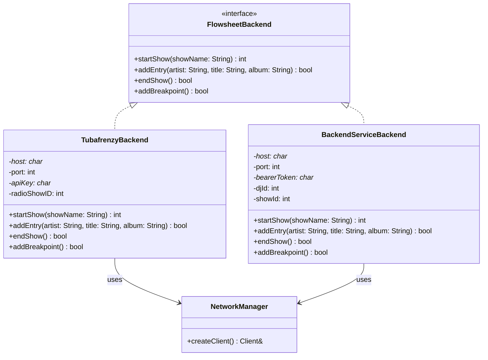

The state machine code calls the `FlowsheetBackend` interface. The config flag determines which implementation is instantiated at boot. Both accept `NetworkManager&` for transport-agnostic HTTP.

### 6.6 Show Lifecycle Differences

| Aspect | tubafrenzy | Backend-Service |
|--------|-----------|----------------|
| **Show ID source** | `radioShowID` from Location header redirect | `Show.id` from JSON response body |
| **Hourly breakpoints** | Server auto-inserts via `autoBreakpoint=true` | Client must explicitly POST `{ "message": "BREAKPOINT" }` |
| **DJ identity** | `djID=0` (string, no DJ table lookup) | `dj_id` is a real integer FK to the DJ table |

The `FlowsheetBackend` interface normalizes these differences:

- **`startShow()`** returns an `int` show ID regardless of source.
- **`addBreakpoint()`** is a no-op in `TubafrenzyBackend` (the server handles it via `autoBreakpoint=true`). In `BackendServiceBackend`, it POSTs the breakpoint entry explicitly.
- The Arduino's `loop()` tracks hour boundaries and calls `addBreakpoint()` when the hour changes. This is harmless for tubafrenzy (no-op) and necessary for Backend-Service.

### 6.7 Testing Strategy

Testing networking code requires injecting fake network responses without real connections. The same `Client&` dependency injection that enables the `NetworkManager` abstraction (Section 7.3) also enables desktop testing with pre-loaded HTTP responses.

#### Arduino-side: FakeClient pattern

The [Phase B.1 DI refactor](https://github.com/WXYC/auto-dj-arduino-switch) introduces a `FakeClient` -- a concrete `Client` subclass that stores a pre-loaded HTTP response buffer and captures all written bytes (the request) for assertion. The real `ArduinoHttpClient` and `ArduinoJson` libraries compile on desktop against a minimal Arduino shim and parse `FakeClient` responses identically to real network responses.

Each protocol in Section 3 maps to specific `FakeClient` test fixtures:

| Protocol (Section) | FakeClient Response | Key Assertions |
|--------------------|--------------------|----------------|
| AzuraCast polling (3.2) | 200 + JSON body with `sh_id`, `song.*`, `live.is_live` | Track change detection, field parsing, `isLiveDJ()` |
| tubafrenzy start show (3.3.1) | 302 + `Location: .../radioShowID=12345` | `radioShowID` extraction from Location header |
| tubafrenzy add entry (3.3.2) | 302 | Request body contains `autoBreakpoint=true`, URL-encoded fields, `X-Auto-DJ-Key` header |
| tubafrenzy end show (3.3.3) | 302 | Request body contains `mode=signoffConfirm` |
| Backend-Service join (3.4.1) | 200 + JSON `{"id": 789, ...}` | `Show.id` extraction from JSON body |
| Backend-Service add entry (3.4.2) | 200 + JSON | Request body is valid `FlowsheetCreateSongFreeform` JSON, `Authorization: Bearer` header |
| Backend-Service end show (3.4.3) | 200 + JSON | Request body contains `dj_id` |
| Backend-Service breakpoint (3.4.4) | 200 + JSON | Request body is `{"message": "BREAKPOINT"}` |
| Mgmt server heartbeat fallback (3.7) | 200 OK | Request body matches `AutoDJHeartbeat` schema |
| Mgmt server command poll (3.7) | 200 + JSON array of commands | Command parsing, ack generation |

The `FakeClient` infrastructure is built once and reused across all Arduino networking tests. Error cases (HTTP 500, malformed JSON, missing fields, timeouts) are tested by loading the appropriate bad response into `FakeClient`.

The `FlowsheetBackend` interface (Section 6.5) enables a second layer of testing: the state machine can be tested against a mock `FlowsheetBackend` without any HTTP parsing at all. This complements the `FakeClient` tests, which verify the HTTP layer in isolation.

#### Arduino-side: WebSocket message testing

The `ManagementClient` module (Section 7.4) serializes heartbeats, acks, and error reports, and deserializes commands and now-playing messages. These tests use a `FakeWebSocket` -- a test double that captures sent frames and plays back pre-loaded received frames, similar to how `FakeClient` works for HTTP.

| Direction | Message Type | Test Focus |
|-----------|-------------|------------|
| Arduino -> Server | `AutoDJHeartbeat` | All fields populated correctly; telemetry counters increment; `config_hash` matches active config; `last_track` is null when no track has been posted |
| Arduino -> Server | `AutoDJAck` | `id` matches the command `id`; `status` reflects actual outcome (`ok`, `error`, `unknown_command`); `error` field populated on failure |
| Arduino -> Server | `AutoDJErrorReport` | `level`/`code`/`module` populated correctly; `count` accumulates repeat errors; `free_ram` matches actual heap query |
| Server -> Arduino | `AutoDJCommand` | Unknown `action` values produce `unknown_command` ack; `set_config` writes to KVStore (mock); `pause`/`resume` update state machine; `restart` triggers reset; string length limits enforced |
| Server -> Arduino | `AutoDJNowPlaying` | `sh_id` change detection (same logic as AzuraCast polling); fields populate the track data used by flowsheet posting; `is_live` flag is surfaced |

Error cases: malformed JSON frames, missing required fields, oversized messages (ArduinoJson memory limits), and connection drops mid-frame.

#### Server-side: HTTP endpoint testing

The management server and Backend-Service endpoints need their own tests, using their native frameworks.

**Backend-Service** (Jest):

| Endpoint | Test Focus |
|----------|-----------|
| `POST /flowsheet/join` | Accepts Auto DJ service account (Bearer PAT); returns `Show` with `id`; rejects expired or invalid tokens |
| `POST /flowsheet` | Accepts `FlowsheetCreateSongFreeform` from Auto DJ; creates `FlowsheetSongEntry` linked to active show; accepts breakpoint message entry (`{"message": "BREAKPOINT"}`) |
| `POST /flowsheet/end` | Ends the Auto DJ's active show; returns `Show` with `end_time` populated |
| `GET /djs` | `is_automation` filter: `?is_automation=false` excludes Auto DJ; `?is_automation=true` returns only Auto DJ; unfiltered returns all |

**tubafrenzy** (JUnit, existing): `isAutoDJRequest()` is already tested. No new server-side tests needed for the Arduino client refactoring -- the server's behavior doesn't change.

#### Server-side: WebSocket and management testing

The management server's WebSocket handling needs dedicated tests that exercise the same message types the Arduino produces and consumes. These are the server's analog to the Arduino's `FakeWebSocket` tests -- but from the opposite direction.

**WebSocket message handling** (Jest or Vitest):

| Scenario | Test Focus |
|----------|-----------|
| **Heartbeat ingestion** | Server receives `AutoDJHeartbeat` JSON -> updates `AutoDJDeviceStatus` -> last heartbeat timestamp updates -> admin API reflects new status |
| **Command delivery** | Admin POSTs `{"action": "pause"}` -> server enqueues `AutoDJCommand` with unique `id` -> command appears on WebSocket as valid `AutoDJCommand` JSON -> `pending_commands` count increments |
| **Ack processing** | Server receives `AutoDJAck` with matching `id` -> command dequeued -> `pending_commands` decrements -> ack with `status: "error"` triggers alert/log |
| **Error report relay** | Server receives `AutoDJErrorReport` -> relayed to Sentry (mock) -> `level: "fatal"` triggers alert |
| **Connection lifecycle** | WebSocket upgrade with valid `X-Auto-DJ-Key` -> accepted; invalid key -> 401; connection drop -> device status changes to `connected: false`; reconnect -> status restores |
| **Stale heartbeat detection** | No heartbeat for >60s -> device marked offline; heartbeat resumes -> device marked online |

**AzuraCast Centrifugo WebSocket parsing** (Arduino-side, GoogleTest):

The Arduino subscribes directly to AzuraCast's Centrifugo WebSocket (Section 3.9). The `AzuraCastClient` must parse both the initial `connect` response and subsequent `pub` messages. These use `FakeWebSocket` with pre-loaded Centrifugo JSON:

| Scenario | Test Focus |
|----------|-----------|
| **Initial connect** | Parse `connect.subs.station:*.publications[0].data.np` -> extract `sh_id`, `artist`, `title`, `album`, `is_live` |
| **Subsequent update** | Parse `pub.data.np` -> same field extraction |
| **Track change detection** | Two messages with different `sh_id` values -> both trigger new track; same `sh_id` -> no trigger |
| **Missing fields** | `null` song fields -> graceful handling (empty strings or skip) |
| **Live DJ flag** | `live.is_live: true` -> `isLiveDJ()` true |
| **Oversized payload** | Centrifugo response exceeding ArduinoJson memory budget -> graceful failure, fall back to HTTP poll |

**Centrifugo relay transform** (management server, Jest or Vitest -- only if relay architecture is used, see Appendix B):

If the direct WebSocket proves impractical and the management server relays now-playing data, the transform from the full Centrifugo payload to the flat `AutoDJNowPlaying` schema (Section 3.6.2) needs its own tests:

| Scenario | Test Focus |
|----------|-----------|
| **Normal transform** | Full AzuraCast now-playing JSON (fixture) -> extract `sh_id`, `artist`, `title`, `album`, `is_live` -> output matches `AutoDJNowPlaying` schema |
| **Missing fields** | AzuraCast JSON with `null` song fields -> graceful handling |
| **Relay to Arduino** | Transformed message sent on WebSocket -> Arduino's `FakeWebSocket` receives valid `AutoDJNowPlaying` |

#### Shared test fixtures: wxyc-shared as the contract

The `api.yaml` schemas (Section 5.2) serve as the contract between Arduino and server. Both sides test against the same type definitions, but from opposite directions.

**How the types flow**:

```
api.yaml (source of truth)
    |
    ├── openapi-generator-cli ──► TypeScript types ──► Management server, Backend-Service, Admin UI
    |                                                   (compile-time type checking)
    |
    ├── Type guards (Section 5.3) ──► isHeartbeat(), isCommand(), etc.
    |                                  (runtime validation in TypeScript)
    |
    └── Manual contract (Section 5.4) ──► Arduino ArduinoJson code
                                          (human-verified against schema)
```

**Canonical JSON fixtures** for each message type should be maintained as shared test data files. Each fixture is the single source of truth for "what does a valid message of this type look like":

| Fixture | Arduino Test Uses It As | Server Test Uses It As |
|---------|------------------------|----------------------|
| `heartbeat.json` | `FakeWebSocket` outbound: assert serialized output matches | Inbound: parse and assert device status updates |
| `command.json` | `FakeWebSocket` inbound: assert parsed fields and side effects | Outbound: assert serialization matches when admin issues command |
| `ack.json` | `FakeWebSocket` outbound: assert serialized output matches | Inbound: assert command dequeue and status tracking |
| `now_playing.json` | `FakeWebSocket` inbound: assert track data extraction | Outbound: assert Centrifugo transform output matches |
| `error_report.json` | `FakeWebSocket` outbound: assert serialized output matches | Inbound: assert Sentry relay and alert logic |

In practice, the Arduino test fixtures live in `test/fixtures/` in the Arduino repo, and the server test fixtures live in the management server's test directory. They are not literally the same files (different repos, different languages), but they **must represent the same JSON shapes**. When a schema changes in `api.yaml`:

1. **TypeScript consumers** get compile errors from generated types (automatic)
2. **Arduino code** must be manually updated (see Section 5.4 contract table)
3. **Test fixtures** on both sides must be updated to match the new schema
4. **Type guards** (Section 5.3) catch runtime mismatches in TypeScript consumers

A CI check in `wxyc-shared` (`scripts/check-breaking-changes.js`) detects breaking schema changes before they reach downstream consumers.

---

## 7. Implementation Roadmap

The phases below are restructured from the [original roadmap](remote-access-roadmap.md). Protocol details, message formats, and credential specs now live in Sections 3-5 and are referenced by section number.

### 7.1 Phase 0: Automatic DST

**No remote infrastructure required.** Firmware-only fix eliminating two manual interventions per year.

Add `isDST(epochSeconds)` implementing the US Eastern time rule:

- DST begins: second Sunday of March at 2:00 AM EST
- DST ends: first Sunday of November at 2:00 AM EDT

Pure function of epoch seconds -- testable on desktop with GoogleTest.

| File | Change |
|------|--------|
| `utils.h` / `utils.cpp` | Add `isDST()`, update `currentHourMs()` offset logic |
| `config.h` | Optionally add `DST_ENABLED` flag (default `true`) |
| `test/test_dst.cpp` | Parameterized boundary tests |

### 7.2 Phase 1: Persistent Storage

**Prerequisite for all remote configuration.** Can be developed in parallel with Phase 2.

Use `KVStore` (TDBStore on QSPI flash) for key-value persistence with wear leveling and power-loss safety.

**Keys to persist**:

| Key | Type | Purpose |
|-----|------|---------|
| `radioShowID` | `int32_t` | Recover in-progress show after power cycle |
| `wifi_ssid` | `char[64]` | Remotely updatable WiFi SSID |
| `wifi_pass` | `char[128]` | Remotely updatable WiFi password |
| `api_key` | `char[128]` | Remotely updatable tubafrenzy API key |
| `poll_interval_ms` | `uint32_t` | Remotely tunable polling interval |
| `utc_offset` | `int32_t` | Manual timezone override |
| `flowsheet_backend` | `uint8_t` | `0` = tubafrenzy, `1` = Backend-Service |
| `backend_service_token` | `char[256]` | Better Auth PAT for Backend-Service |
| `backend_service_dj_id` | `int32_t` | DJ record ID in Backend-Service |

**RuntimeConfig struct** (replaces scattered `#define` usage):

```cpp
struct RuntimeConfig {
    char wifiSsid[64];
    char wifiPass[128];
    char apiKey[128];
    uint32_t pollIntervalMs;
    int32_t utcOffsetSeconds;
    int32_t radioShowID;           // -1 = no active show
    uint8_t flowsheetBackend;      // 0 = TUBAFRENZY, 1 = BACKEND_SERVICE
    char backendServiceToken[256];
    int32_t backendServiceDjId;
};
```

**Architecture**: See the KVStore boot sequence diagram in the [original roadmap](remote-access-roadmap.md#phase-1-persistent-storage).

| File | Change |
|------|--------|
| `config_store.h` / `config_store.cpp` | New module: KVStore wrapper with `load()`, `save(key)`, `reset()` |
| `config.h` | Compile-time values become defaults only |
| `auto-dj-arduino-switch.ino` | Load config at boot; pass `RuntimeConfig` to modules |
| `wifi_manager.h` / `flowsheet_client.h` / `azuracast_client.h` | Accept config struct instead of raw strings |

### 7.3 Phase 2: Ethernet Shield Integration

**Adds the primary network transport.** Can be developed in parallel with Phase 1.

**Hardware**: Arduino Ethernet Shield 2 (W5500, SPI). CS on D10, SPI on D11-D13. No conflicts with existing relay (D2) or LED (D3).

**Software TLS**: `SSLClient` (OPEnSLab-NGO) wraps `EthernetClient` with BearSSL. Drop-in replacement for `WiFiSSLClient`.

**Network abstraction** (`NetworkManager`):

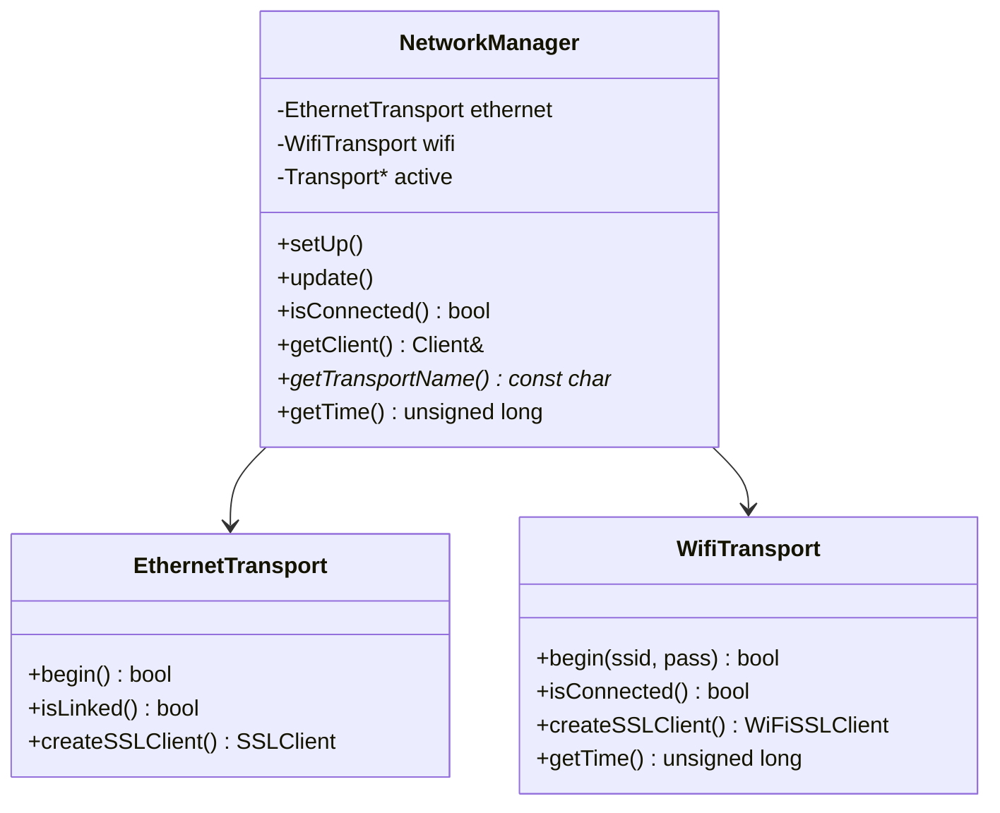

**Failover**: `update()` checks the active transport; if disconnected, tries Ethernet first, then WiFi. See Section 2.2.

**NTP**: See Section 3.5.

**Migrating HTTP clients**: `AzuraCastClient` and `FlowsheetClient` accept `NetworkManager&` instead of creating `WiFiSSLClient` directly. See the [original roadmap](remote-access-roadmap.md#migrating-http-clients) for before/after code.

**Studio prerequisites**: Verify live Ethernet jack, register MAC with UNC ITS, confirm outbound port 443 access on wired VLAN.

| File | Change |
|------|--------|
| `network_manager.h` / `network_manager.cpp` | New: dual-transport manager with failover |
| `ethernet_transport.h` / `ethernet_transport.cpp` | New: W5500 + SSLClient setup |
| `wifi_manager.h` / `wifi_manager.cpp` | Refactor into `wifi_transport.h/.cpp` |
| `azuracast_client.h/.cpp` | Accept `NetworkManager&` |
| `flowsheet_client.h/.cpp` | Accept `NetworkManager&` |
| `auto-dj-arduino-switch.ino` | Replace `WifiManager` with `NetworkManager` |
| `config.h` | Add `ETHERNET_CS_PIN`, `ETHERNET_MAC` defaults |

### 7.4 Phase 3: WebSocket Management + AzuraCast Relay

**Depends on Phases 1 + 2.** Adds real-time remote visibility and control.

**Arduino-side `ManagementClient`**:

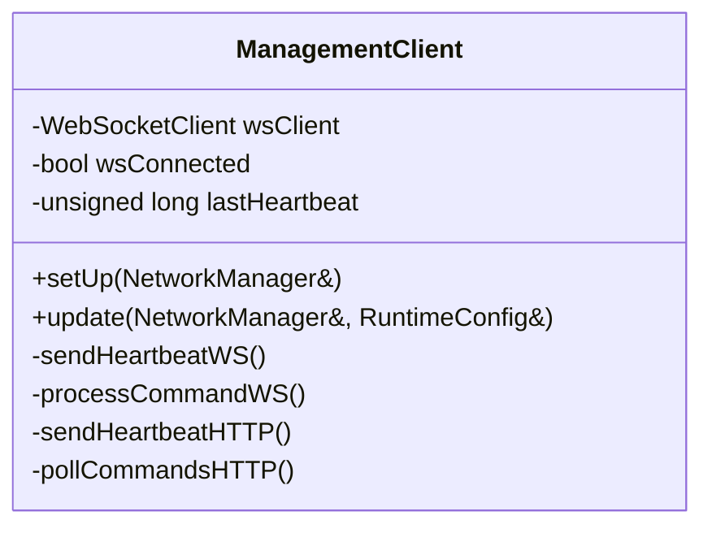

`update()` checks the active transport:
- **Ethernet**: Maintain WebSocket connection. `wsClient.poll()` (non-blocking) for commands. Heartbeats every 30s.
- **WiFi**: Per-call HTTPS. POST heartbeat + GET commands every 60s.

**Protocol**: See Section 3.6 (WebSocket), Section 3.7 (HTTP fallback), Section 3.8 (server endpoints).

**Message types**: See Section 3.6.2 and Section 5.2 (OpenAPI schemas).

**AzuraCast now-playing**: The Arduino subscribes directly to AzuraCast's Centrifugo WebSocket over Ethernet and falls back to HTTP polling over WiFi. See Section 3.9. This is independent of the management server -- the now-playing feed and the management channel are separate WebSocket connections.

**`loop()` integration**:

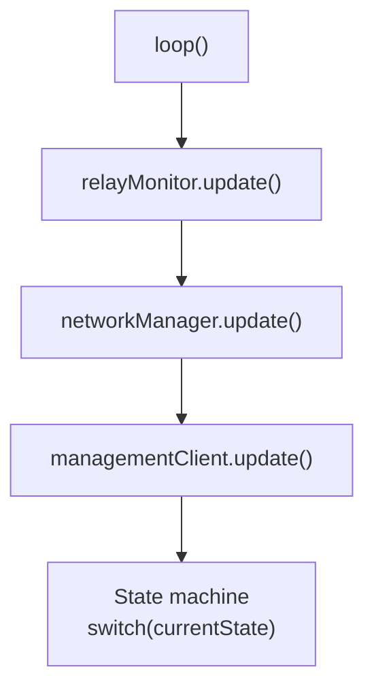

| Component | Change |
|-----------|--------|
| **Arduino** | New `management_client.h/.cpp` |
| **Server** | WebSocket endpoint, HTTP fallback endpoints, command queue, admin API |
| **Arduino libraries** | Add `ArduinoWebsockets` (Gil Maimon) or equivalent |

### 7.5 Phase 4: Remote Credential Rotation

**Depends on Phase 3.** With Ethernet as the primary transport, the urgency is reduced -- WiFi password is only used by the fallback.

| Credential | Before (WiFi-only) | After (Ethernet primary) |
|-----------|--------------------|-----------------------|
| `wifi_pass` | **Critical.** Annual rotation bricks the device. | **Low urgency.** Only affects fallback transport. |
| `api_key` | Critical. | **Still critical.** Used for flowsheet writes and management auth. |
| `backend_service_token` | N/A | **Moderate.** Can be rotated via management server push. |

**Protocol**: See Sections 4.6 (rotation protocol) and 4.7 (fallback and recovery).

### 7.6 Phase 5: OTA Firmware Updates

**Depends on Phases 1 + 3.** For changes that can't be expressed as config updates.

1. Firmware binary (`.bin`) hosted at a known URL (GitHub Releases, S3, or static file).
2. Version manifest at a known URL with version number, binary URL, and SHA-256 hash.
3. Arduino checks manifest on command (`check_update`) or on a periodic schedule.
4. If newer, downloads binary to QSPI flash (staging area), verifies SHA-256, writes to boot flash.
5. Reboot.

**Safeguards**: SHA-256 verification, version check, QSPI staging, dual-bank boot (if supported), watchdog timer, Ethernet-only downloads, rollback command.

See the [original roadmap](remote-access-roadmap.md#phase-5-pull-based-ota-firmware-updates) for the full sequence diagram and safeguard details.

### 7.7 Phase Summary

Phases 1 and 2 are independent and can be developed in parallel. Phase 3 depends on both. Phases 4 and 5 build on Phase 3.

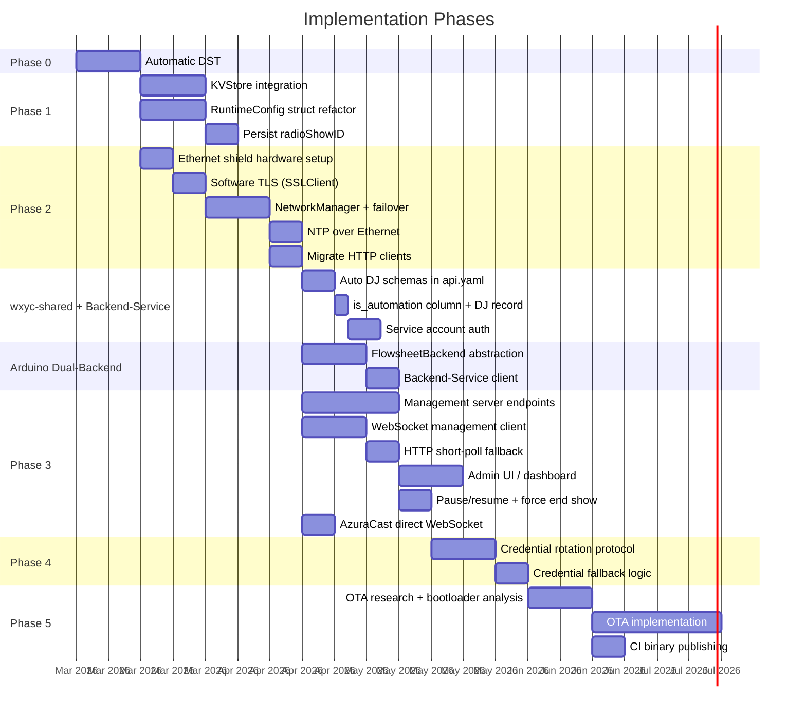

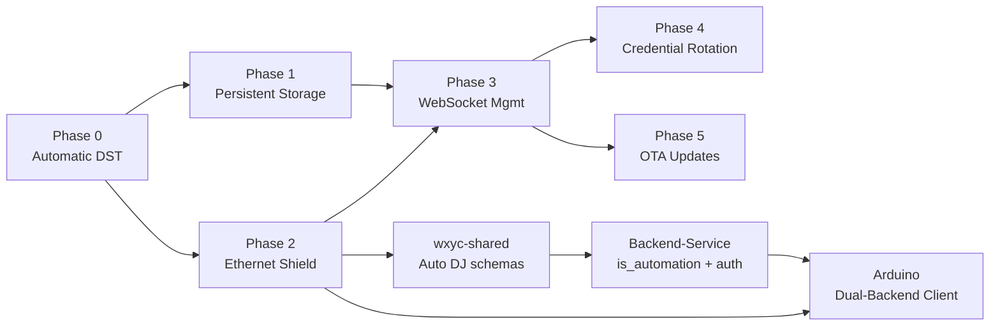

| Phase | Outcome | Depends on |
|-------|---------|-----------|
| **0: Automatic DST** | Correct timestamps year-round, no manual intervention | Nothing |
| **1: Persistent Storage** | Survive power cycles; runtime config struct replaces `#define` soup | Phase 0 (should land first, but no hard dependency) |
| **2: Ethernet Shield** | Stable primary transport; WiFi becomes fallback; network abstraction layer | Phase 0 (should land first, but no hard dependency) |
| **wxyc-shared schemas** | Auto DJ types in `api.yaml`; `@wxyc/shared/auto-dj` entry point | Phase 2 (needs network abstraction for dual-backend) |
| **Backend-Service setup** | `is_automation` column, Auto DJ DJ record, service account auth | wxyc-shared schemas |
| **Arduino dual-backend** | `FlowsheetBackend` abstraction; Backend-Service client | Phase 2 + Backend-Service setup |
| **3: WebSocket Management** | Real-time remote visibility and control | Phases 1 + 2 |
| **4: Credential Rotation** | Remotely update credentials without reflashing | Phase 3 |
| **5: OTA Updates** | Remotely deploy new firmware over Ethernet | Phases 1 + 3 |

---

## 8. Open Questions

### From the original roadmap

1. **Studio Ethernet jack:** Is there a live Ethernet jack in the WXYC studio? If not, request activation from UNC ITS. Hard prerequisite for Phase 2.

2. **Ethernet VLAN firewall rules:** Does the wired campus VLAN allow persistent outbound TCP on port 443? Does it have longer NAT idle timeouts than UNC-PSK WiFi? Affects WebSocket viability.

3. **Server choice:** With WebSocket in the picture, Backend-Service (Express/Node.js) is a more natural fit than tubafrenzy (Java 8/Tomcat). Alternatively, a standalone lightweight service (Hono or Fastify on Railway) could host just the management endpoints. See Appendix A.

4. **Admin UI scope:** A full dashboard, or just an API that station managers can query via `curl` / a simple status page? Initial implementation should be minimal.

5. **Heartbeat storage:** How long to retain heartbeat history? A rolling window (e.g., 7 days) is sufficient for debugging.

6. **KVStore vs. LittleFS:** Mbed OS offers both. KVStore is simpler (flat key-value), LittleFS is a full filesystem. KVStore is sufficient unless Phase 5 needs a filesystem for QSPI staging.

7. **Giga R1 OTA bootloader support:** Does the Arduino Mbed OS GIGA board package support dual-bank booting and safe firmware swaps? Hardware research needed before Phase 5.

8. **SSLClient trust anchors:** BearSSL requires compiled-in root CA certificates. Which CAs sign the certs for `remote.wxyc.org`, `www.wxyc.info`, and the management server?

### New questions

9. **Centrifugo channel name:** The channel format is `station:<shortcode>` where the shortcode is the station's URL-safe identifier in AzuraCast ([source](https://www.azuracast.com/docs/developers/now-playing-data/)). For WXYC this is likely `station:main` or `station:wxyc` -- verify by inspecting the AzuraCast admin panel or the station's shortcode in the API response at `/api/stations`. **Partially resolved**: format confirmed, exact shortcode needs verification.

10. ~~**Centrifugo authentication:**~~ **Resolved.** The now-playing WebSocket endpoint (`/api/live/nowplaying/websocket`) is public -- no authentication token is required ([source](https://www.azuracast.com/docs/developers/now-playing-data/)). The Arduino subscribes by sending `{"subs": {"station:<shortcode>": {}}}` after connecting. This eliminates the need for the management server as a relay for the now-playing feed. See Section 3.9.

11. **Centrifugo reconnection:** The Arduino must handle WebSocket reconnection itself (the `ArduinoWebsockets` library does not have built-in reconnection with backoff). Implement exponential backoff in the `AzuraCastClient` -- e.g., 1s, 2s, 4s, 8s, capped at 60s. During reconnection, fall back to HTTP polling. The `recover: true` subscription flag tells Centrifugo to replay missed messages on reconnect ([source](https://gist.github.com/Moonbase59/d42f411e10aff6dc58694699010307aa)).

12. **Backend-Service `show_id` tracking:** Does Backend-Service track the active show per DJ internally (so the Arduino doesn't need to pass `show_id` on every `POST /flowsheet` call), or does the Arduino need to include it? The current `api.yaml` schema for `FlowsheetCreateSongFreeform` does not include `show_id`, which suggests the server tracks it.

13. ~~**Backend-Service `autoBreakpoint` equivalent**~~: **Resolved.** Backend-Service supports `entry_type: 'breakpoint'` (type code 8, "hour marker") but has no automatic insertion like tubafrenzy's `autoBreakpoint=true`. When targeting Backend-Service, the Arduino must explicitly POST a breakpoint entry at the top of each hour. Section 6.6 documents this.

14. ~~**wxyc-shared entry point**~~: **Decided** -- new entry point `@wxyc/shared/auto-dj`. Keeps import footprint small for consumers that don't need Auto DJ types. Requires a new entry in `tsup.config.ts` and `package.json` exports.

15. ~~**AsyncAPI**~~: **Decided** -- OpenAPI component schemas only. Protocol direction and lifecycle documented in prose with Mermaid sequence diagrams (Section 3.6). No AsyncAPI spec needed.

16. **`is_automation` flag in mobile apps:** The `is_automation` column on `DJ`/`NewDJ` in `api.yaml` will propagate to Swift (wxyc-ios-64) and Kotlin (WXYC-Android) via existing code generation. A follow-up PR to each mobile app is needed to handle this field (e.g., filtering Auto DJ from DJ lists). Track as a separate task.

---

## Appendix A: Server Choice Analysis

| | tubafrenzy | Backend-Service | Standalone (Hono/Fastify) |
|--|-----------|----------------|--------------------------|
| **WebSocket support** | Possible via Tomcat 9's JSR 356, but no existing WebSocket usage | Native with `ws` package; Express is already async | Native; lightweight |
| **Auth** | `X-Auto-DJ-Key` already checked | Better Auth for admin; can add API key check for Arduino | Needs its own auth |
| **Centrifugo client** | Java client exists (`centrifuge-java`) | `centrifuge-js` works in Node.js | `centrifuge-js` works in Node.js |
| **Pro** | Already the Arduino's primary target | Actively maintained; modern stack; WebSocket is natural fit | Decoupled; independently deployable |
| **Con** | Legacy Java 8; WebSocket in a JSP app is awkward | Arduino would need a second server dependency | Another service to deploy and maintain |
| **Deployment** | Kattare shared hosting (limited) | EC2 (existing) | Railway (easy, but another bill) |

**Conclusion**: Backend-Service is the strongest candidate. WebSocket is idiomatic in Node.js, Better Auth provides admin authentication, and the service is already deployed on EC2 with CI/CD. A standalone service on Railway is a reasonable alternative if the management concern should remain decoupled from the flowsheet API.

## Appendix B: AzuraCast Centrifugo Integration Details

AzuraCast embeds [Centrifugo](https://centrifugal.dev/) for real-time updates. It exposes two public endpoints for now-playing data ([source](https://www.azuracast.com/docs/developers/now-playing-data/)):

| Protocol | Endpoint | Direction |
|----------|---------|-----------|
| **WebSocket** | `wss://<host>/api/live/nowplaying/websocket` | Bidirectional (subscribe + receive) |
| **SSE** | `https://<host>/api/live/nowplaying/sse?cf_connect=<JSON>` | Server -> client only |

The Arduino uses the WebSocket endpoint (Section 3.9). SSE is not suitable for Arduino (no `EventSource` API).

### Protocol Details

**Subscription format** ([source](https://www.azuracast.com/docs/developers/now-playing-data/)):

```json
{"subs": {"station:<shortcode>": {"recover": true}}}
```

The `recover: true` flag enables Centrifugo's [history recovery](https://centrifugal.dev/docs/server/history_and_recovery) -- on reconnect, the server replays messages missed during the disconnection window.

**Initial data on connect**: Centrifugo sends cached publications immediately on subscription. The `connect` message includes the current now-playing state, so the Arduino has accurate data from the moment of connection -- no need to wait for the next track change or make a separate HTTP request ([source](https://gist.github.com/Moonbase59/d42f411e10aff6dc58694699010307aa)).

**Channel naming**: The channel format is `station:<shortcode>` where the shortcode is the station's URL-safe identifier in AzuraCast. For WXYC, this needs to be verified by inspecting the AzuraCast admin panel or querying `/api/stations` (see Open Question 9).

**Authentication**: The now-playing WebSocket endpoint is public. No JWT token, API key, or other authentication is required.

**Centrifugo version note**: AzuraCast updated to Centrifugo v5 in early 2024, which changed the SSE/WebSocket message format. The current format sends initial cached publications in the `connect` response. Older AzuraCast installations may use a different format. The examples in this document and in Section 3.9 reflect the current (post-2024) format.

### Relay Alternative

If the direct WebSocket connection (Section 3.9) proves impractical -- for example, if the Centrifugo payload exceeds ArduinoJson's memory budget, or if reconnection logic is too complex for the Arduino -- the management server can act as a relay:

1. Management server subscribes to `station:<shortcode>` using `centrifuge-js` (works in Node.js) or a [Go/Python Centrifugo client](https://centrifugal.dev/docs/transports/client_api).
2. Management server extracts `sh_id`, `artist`, `title`, `album`, `is_live` from the full payload.
3. Management server sends a flat `AutoDJNowPlaying` message (~200 bytes) to the Arduino over the management WebSocket (Section 3.6.2).

This adds a dependency on the management server (Phase 3) and an extra network hop, but guarantees a small, predictable payload for the Arduino to parse. The decision between direct and relay can be deferred until Phase 2 implementation, when the actual Centrifugo payload size from `remote.wxyc.org` can be measured.
