# Networking Specification

This document specifies all network communication for WXYC's auto-DJ system -- how auto-DJ entries flow from AzuraCast through the [auto-DJ orchestrator](https://github.com/WXYC/auto-dj-orchestrator) to the flowsheet, how DJs activate and deactivate auto-DJ mode, and how the optional Arduino relay reporter fits in.

## 1. Overview

### 1.1 Purpose

WXYC's auto-DJ system bridges AzuraCast (the streaming/auto-DJ software) with the station's flowsheet. When no human DJ is on air, AzuraCast plays tracks automatically. This system detects those tracks and logs them to the flowsheet so the station's playlist archive stays complete.

A **standalone auto-DJ orchestrator service** subscribes to AzuraCast's now-playing feed and writes entries to the flowsheet. A `FLOWSHEET_BACKEND` flag determines the target: when set to `BACKEND_SERVICE`, it writes to Backend-Service's API and mirrors to tubafrenzy; when set to `TUBAFRENZY`, it writes to tubafrenzy only. A **virtual switch in dj-site** lets DJs activate and deactivate auto-DJ mode with explicit human confirmation. The **Arduino** remains relevant as an optional relay state reporter and management target, but it no longer makes flowsheet decisions or polls AzuraCast directly.

This document is the single source of truth for all network traffic in this system.

### 1.2 Problem Statement

The original design positioned the Arduino as the central decision-maker: it detected the AUX relay state, polled AzuraCast for now-playing data, and wrote entries to the flowsheet. Team feedback identified fundamental problems with this approach:

1. **The relay is not reliable ground truth.** The AUX channel being on could mean auto-DJ, a remote DJ, or someone's laptop. The relay signal is advisory, not authoritative.

2. **Business logic should move off-device.** AzuraCast polling and flowsheet writing are server-side concerns. Running them on a microcontroller with limited debugging, no persistent storage (at Phase 0), and constrained networking adds fragility without benefit.

3. **Human affirmation is required.** Auto-DJ entries should only be published with positive human confirmation -- a DJ explicitly activating auto-DJ mode via a virtual switch in dj-site. The relay alone cannot provide this.

4. **The device scope should narrow.** The Arduino should report relay state (an advisory signal) and remain a management target for remote administration, not decide what to write to the flowsheet.

5. **tubafrenzy must still be supported.** During the migration, entries must reach both the PostgreSQL database (Backend-Service) and tubafrenzy's MySQL database.

This revision relocates auto-DJ logic to the auto-DJ orchestrator and introduces a virtual switch in dj-site, while preserving the Arduino's role as an optional hardware sensor and management target.

### 1.3 Document Scope

This document covers:

- The auto-DJ orchestrator (AzuraCast subscription, flowsheet pipeline, mirror to tubafrenzy)
- The virtual switch activation flow (dj-site → orchestrator)
- Conflict resolution between auto-DJ and live DJs
- The auto-DJ system user identity and authentication
- Arduino relay state reporting and device management (optional)
- Shared type contracts via [`wxyc-shared`](https://github.com/WXYC/wxyc-shared) (`api.yaml`)
- The management server protocol for Arduino administration (WebSocket + HTTP fallback)
- AzuraCast real-time now-playing via Centrifugo WebSocket and HTTP polling fallback
- Implementation phases

Related documents:

| Document | Scope |
|----------|-------|
| [remote-administration.md](remote-administration.md) | Parameter inventory: every configurable value on the Arduino, its current default, and why it might change |
| [wiring.md](wiring.md) | Hardware wiring: relay, LED, pin assignments |

### 1.4 Terminology

| Term | Definition |
|------|-----------|
| **tubafrenzy** | The legacy Java/Tomcat flowsheet system at `www.wxyc.info`. Form-encoded API, 302 redirect responses, `radioShowID` extracted from the Location header. |
| **Backend-Service** | The new Express/Node.js API at `api.wxyc.org`. JSON API, 200 JSON responses, `Show.id` from the response body. Uses [Better Auth](https://www.better-auth.com/) for authentication. |
| **auto-DJ orchestrator** | A [standalone service](https://github.com/WXYC/auto-dj-orchestrator) that subscribes to AzuraCast, detects track changes, and writes flowsheet entries. A `FLOWSHEET_BACKEND` flag determines the target: `BACKEND_SERVICE` (write to Backend-Service API + mirror to tubafrenzy) or `TUBAFRENZY` (write to tubafrenzy API only). Deployed independently (e.g., Railway). Also hosts the Arduino management server. |
| **virtual switch** | A toggle in dj-site that lets DJs activate or deactivate auto-DJ mode. Requires explicit human confirmation. Calls the orchestrator's activation API. |
| **mirror** | When `FLOWSHEET_BACKEND=BACKEND_SERVICE`, the orchestrator writes to Backend-Service's API and also mirrors entries to tubafrenzy so the legacy database stays complete. When `FLOWSHEET_BACKEND=TUBAFRENZY`, entries go to tubafrenzy only. |
| **AzuraCast** | The auto DJ and streaming software at `remote.wxyc.org`. Provides a now-playing API. |
| **Centrifugo** | The real-time messaging server embedded in AzuraCast. Publishes now-playing updates over WebSocket. |
| **management server** | The component within the auto-DJ orchestrator that hosts the WebSocket management channel, heartbeat endpoints, and admin API for Arduino device management. |
| **flowsheet** | The station's playback log -- a record of every song played during a show. |
| **`sh_id`** | AzuraCast's song history ID. A monotonically increasing integer unique per play event. Used to detect track changes. |
| **`radioShowID`** | tubafrenzy's show identifier. An integer extracted from the Location header after starting a show. |
| **`Show.id`** | Backend-Service's show identifier. An integer returned in the JSON response body after joining a show. |
| **auto-DJ system user** | A dedicated Better Auth user account (`auto-dj@wxyc.org`, role: `dj`) that represents the auto-DJ automation. Used as `primary_dj_id` on auto-DJ shows. |
| **relay state** | The physical state of the AUX relay contact on the mixing board. An advisory signal reported by the Arduino -- not authoritative for auto-DJ activation. |

---

## 2. System Architecture

### 2.1 Network Topology

The auto-DJ orchestrator is a standalone service that subscribes to AzuraCast for now-playing data and writes entries to the flowsheet. A `FLOWSHEET_BACKEND` flag determines the target: when set to `BACKEND_SERVICE`, it writes to Backend-Service's API and mirrors to tubafrenzy; when set to `TUBAFRENZY`, it writes to tubafrenzy only. The orchestrator also hosts the Arduino management server. The Arduino is an optional relay state reporter.

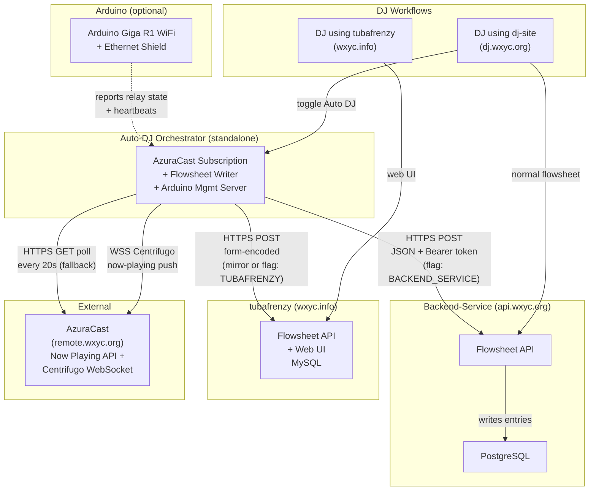
```mermaid
flowchart TD
    subgraph DJs["DJ Workflows"]
        DJ1["DJ using dj-site<br>(dj.wxyc.org)"]
        DJ2["DJ using tubafrenzy<br>(wxyc.info)"]
    end

    subgraph Orchestrator["Auto-DJ Orchestrator (standalone)"]
        ORCH["AzuraCast Subscription<br>+ Flowsheet Writer<br>+ Arduino Mgmt Server"]
    end

    subgraph Backend["Backend-Service (api.wxyc.org)"]
        API["Flowsheet API"]
        PG["PostgreSQL"]
    end

    subgraph Legacy["tubafrenzy (wxyc.info)"]
        TF["Flowsheet API<br>+ Web UI<br>MySQL"]
    end

    subgraph External["External"]
        AZ["AzuraCast<br>(remote.wxyc.org)<br>Now Playing API +<br>Centrifugo WebSocket"]
    end

    subgraph Device["Arduino (optional)"]
        ARD["Arduino Giga R1 WiFi<br>+ Ethernet Shield"]
    end

    DJ1 -->|"toggle Auto DJ"| ORCH
    DJ1 -->|"normal flowsheet"| API
    DJ2 -->|"web UI"| TF
    API -->|"writes entries"| PG

    ORCH -->|"WSS Centrifugo<br>now-playing push"| AZ
    ORCH -->|"HTTPS GET poll<br>every 20s (fallback)"| AZ
    ORCH -->|"HTTPS POST<br>JSON + Bearer token<br>(flag: BACKEND_SERVICE)"| API
    ORCH -->|"HTTPS POST<br>form-encoded<br>(mirror or flag: TUBAFRENZY)"| TF

    ARD -.->|"reports relay state<br>+ heartbeats"| ORCH
```

Dashed lines indicate optional connections. The Arduino is not required for auto-DJ operation -- the virtual switch in dj-site is the authoritative activation mechanism.

### 2.2 Virtual Switch Activation

Auto-DJ mode is activated and deactivated by DJs using a virtual switch in dj-site. This replaces the original design where the Arduino's relay detection was the trigger.

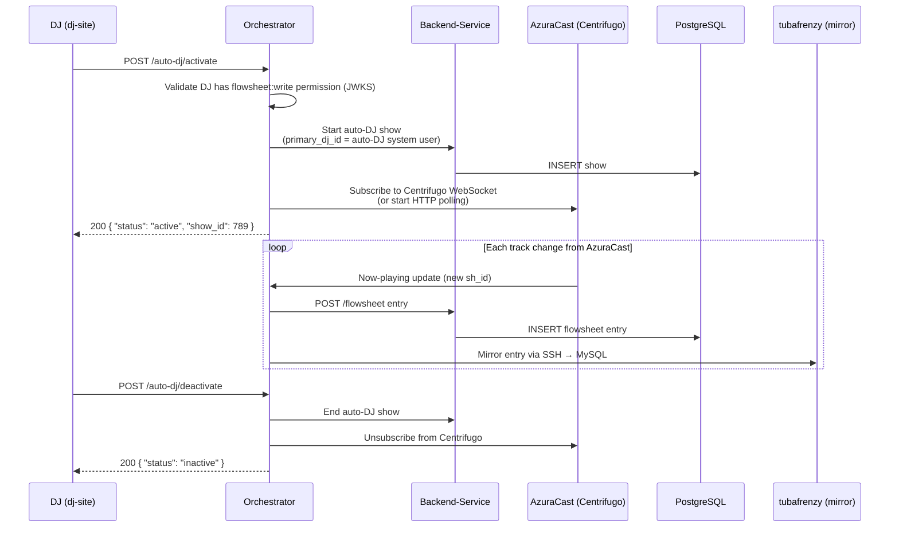
```mermaid
sequenceDiagram
    participant DJ as DJ (dj-site)
    participant Orch as Orchestrator
    participant BS as Backend-Service
    participant AZ as AzuraCast (Centrifugo)
    participant PG as PostgreSQL
    participant TF as tubafrenzy (mirror)

    DJ->>Orch: POST /auto-dj/activate
    Orch->>Orch: Validate DJ has flowsheet:write permission (JWKS)
    Orch->>BS: Start auto-DJ show<br>(primary_dj_id = auto-DJ system user)
    BS->>PG: INSERT show
    Orch->>AZ: Subscribe to Centrifugo WebSocket<br>(or start HTTP polling)
    Orch-->>DJ: 200 { "status": "active", "show_id": 789 }

    loop Each track change from AzuraCast
        AZ->>Orch: Now-playing update (new sh_id)
        Orch->>BS: POST /flowsheet entry
        BS->>PG: INSERT flowsheet entry
        Orch->>TF: Mirror entry via SSH → MySQL
    end

    DJ->>Orch: POST /auto-dj/deactivate
    Orch->>BS: End auto-DJ show
    Orch->>AZ: Unsubscribe from Centrifugo
    Orch-->>DJ: 200 { "status": "inactive" }
```

**Activation flow**:

1. DJ clicks the auto-DJ toggle in dj-site.
2. dj-site sends `POST /auto-dj/activate` to the orchestrator.
3. The orchestrator validates that the DJ has `flowsheet:write` permission (via Backend-Service's JWKS endpoint).
4. The orchestrator starts an auto-DJ show using the auto-DJ system user as `primary_dj_id`.
5. The orchestrator subscribes to AzuraCast's Centrifugo WebSocket (primary) or starts HTTP polling (fallback).
6. Track changes flow through the flowsheet pipeline: PostgreSQL write + tubafrenzy mirror.

**Deactivation flow**:

1. DJ clicks the toggle again (or a live DJ starts a regular show).
2. dj-site sends `POST /auto-dj/deactivate`.
3. The orchestrator ends the auto-DJ show, unsubscribes from AzuraCast.

**Why human affirmation**: The relay being on does not mean auto-DJ should be active. A remote DJ, a guest with a laptop, or a test signal could all activate the AUX channel. Only a positive human action -- clicking the toggle -- should start publishing entries to the flowsheet.

See [Section 3.4](#34-auto-dj-activation-api) for the full API specification.

### 2.3 Conflict Resolution

When a live DJ starts a show, auto-DJ must deactivate. Multiple safeguards prevent conflicting shows:

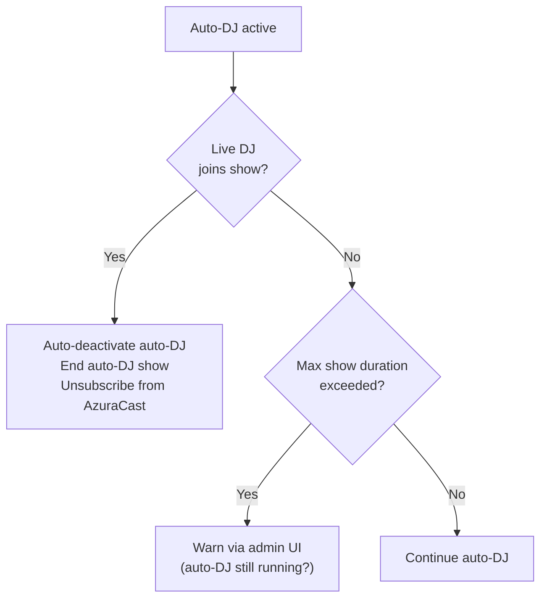
```mermaid
flowchart TD
    AutoDJ["Auto-DJ active"] --> LiveDJ{"Live DJ<br>joins show?"}
    LiveDJ -- Yes --> Deactivate["Auto-deactivate auto-DJ<br>End auto-DJ show<br>Unsubscribe from AzuraCast"]
    LiveDJ -- No --> Timeout{"Max show duration<br>exceeded?"}
    Timeout -- Yes --> Warn["Warn via admin UI<br>(auto-DJ still running?)"]
    Timeout -- No --> Continue["Continue auto-DJ"]
```

| Scenario | Behavior |
|----------|----------|
| **DJ starts a show via dj-site** | `POST /flowsheet/join` detects active auto-DJ show. The orchestrator auto-deactivates auto-DJ (ends show, unsubscribes from AzuraCast) before starting the DJ's show. |
| **DJ starts a show via tubafrenzy** | The mirror middleware detects the new show in tubafrenzy and triggers auto-DJ deactivation in the orchestrator. |
| **Max show duration** | If auto-DJ runs longer than a configurable maximum (e.g., 12 hours), the orchestrator emits a warning to the admin UI. This catches orphaned auto-DJ sessions. Auto-DJ is **not** auto-terminated -- the warning prompts a human to investigate. |
| **Orchestrator restart** | On startup, the orchestrator checks for an orphaned auto-DJ show (active show with `primary_dj_id` = auto-DJ system user, no recent track activity). If found, it either resumes the AzuraCast subscription or ends the stale show, depending on how long it has been inactive. |
| **Simultaneous activation** | `POST /auto-dj/activate` is idempotent. If auto-DJ is already active, the endpoint returns the current status without starting a second subscription. |

### 2.4 Auto-DJ System Identity

The auto-DJ system operates as a dedicated Better Auth user account, not an anonymous or special-cased entity. This means auto-DJ entries flow through the same flowsheet pipeline as human DJ entries -- no separate code paths.

| Property | Value |
|----------|-------|
| **Email** | `auto-dj@wxyc.org` |
| **Role** | `dj` (grants `flowsheet:write` permission) |
| **DJ name** | `Auto DJ` |
| **`is_automation`** | `true` (distinguishes automation from human DJs in admin UIs and mobile apps) |
| **Auth mechanism** | Personal Access Token (PAT) via Better Auth's bearer plugin, used by the orchestrator when targeting Backend-Service |

The auto-DJ system user is created once by an admin ([Section 4.3](#43-auto-dj-system-identity-set-up)). The auto-DJ orchestrator uses this identity when calling the flowsheet API internally -- it goes through the same validation and authorization as any DJ.

### 2.5 AzuraCast Now-Playing Subscription

AzuraCast is the auto DJ and streaming software at `remote.wxyc.org`. Its role in the revised architecture is unchanged: it answers *what song is playing right now?* What changes is the **consumer** -- the orchestrator subscribes to AzuraCast instead of the Arduino.

AzuraCast exposes now-playing data through two interfaces. The orchestrator uses both as mutually exclusive modes:

| Interface | Protocol | Endpoint | Latency | Status |
|-----------|----------|----------|---------|--------|
| **Centrifugo WebSocket** | WSS | `/api/live/nowplaying/websocket` | Near-real-time (push) | Primary |
| **Static HTTP** | HTTPS GET | `/api/nowplaying_static/main.json` | Up to 20s (poll interval) | Fallback |

Both interfaces are **public** -- no authentication required. Both return the same logical data (`sh_id`, `artist`, `title`, `album`, `is_live`).

**Dual-mode strategy**:

- **Centrifugo WebSocket** (primary): The orchestrator subscribes via `centrifuge-js` (the official Centrifugo JavaScript client for Node.js). Track updates arrive in near-real-time. A 60-second safety-net HTTP poll catches any missed messages.
- **HTTP polling** (fallback): If the WebSocket connection cannot be established or is lost, the orchestrator falls back to polling the static HTTP endpoint every 20 seconds. This uses a simple `fetch` call with no persistent connections.

The orchestrator activates the subscription when `POST /auto-dj/activate` is called and tears it down on deactivation. While inactive, the orchestrator makes no AzuraCast requests.

**Track change detection**: Compare `sh_id` to the previous value. If different, a new track is playing. Same logic as the original Arduino implementation, now running server-side.

**`is_live` flag**: When `live.is_live` is `true`, AzuraCast reports that a live DJ is streaming. The orchestrator treats this as an advisory signal -- it does not auto-deactivate based on this flag alone, since `is_live` reflects AzuraCast's streamer state, not the flowsheet's show state.

See [Section 3.2](#32-azuracast-now-playing-http-polling) for the HTTP polling protocol and [Section 3.3](#33-azuracast-centrifugo-websocket) for the Centrifugo WebSocket protocol.

### 2.6 Dual-Database Architecture

The orchestrator supports both flowsheet backends. A `FLOWSHEET_BACKEND` config flag determines the target:

| Flag | Primary target | Mirror target | Description |
|------|---------------|---------------|-------------|
| `BACKEND_SERVICE` | Backend-Service API → PostgreSQL | tubafrenzy API → MySQL | Write to Backend-Service; also mirror to tubafrenzy so the legacy database stays complete |
| `TUBAFRENZY` | tubafrenzy API → MySQL | (none) | Write to tubafrenzy only (current production behavior, minus the Arduino) |

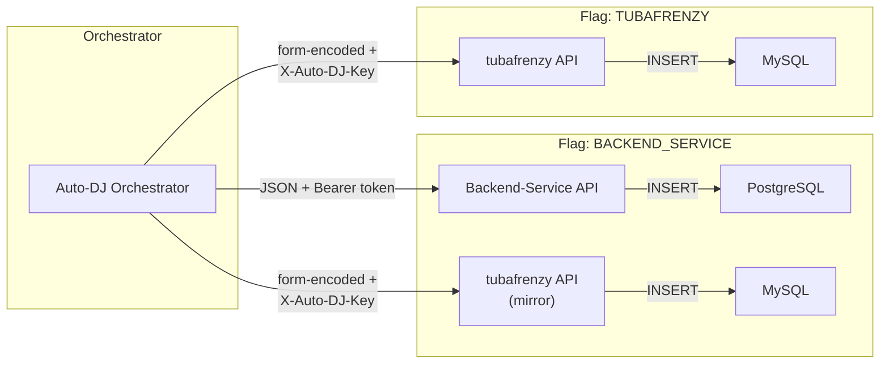
```mermaid
flowchart LR
    subgraph Orchestrator
        ORCH["Auto-DJ Orchestrator"]
    end

    subgraph BS_Mode["Flag: BACKEND_SERVICE"]
        BS_API["Backend-Service API"] -->|"INSERT"| PG["PostgreSQL"]
        TF_MIRROR["tubafrenzy API<br>(mirror)"] -->|"INSERT"| TF_DB1["MySQL"]
    end

    subgraph TF_Mode["Flag: TUBAFRENZY"]
        TF_API["tubafrenzy API"] -->|"INSERT"| TF_DB2["MySQL"]
    end

    ORCH -->|"JSON + Bearer token"| BS_API
    ORCH -->|"form-encoded +<br>X-Auto-DJ-Key"| TF_MIRROR
    ORCH -->|"form-encoded +<br>X-Auto-DJ-Key"| TF_API
```

| | Backend-Service | tubafrenzy |
|--|----------------|-----------|
| **Content type** | `application/json` | `application/x-www-form-urlencoded` |
| **Auth** | `Authorization: Bearer <PAT>` | `X-Auto-DJ-Key` header |
| **Start show** | `POST /flowsheet/join` → 200 JSON | `POST /playlists/startRadioShow` → 302 |
| **Add entry** | `POST /flowsheet` → 200 JSON | `POST /playlists/flowsheetEntryAdd` → 302 |
| **End show** | `POST /flowsheet/end` → 200 JSON | `POST /playlists/finishRadioShow` → 302 |
| **Breakpoints** | Orchestrator inserts explicit breakpoint entries at hour boundaries | `autoBreakpoint=true` lets the server handle breakpoints |
| **DJ identity** | Auto-DJ system user (`dj_id` from DJ table) | `djID=0` (tubafrenzy convention) |

The Arduino no longer writes to either database. All flowsheet writes go through the orchestrator.

### 2.7 Arduino Device Role

The Arduino's role is narrowed from the original design. It is now an **optional relay state reporter** and a **management target** for remote administration. It does not poll AzuraCast, write to the flowsheet, or make auto-DJ decisions.

| Responsibility | Before (original design) | After (revised) |
|----------------|------------------------|-----------------|
| **Detect relay state** | Primary trigger for auto-DJ activation | Advisory signal reported to the orchestrator |
| **Poll AzuraCast** | Arduino polls HTTP / subscribes to Centrifugo | Orchestrator subscribes |
| **Write flowsheet entries** | Arduino POSTs to tubafrenzy / Backend-Service | Orchestrator writes (Arduino does not) |
| **Start/end shows** | Arduino manages show lifecycle | Orchestrator manages show lifecycle (via Backend-Service API) |
| **Remote management** | Planned (heartbeats, commands) | Unchanged -- Arduino reports status, accepts commands |

**What the Arduino still does**:

1. **Reports relay state**: Sends the current AUX relay contact state to the orchestrator as an advisory signal (`POST /api/auto-dj/relay-state`). This can inform the admin UI (e.g., "relay is on but auto-DJ is not active -- someone may be in the studio") but does not trigger auto-DJ activation.
2. **Accepts management commands**: Heartbeats, config updates (`set_config`), `restart`, and `ping` via the management server ([Section 2.8](#28-management-server)).
3. **Runs LED indicators**: Shows the current state (relay on/off, network status) on the studio hardware.

**When the Arduino is unavailable**: The auto-DJ system functions normally without the Arduino. DJs activate auto-DJ via the virtual switch. The orchestrator subscribes to AzuraCast. Entries flow to the configured backend(s). The only loss is the advisory relay state signal.

#### Arduino Transport Strategy

When the Arduino is deployed, it uses the same dual-transport strategy as the original design:

- **Ethernet** (primary): All traffic flows through the W5500 Ethernet Shield with software TLS. The WebSocket to the management server stays open persistently.
- **WiFi** (fallback): Per-call `WiFiSSLClient` instances. No persistent connections. The management channel degrades to HTTP short polling.

See [Section 7.4](#74-phase-3-arduino-hardware-integration) for the Arduino-specific implementation phases.

#### Arduino Constraints

| Constraint | Detail |
|-----------|--------|
| **Network** | UNC campus networks are behind NAT with no inbound port access. All remote access must be outbound-initiated. |
| **Hardware** | Arduino Giga R1 WiFi (STM32H747XI). 1 MB SRAM, 2 MB internal flash, 16 MB QSPI flash. |
| **Ethernet** | Arduino Ethernet Shield 2 (W5500, SPI-based). Hardware TCP/IP stack. Studio needs a live Ethernet jack. |
| **WiFi** | Built-in WiFi (UNC-PSK, WPA2). `WiFi.begin()` blocks for up to 36 seconds on reconnection (known bug). Global `WiFiSSLClient` crashes the board. |
| **TLS** | W5500 handles TCP but not TLS. Software TLS via `SSLClient` + BearSSL over Ethernet. `WiFiSSLClient` handles TLS in firmware over WiFi. |

### 2.8 Management Server

The management server is the remote administration layer for the Arduino. It provides device visibility (is the Arduino alive? what's its relay state?), remote control (`set_config`, `restart`, `ping`), and credential rotation -- without physical access to the studio. It is hosted within the auto-DJ orchestrator service.

The management server is a component of the orchestrator -- both the AzuraCast subscription/flowsheet logic and the Arduino management server live in the same service. This keeps all auto-DJ concerns in one place.

**Responsibilities**:

| Responsibility | Description | Protocol reference |
|----------------|-------------|-------------------|
| **Heartbeat tracking** | Receive periodic heartbeats from the Arduino (every 30s over WebSocket, every 60s over HTTP). Maintain an `AutoDJDeviceStatus` record. Mark the device offline if no heartbeat arrives within 60s. | [Section 3.8.2](#382-message-types), [3.9](#39-http-fallback-management-polling) |
| **Command dispatch** | Accept commands from the admin UI (`set_config`, `restart`, `ping`), enqueue them, and deliver them to the Arduino. | [Section 3.8.3](#383-supported-commands), [3.10](#310-server-side-endpoints) |
| **Acknowledgment processing** | Receive acks from the Arduino confirming command execution. Dequeue the command, update status. | [Section 3.8.2](#382-message-types) |
| **Error report relay** | Receive structured error reports from the Arduino and forward them to Sentry or another error tracking service. Alert on `fatal`-level errors. | [Section 3.8.2](#382-message-types) |
| **Credential rotation** | Push new API keys to the Arduino via `set_config` commands. Coordinate the two-phase rotation protocol. | [Section 4.7](#47-credential-rotation-protocol-arduino) |
| **Relay state ingestion** | Receive relay state reports from the Arduino and surface them in the admin UI as an advisory signal. | [Section 3.7](#37-arduino-relay-state-reporting) |
| **Admin API** | Expose device status and command endpoints to the admin UI, authenticated via Better Auth. | [Section 3.10](#310-server-side-endpoints), [4.6](#46-management-server-auth-admin-facing) |

**Dual-transport interface**: The management server exposes the same logical operations over two transports to match the Arduino's network mode:

| Transport | Arduino mode | Channel | Latency |
|-----------|-------------|---------|---------|
| **WebSocket** (`/api/auto-dj/ws`) | Ethernet (primary) | Persistent bidirectional connection | Real-time |
| **HTTP** (`/api/auto-dj/heartbeat`, `/api/auto-dj/commands`) | WiFi (fallback) | Short polling every 60s | Up to 60s |

**Auth model**: Two audiences, two auth mechanisms (Sections [4.5](#45-management-server-auth-arduino-facing), [4.6](#46-management-server-auth-admin-facing)):

- **Arduino-facing**: `X-Auto-DJ-Key` header (shared secret, timing-safe comparison)
- **Admin-facing**: Better Auth session/JWT (`stationManager` role required)

### 2.9 Admin UI

The admin UI provides two control surfaces:

1. **Auto-DJ toggle** (in dj-site): A first-class control in the DJ workflow for activating/deactivating auto-DJ mode. Available to any user with `flowsheet:write` permission. This is the primary way auto-DJ is controlled.

2. **Device management dashboard** (in dj-site or standalone): Gives station managers visibility into the Arduino's state and the ability to issue management commands. This is the same admin dashboard from the original design, now clearly separated from auto-DJ activation.

**Auto-DJ toggle capabilities**:

| Capability | Endpoint | Description |
|------------|----------|-------------|
| **Activate auto-DJ** | `POST /auto-dj/activate` | Start auto-DJ show, subscribe to AzuraCast |
| **Deactivate auto-DJ** | `POST /auto-dj/deactivate` | End auto-DJ show, unsubscribe from AzuraCast |
| **Check status** | `GET /auto-dj/status` | Current auto-DJ state (active/inactive, current show, last track) |

**Device management capabilities**:

| Capability | Endpoint | Description |
|------------|----------|-------------|
| **Device status** | `GET /api/auto-dj/device/status` | Arduino online/offline, transport, uptime, last heartbeat, relay state |
| **Issue commands** | `POST /api/auto-dj/device/commands` | Send commands: `set_config`, `restart`, `ping` |
| **Command history** | (derived from status) | View pending commands and their ack status |
| **Error visibility** | (derived from status) | View recent error reports relayed from the Arduino |

**Auth**:
- Auto-DJ toggle: Better Auth session/JWT, `flowsheet:write` permission (any DJ role or higher).
- Device management: Better Auth session/JWT, `stationManager` role required.

**Deployment**: A page within dj-site (already uses Better Auth, already deployed to Cloudflare Pages). The auto-DJ toggle should be accessible from the main flowsheet view.

---

## 3. Protocol Reference

### 3.1 Traffic Summary Table

Traffic is organized by actor: the auto-DJ orchestrator, the Arduino (optional relay reporter), dj-site (virtual switch), and the admin UI.

#### Orchestrator Traffic

| # | Direction | Protocol | Endpoint / Channel | Auth | Content Type | Status |
|---|-----------|----------|-------------------|------|-------------|--------|
| 1 | Orch → AzuraCast | WSS | `/api/live/nowplaying/websocket` | None (public) | JSON frames | Planned (primary) |
| 2 | Orch → AzuraCast | HTTPS GET | `/api/nowplaying_static/main.json` | None (public) | JSON response | Planned (fallback) |
| 3 | Orch → Backend-Service | HTTPS POST | Flowsheet API | System user PAT | JSON | Planned |
| 4 | Orch → tubafrenzy | SSH tunnel | MySQL INSERT/UPDATE | SSH key | SQL | Planned |

#### dj-site Traffic

| # | Direction | Protocol | Endpoint | Auth | Content Type | Status |
|---|-----------|----------|----------|------|-------------|--------|
| 5 | dj-site → Orch | HTTPS POST | `/auto-dj/activate` | Better Auth JWT | JSON | Planned |
| 6 | dj-site → Orch | HTTPS POST | `/auto-dj/deactivate` | Better Auth JWT | JSON | Planned |
| 7 | dj-site → Orch | HTTPS GET | `/auto-dj/status` | Better Auth JWT | JSON response | Planned |

#### Arduino Traffic (optional)

| # | Direction | Protocol | Endpoint / Channel | Auth | Content Type | Transport | Status |
|---|-----------|----------|-------------------|------|-------------|-----------|--------|
| 8 | Arduino → Orch | HTTPS POST | `/api/auto-dj/relay-state` | `X-Auto-DJ-Key` | JSON | Both | Planned |
| 9 | Arduino ↔ Orch | WSS | `/api/auto-dj/ws` | `X-Auto-DJ-Key` | JSON frames | Ethernet | Planned |
| 10 | Arduino → Orch | HTTPS POST | `/api/auto-dj/heartbeat` | `X-Auto-DJ-Key` | JSON | WiFi (fallback) | Planned |
| 11 | Arduino → Orch | HTTPS GET | `/api/auto-dj/commands` | `X-Auto-DJ-Key` | JSON response | WiFi (fallback) | Planned |
| 12 | Arduino → NTP | UDP | `pool.ntp.org:123` | None | NTP packet | Ethernet | Planned |
| 13 | Arduino → NTP | WiFi.getTime() | (internal to WiFi module) | None | NTP | WiFi | **Live** |

#### Admin UI Traffic

| # | Direction | Protocol | Endpoint | Auth | Content Type | Status |
|---|-----------|----------|----------|------|-------------|--------|
| 14 | Admin → Orch | HTTPS POST | `/api/auto-dj/device/commands` | Better Auth JWT | JSON | Planned |
| 15 | Admin → Orch | HTTPS GET | `/api/auto-dj/device/status` | Better Auth JWT | JSON response | Planned |

#### Legacy Arduino Traffic (existing, to be superseded)

| # | Direction | Protocol | Endpoint | Auth | Content Type | Status |
|---|-----------|----------|----------|------|-------------|--------|
| 16 | Arduino → AzuraCast | HTTPS GET | `/api/nowplaying_static/main.json` | None (public) | JSON response | **Live** (to be removed) |
| 17 | Arduino → tubafrenzy | HTTPS POST | `/playlists/startRadioShow` | `X-Auto-DJ-Key` | Form-encoded | **Live** (to be removed) |
| 18 | Arduino → tubafrenzy | HTTPS POST | `/playlists/flowsheetEntryAdd` | `X-Auto-DJ-Key` | Form-encoded | **Live** (to be removed) |
| 19 | Arduino → tubafrenzy | HTTPS POST | `/playlists/finishRadioShow` | `X-Auto-DJ-Key` | Form-encoded | **Live** (to be removed) |

The legacy Arduino traffic (rows 16-19) represents the current production behavior where the Arduino directly polls AzuraCast and writes to tubafrenzy. This will be superseded by the auto-DJ orchestrator. The Arduino will continue to function with this firmware until the orchestrator is deployed, at which point the Arduino firmware will be updated to remove flowsheet writing and AzuraCast polling, retaining only relay state reporting and management.

---

### 3.2 AzuraCast Now-Playing: HTTP Polling

**Consumer**: auto-DJ orchestrator (replaces the Arduino as consumer)

The orchestrator polls AzuraCast's static now-playing endpoint to detect track changes. This is the fallback mode when the Centrifugo WebSocket is unavailable.

| Field | Value |
|-------|-------|
| **Method** | GET |
| **URL** | `https://remote.wxyc.org/api/nowplaying_static/main.json` |
| **Auth** | None (public endpoint) |
| **Response** | ~10 KB JSON, Nginx-cached |
| **Poll interval** | 20 seconds |

**Parsed fields**:

| JSON Path | Type | Purpose |
|-----------|------|---------|
| `now_playing.sh_id` | `int` | Song history ID. Monotonically increasing. A new value means a new track. |
| `now_playing.song.artist` | `string` | Artist name for the flowsheet entry. |
| `now_playing.song.title` | `string` | Track title for the flowsheet entry. |
| `now_playing.song.album` | `string` | Album title for the flowsheet entry. |
| `live.is_live` | `bool` | `true` when a live DJ is broadcasting. Advisory signal -- does not auto-deactivate auto-DJ. |

**Track change detection**: Compare `sh_id` to the previous value. If different, a new track is playing. The first poll after activation always triggers (previous `sh_id` is 0).

**Implementation note**: In the orchestrator (Node.js), this is a simple `fetch` call on a `setInterval` timer. No special libraries needed.

### 3.3 AzuraCast Centrifugo WebSocket

**Consumer**: auto-DJ orchestrator (replaces the Arduino as consumer)

AzuraCast embeds a [Centrifugo](https://centrifugal.dev/) real-time messaging server and exposes a public WebSocket endpoint for now-playing updates.

#### 3.3.1 Protocol

| Field | Value |
|-------|-------|
| **Endpoint** | `wss://remote.wxyc.org/api/live/nowplaying/websocket` |
| **Auth** | None (public, no token required) |
| **Client library** | `centrifuge-js` (official Centrifugo JavaScript client for Node.js) |
| **Fallback** | HTTP polling ([Section 3.2](#32-azuracast-now-playing-http-polling)) when WebSocket is unavailable |

**Connection sequence**:

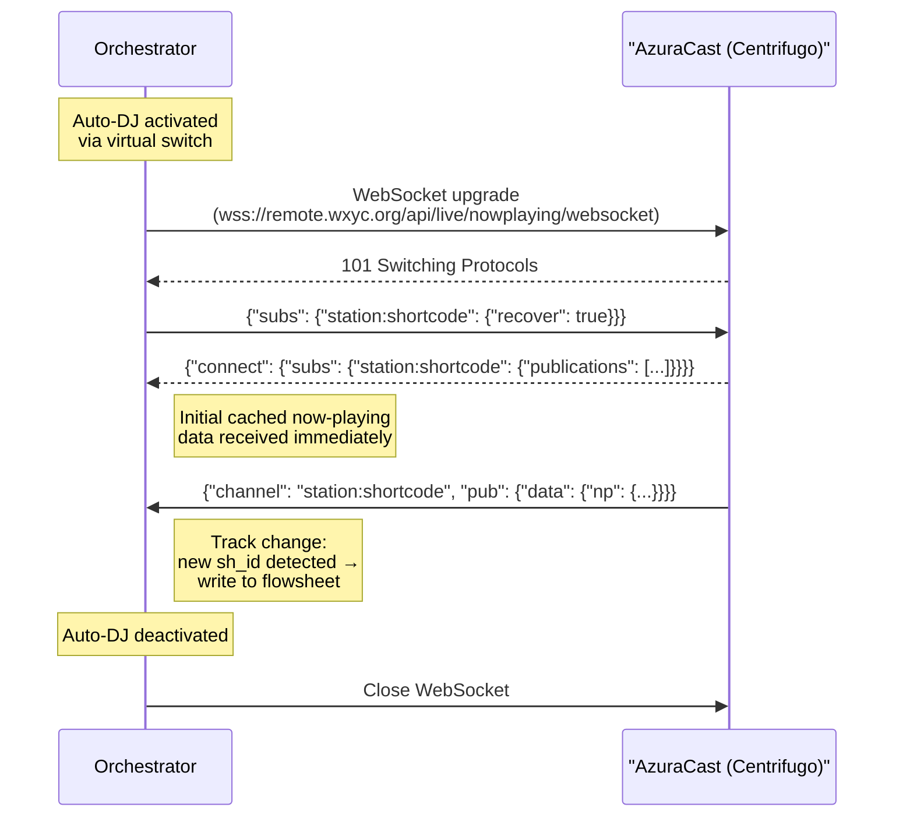
```mermaid
sequenceDiagram
    participant Orch as Orchestrator
    participant AZ as "AzuraCast (Centrifugo)"

    Note over Orch: Auto-DJ activated<br/>via virtual switch

    Orch->>AZ: WebSocket upgrade<br/>(wss://remote.wxyc.org/api/live/nowplaying/websocket)
    AZ-->>Orch: 101 Switching Protocols

    Orch->>AZ: {"subs": {"station:shortcode": {"recover": true}}}
    AZ-->>Orch: {"connect": {"subs": {"station:shortcode": {"publications": [...]}}}}
    Note right of Orch: Initial cached now-playing<br/>data received immediately

    AZ->>Orch: {"channel": "station:shortcode", "pub": {"data": {"np": {...}}}}
    Note right of Orch: Track change:<br/>new sh_id detected →<br/>write to flowsheet

    Note over Orch: Auto-DJ deactivated

    Orch->>AZ: Close WebSocket
```

The `recover: true` flag enables Centrifugo's connection recovery -- on reconnect, the server replays messages missed during the disconnection window.

**Relevant fields in `np`**:

| JSON Path | Type | Usage |
|-----------|------|-------|
| `np.now_playing.sh_id` | `int` | Track change detection (same as HTTP polling) |
| `np.now_playing.song.artist` | `string` | Flowsheet entry |
| `np.now_playing.song.title` | `string` | Flowsheet entry |
| `np.now_playing.song.album` | `string` | Flowsheet entry |
| `np.live.is_live` | `bool` | Live DJ detection (advisory) |

These are the same fields extracted by the HTTP polling endpoint ([Section 3.2](#32-azuracast-now-playing-http-polling)).

**Sources**: [AzuraCast Now Playing Data APIs](https://www.azuracast.com/docs/developers/now-playing-data/), [AzuraCast HPNP SSE example](https://gist.github.com/Moonbase59/d42f411e10aff6dc58694699010307aa)

#### 3.3.2 Dual-Mode Architecture

The orchestrator uses the Centrifugo WebSocket as the primary subscription and HTTP polling as the fallback. These are mutually exclusive modes -- the module uses one or the other, not both simultaneously (except for a safety-net poll).

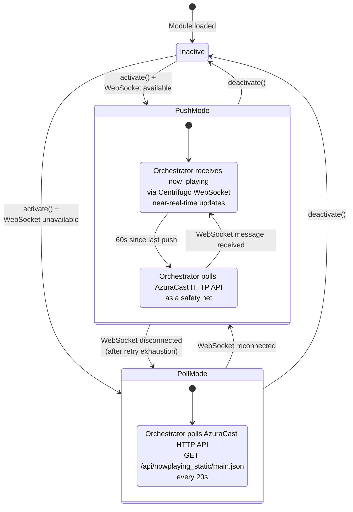
```mermaid
stateDiagram-v2
    [*] --> Inactive: Module loaded

    Inactive --> PushMode: activate() +<br/>WebSocket available
    Inactive --> PollMode: activate() +<br/>WebSocket unavailable

    state PushMode {
        [*] --> Listening
        Listening: Orchestrator receives now_playing<br/>via Centrifugo WebSocket<br/>near-real-time updates
        Listening --> SafetyPoll: 60s since last push
        SafetyPoll: Orchestrator polls AzuraCast HTTP API<br/>as a safety net
        SafetyPoll --> Listening: WebSocket message received
    }

    state PollMode {
        [*] --> Polling
        Polling: Orchestrator polls AzuraCast HTTP API<br/>GET /api/nowplaying_static/main.json<br/>every 20s
    }

    PushMode --> PollMode: WebSocket disconnected<br/>(after retry exhaustion)
    PollMode --> PushMode: WebSocket reconnected
    PushMode --> Inactive: deactivate()
    PollMode --> Inactive: deactivate()
```

- **Push mode** (primary): The orchestrator subscribes via `centrifuge-js`. Track updates arrive in near-real-time. A 60-second safety-net HTTP poll catches any missed messages.
- **Poll mode** (fallback): The orchestrator polls the static HTTP endpoint every 20 seconds. Simple `fetch` call, no persistent connections.

#### 3.3.3 Reconnection

`centrifuge-js` handles reconnection with exponential backoff automatically. If reconnection fails after a configurable number of attempts, the module falls back to HTTP polling. When the WebSocket reconnects, it switches back to push mode.

### 3.4 Auto-DJ Activation API

**Status**: Planned (Phase 1)

The auto-DJ activation API is the control plane for starting and stopping the orchestrator. It is called by the virtual switch in dj-site.

#### 3.4.1 Activate

| Field | Value |
|-------|-------|
| **Method** | POST |
| **URL** | `https://api.wxyc.org/auto-dj/activate` |
| **Auth** | Better Auth session cookie or JWT (`flowsheet:write` permission required) |
| **Content-Type** | `application/json` |
| **Request body** | `{}` (empty, or optional configuration overrides) |
| **Success response** | 200 JSON |

**Response**:

```json
{
    "status": "active",
    "show_id": 789,
    "started_at": "2026-02-23T03:00:00.000Z",
    "subscription_mode": "websocket"
}
```

| Field | Type | Description |
|-------|------|-------------|
| `status` | `"active"` | Auto-DJ is now active |
| `show_id` | `integer` | The `Show.id` of the auto-DJ show |
| `started_at` | `string` | ISO 8601 timestamp of when the show started |
| `subscription_mode` | `string` | `"websocket"` or `"polling"` -- how the orchestrator is receiving now-playing data |

**Behavior**:

1. Validate the caller has `flowsheet:write` permission.
2. Check for an existing active auto-DJ show. If one exists, return the current status (idempotent).
3. Create a new show with `primary_dj_id` = auto-DJ system user's DJ record ID.
4. Start the AzuraCast subscription (Centrifugo WebSocket or HTTP polling).
5. Return the show details.

**Error responses**:

| Status | Condition |
|--------|-----------|
| 403 | Caller lacks `flowsheet:write` permission |
| 409 | A live DJ show is currently active (conflict) |

#### 3.4.2 Deactivate

| Field | Value |
|-------|-------|
| **Method** | POST |
| **URL** | `https://api.wxyc.org/auto-dj/deactivate` |
| **Auth** | Better Auth session cookie or JWT (`flowsheet:write` permission required) |
| **Content-Type** | `application/json` |
| **Request body** | `{}` |
| **Success response** | 200 JSON |

**Response**:

```json
{
    "status": "inactive",
    "show_id": 789,
    "ended_at": "2026-02-23T07:00:00.000Z",
    "entries_posted": 42
}
```

**Behavior**:

1. Validate the caller has `flowsheet:write` permission.
2. If auto-DJ is not active, return `{ "status": "inactive" }` (idempotent).
3. Unsubscribe from AzuraCast (close WebSocket or stop polling).
4. End the auto-DJ show.
5. Return the show summary.

#### 3.4.3 Status

| Field | Value |
|-------|-------|
| **Method** | GET |
| **URL** | `https://api.wxyc.org/auto-dj/status` |
| **Auth** | Better Auth session cookie or JWT (any authenticated user) |
| **Success response** | 200 JSON |

**Response** (when active):

```json
{
    "status": "active",
    "show_id": 789,
    "started_at": "2026-02-23T03:00:00.000Z",
    "subscription_mode": "websocket",
    "last_track": {
        "artist": "Yo La Tengo",
        "title": "Autumn Sweater",
        "album": "I Can Hear the Heart Beating as One",
        "posted_at": "2026-02-23T04:15:00.000Z"
    },
    "entries_posted": 12,
    "relay_state": "on"
}
```

**Response** (when inactive):

```json
{
    "status": "inactive",
    "relay_state": "unknown"
}
```

The `relay_state` field reflects the most recent advisory signal from the Arduino (`"on"`, `"off"`, or `"unknown"` if the Arduino has not reported recently).

### 3.5 Flowsheet Write Pipeline

When the orchestrator detects a track change (new `sh_id` from AzuraCast), it writes the entry to both databases through the normal flowsheet API pipeline.

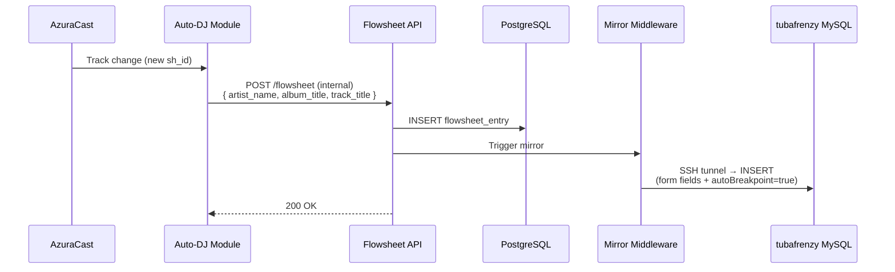
```mermaid
sequenceDiagram
    participant AZ as AzuraCast
    participant AutoDJ as Auto-DJ Module
    participant API as Flowsheet API
    participant PG as PostgreSQL
    participant Mirror as Mirror Middleware
    participant TF as tubafrenzy MySQL

    AZ->>AutoDJ: Track change (new sh_id)
    AutoDJ->>API: POST /flowsheet (internal)<br/>{ artist_name, album_title, track_title }
    API->>PG: INSERT flowsheet_entry
    API->>Mirror: Trigger mirror
    Mirror->>TF: SSH tunnel → INSERT<br/>(form fields + autoBreakpoint=true)
    API-->>AutoDJ: 200 OK
```

**External call**: The orchestrator calls Backend-Service's flowsheet API (or tubafrenzy's API) over HTTPS, depending on the `FLOWSHEET_BACKEND` flag. The auto-DJ system user's PAT authenticates requests to Backend-Service.

**Mirror middleware**: The mirror replicates each write to tubafrenzy. It translates the JSON flowsheet entry into tubafrenzy's form-encoded format, including `autoBreakpoint=true` so tubafrenzy handles hourly breakpoints via its `FlowsheetEntryService.createEntryWithAutoBreakpoints()` method.

**Breakpoints**: The orchestrator tracks hour boundaries and inserts explicit breakpoint entries (`{ "message": "BREAKPOINT" }`) at the top of each hour for Backend-Service's PostgreSQL database. The mirror middleware sets `autoBreakpoint=true` on the corresponding tubafrenzy write, so tubafrenzy handles breakpoints server-side as it always has.

---

### Arduino Outbound Traffic (Optional)

The following sections describe traffic from the Arduino. The Arduino is optional -- auto-DJ functions without it. These protocols are relevant when the Arduino hardware is deployed in the studio.

### 3.6 tubafrenzy Flowsheet Operations (Legacy Arduino-Direct)

**Status**: Live (implemented in `flowsheet_client.cpp`). To be superseded by the auto-DJ orchestrator.

This section documents the existing Arduino-to-tubafrenzy protocol for reference. Once the auto-DJ orchestrator is deployed, the Arduino firmware will be updated to remove this functionality. The protocol is preserved here because it informs the mirror middleware's implementation.

All tubafrenzy requests are form-encoded POSTs authenticated by the `X-Auto-DJ-Key` header. The server responds with 302 redirects on success.

#### 3.6.1 Start Show

| Field | Value |
|-------|-------|
| **Method** | POST |
| **URL** | `https://www.wxyc.info/playlists/startRadioShow` |
| **Content-Type** | `application/x-www-form-urlencoded` |
| **Auth** | `X-Auto-DJ-Key: <key>` |
| **Success response** | 302 with Location header containing the new `radioShowID` |

**Request body parameters**:

| Parameter | Value | Source |
|-----------|-------|--------|
| `djID` | `"0"` | `AUTO_DJ_ID` in `config.h` |
| `djName` | `"Auto DJ"` | `AUTO_DJ_NAME` in `config.h` (URL-encoded) |
| `djHandle` | `"AutoDJ"` | `AUTO_DJ_HANDLE` in `config.h` (URL-encoded) |
| `showName` | `"Auto DJ"` | `AUTO_DJ_SHOW_NAME` in `config.h` (URL-encoded) |
| `startingHour` | epoch milliseconds | `currentHourMs()` from `utils.cpp` |

**Response handling**: Parse `radioShowID` from the Location header using `parseRadioShowID()` (in `utils.cpp`). Returns -1 on failure.

#### 3.6.2 Add Flowsheet Entry

| Field | Value |
|-------|-------|
| **Method** | POST |
| **URL** | `https://www.wxyc.info/playlists/flowsheetEntryAdd` |
| **Content-Type** | `application/x-www-form-urlencoded` |
| **Auth** | `X-Auto-DJ-Key: <key>` |
| **Success response** | 302 |

**Request body parameters**:

| Parameter | Value | Source |
|-----------|-------|--------|
| `radioShowID` | integer | From `startShow()` response |
| `workingHour` | epoch milliseconds | `currentHourMs()` from `utils.cpp` |
| `artistName` | string | From AzuraCast `now_playing.song.artist` (URL-encoded) |
| `songTitle` | string | From AzuraCast `now_playing.song.title` (URL-encoded) |
| `releaseTitle` | string | From AzuraCast `now_playing.song.album` (URL-encoded) |
| `releaseType` | `"otherRelease"` | Hardcoded |
| `autoBreakpoint` | `"true"` | Tells the server to auto-insert hourly breakpoints via `FlowsheetEntryService.createEntryWithAutoBreakpoints()` |

#### 3.6.3 End Show

| Field | Value |
|-------|-------|
| **Method** | POST |
| **URL** | `https://www.wxyc.info/playlists/finishRadioShow` |
| **Content-Type** | `application/x-www-form-urlencoded` |
| **Auth** | `X-Auto-DJ-Key: <key>` |
| **Success response** | 302 |

**Request body parameters**:

| Parameter | Value | Source |
|-----------|-------|--------|
| `radioShowID` | integer | From `startShow()` response |
| `mode` | `"signoffConfirm"` | Skips the interactive JSP confirmation page |

### 3.7 Arduino Relay State Reporting

**Status**: Planned

The Arduino reports the physical relay contact state to the orchestrator as an advisory signal. This does not trigger auto-DJ activation -- it provides visibility for the admin UI.

| Field | Value |
|-------|-------|
| **Method** | POST |
| **URL** | `https://api.wxyc.org/api/auto-dj/relay-state` |
| **Auth** | `X-Auto-DJ-Key: <key>` |
| **Content-Type** | `application/json` |
| **Success response** | 200 OK |

**Request body**:

```json
{
    "relay_on": true,
    "timestamp": 1708400000
}
```

| Field | Type | Description |
|-------|------|-------------|
| `relay_on` | `boolean` | `true` when the AUX relay contact is closed (channel active) |
| `timestamp` | `integer` | Unix timestamp of the state change |

The Arduino sends this report on every relay state change (transition from on→off or off→on), not on a polling interval. The orchestrator stores the most recent relay state and surfaces it in the auto-DJ status API ([Section 3.4.3](#343-status)) and device management dashboard.

### 3.8 WebSocket: Arduino Management Channel

**Status**: Planned (Phase 3)

The WebSocket management channel provides real-time bidirectional communication between the Arduino and the management server (within the orchestrator). It carries heartbeats, commands, acknowledgments, and error reports.

Note: Unlike the original design, the management channel no longer carries now-playing data. The auto-DJ orchestrator subscribes to AzuraCast directly ([Section 3.3](#33-azuracast-centrifugo-websocket)). The management channel is exclusively for Arduino device management.

#### 3.8.1 Connection Lifecycle

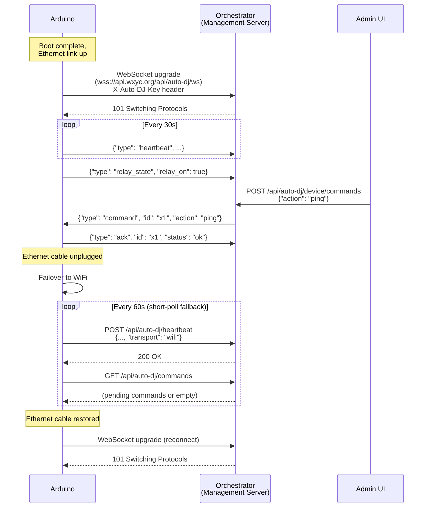
```mermaid
sequenceDiagram
    participant Arduino
    participant Server as Orchestrator<br/>(Management Server)
    participant Admin as Admin UI

    Note over Arduino: Boot complete,<br/>Ethernet link up

    Arduino->>Server: WebSocket upgrade<br/>(wss://api.wxyc.org/api/auto-dj/ws)<br/>X-Auto-DJ-Key header
    Server-->>Arduino: 101 Switching Protocols

    loop Every 30s
        Arduino->>Server: {"type": "heartbeat", ...}
    end

    Arduino->>Server: {"type": "relay_state", "relay_on": true}

    Admin->>Server: POST /api/auto-dj/device/commands<br/>{"action": "ping"}
    Server->>Arduino: {"type": "command", "id": "x1", "action": "ping"}
    Arduino->>Server: {"type": "ack", "id": "x1", "status": "ok"}

    Note over Arduino: Ethernet cable unplugged

    Arduino->>Arduino: Failover to WiFi

    loop Every 60s (short-poll fallback)
        Arduino->>Server: POST /api/auto-dj/heartbeat<br/>{..., "transport": "wifi"}
        Server-->>Arduino: 200 OK
        Arduino->>Server: GET /api/auto-dj/commands
        Server-->>Arduino: (pending commands or empty)
    end

    Note over Arduino: Ethernet cable restored
    Arduino->>Server: WebSocket upgrade (reconnect)
    Server-->>Arduino: 101 Switching Protocols
```

#### 3.8.2 Message Types

All WebSocket messages are JSON objects with a `type` discriminator field.

**Heartbeat** (Arduino → Server):

```json
{
    "type": "heartbeat",
    "state": "IDLE",
    "transport": "ethernet",
    "relay_on": true,
    "uptime_s": 86402,
    "wifi_rssi": null,
    "free_ram": 524288,
    "last_error": null,
    "firmware_version": "1.2.0",
    "config_hash": "a3f2c8",
    "loop_max_ms": 45,
    "reconnect_count": 0,
    "errors_since_boot": 2
}
```

| Field | Type | Description |
|-------|------|-------------|
| `type` | `"heartbeat"` | Message discriminator |
| `state` | `string` | Current state machine state (`BOOTING`, `IDLE`, `REPORTING`) |
| `transport` | `string` | Active transport (`"ethernet"` or `"wifi"`) |
| `relay_on` | `boolean` | Current relay contact state |
| `uptime_s` | `integer` | Seconds since boot |
| `wifi_rssi` | `integer \| null` | WiFi signal strength in dBm, or `null` if on Ethernet |
| `free_ram` | `integer` | Free heap bytes |
| `last_error` | `string \| null` | Last error message, or `null` |
| `firmware_version` | `string` | Semantic version of the running firmware |
| `config_hash` | `string` | Short hash of the active runtime config |
| `loop_max_ms` | `integer` | Maximum `loop()` duration since last heartbeat |
| `reconnect_count` | `integer` | Number of network reconnections since boot |
| `errors_since_boot` | `integer` | Total errors since boot |

Note: The heartbeat no longer includes `radio_show_id`, `last_track`, `tracks_detected`, or `tracks_posted` -- the Arduino no longer manages shows or posts flowsheet entries.

**Relay State** (Arduino → Server):

```json
{
    "type": "relay_state",
    "relay_on": true,
    "timestamp": 1708400000
}
```

Sent on relay state transitions (on→off or off→on). This is the WebSocket equivalent of `POST /api/auto-dj/relay-state` ([Section 3.7](#37-arduino-relay-state-reporting)) -- whichever transport is active delivers the message.

**Command** (Server → Arduino):

```json
{
    "type": "command",
    "id": "abc123",
    "action": "set_config",
    "key": "wifi_pass",
    "value": "new-password"
}
```

| Field | Type | Description |
|-------|------|-------------|
| `type` | `"command"` | Message discriminator |
| `id` | `string` | Unique command ID for acknowledgment correlation |
| `action` | `string` | One of: `set_config`, `restart`, `ping` |
| `key` | `string \| undefined` | Config key (only for `set_config`) |
| `value` | `string \| undefined` | Config value (only for `set_config`) |

Note: `pause`, `resume`, and `end_show` are removed from the Arduino's command set -- the Arduino no longer manages shows. These actions are now handled by the orchestrator's activation API ([Section 3.4](#34-auto-dj-activation-api)).

**Acknowledgment** (Arduino → Server):

```json
{
    "type": "ack",
    "id": "abc123",
    "status": "ok"
}
```

| Field | Type | Description |
|-------|------|-------------|
| `type` | `"ack"` | Message discriminator |
| `id` | `string` | The `id` from the command being acknowledged |
| `status` | `string` | One of: `ok`, `error`, `unknown_command` |
| `error` | `string \| undefined` | Error message (only when `status` is `"error"`) |

**Error Report** (Arduino → Server):

```json
{
    "type": "error",
    "level": "error",
    "module": "network_manager",
    "code": "WIFI_DISCONNECT",
    "message": "WiFi connection lost, failing over to Ethernet",
    "state": "IDLE",
    "uptime_s": 86402,
    "free_ram": 524288,
    "count": 3
}
```

| Field | Type | Description |
|-------|------|-------------|
| `type` | `"error"` | Message discriminator |
| `level` | `string` | One of: `warning`, `error`, `fatal` |
| `module` | `string` | Source module (e.g., `network_manager`, `relay_monitor`) |
| `code` | `string` | Error code (e.g., `WIFI_DISCONNECT`, `WS_DISCONNECT`, `TLS_HANDSHAKE`, `NTP_FAIL`) |
| `message` | `string` | Human-readable error description |
| `state` | `string` | State machine state when the error occurred |
| `uptime_s` | `integer` | Seconds since boot |
| `free_ram` | `integer` | Free heap bytes at time of error |
| `count` | `integer` | Number of times this error has occurred since last report |

Consecutive identical errors are batched: `count` is incremented locally and the error report is sent periodically rather than on every occurrence.

#### 3.8.3 Supported Commands

| Action | Parameters | Effect | Hot-reload? |
|--------|-----------|--------|-------------|
| `set_config` | `key`, `value` | Write a config parameter to KVStore | Depends on key |
| `restart` | -- | Software reset via `NVIC_SystemReset()` | N/A |
| `ping` | -- | Arduino sends an immediate heartbeat in response | Yes |

#### 3.8.4 Hot-Reload Behavior

| Config key | Hot-reloadable? | Notes |
|-----------|----------------|-------|
| `wifi_ssid` / `wifi_pass` | No | Requires restart; only affects the WiFi fallback transport |
| `api_key` | Yes | Takes effect on next HTTP request |
| `utc_offset` | Yes | Takes effect on next local time display |

#### 3.8.5 Keepalive Strategy

NAT gateways and campus firewalls kill idle TCP connections, typically after 60-300 seconds. The WebSocket must stay active:

- **Heartbeat interval (30s)** acts as an application-level keepalive. The server expects a heartbeat at least this often; absence triggers a "device offline" alert.
- **WebSocket ping/pong frames** as a transport-level keepalive. Most WebSocket libraries handle these automatically. If the server doesn't receive a pong within 10 seconds, it considers the connection dead.

### 3.9 HTTP Fallback: Management Polling

**Status**: Planned

When the Arduino is on WiFi (no persistent connections), the management channel degrades to HTTP short polling on a 60-second interval.

**Heartbeat** (Arduino → Server):

| Field | Value |
|-------|-------|
| **Method** | POST |
| **URL** | `https://api.wxyc.org/api/auto-dj/heartbeat` |
| **Auth** | `X-Auto-DJ-Key: <key>` |
| **Content-Type** | `application/json` |
| **Body** | Same JSON as the WebSocket heartbeat message ([Section 3.8.2](#382-message-types)) |
| **Response** | 200 OK |

**Command poll** (Arduino → Server):

| Field | Value |
|-------|-------|
| **Method** | GET |
| **URL** | `https://api.wxyc.org/api/auto-dj/commands` |
| **Auth** | `X-Auto-DJ-Key: <key>` |
| **Response** | 200 JSON array of pending commands, or empty array |

The Arduino processes each command and sends acknowledgments as separate POST requests.

### 3.10 Server-Side Endpoints

#### Auto-DJ Module Endpoints

| Method | Path | Purpose | Auth |
|--------|------|---------|------|
| `POST` | `/auto-dj/activate` | Activate auto-DJ mode | Better Auth session/JWT (`flowsheet:write`) |
| `POST` | `/auto-dj/deactivate` | Deactivate auto-DJ mode | Better Auth session/JWT (`flowsheet:write`) |
| `GET` | `/auto-dj/status` | Auto-DJ status (active/inactive, current show, last track) | Better Auth session/JWT (any authenticated) |

#### Arduino Management Endpoints

| Method | Path | Purpose | Auth |
|--------|------|---------|------|
| `GET` (upgrade) | `/api/auto-dj/ws` | WebSocket management channel | `X-Auto-DJ-Key` |
| `POST` | `/api/auto-dj/heartbeat` | Heartbeat (WiFi fallback) | `X-Auto-DJ-Key` |
| `GET` | `/api/auto-dj/commands` | Command poll (WiFi fallback) | `X-Auto-DJ-Key` |
| `POST` | `/api/auto-dj/relay-state` | Relay state report | `X-Auto-DJ-Key` |
| `POST` | `/api/auto-dj/device/commands` | Admin enqueues a command | Better Auth session/JWT (`stationManager`) |
| `GET` | `/api/auto-dj/device/status` | Device status (online/offline, transport, relay state) | Better Auth session/JWT (`stationManager`) |

Arduino-facing endpoints authenticate via the `X-Auto-DJ-Key` header. Admin-facing endpoints authenticate via Better Auth session cookies or JWT.

### 3.11 NTP Time Sync (Arduino)

**Status**: Live over WiFi (`WiFi.getTime()`), planned over Ethernet (`NTPClient`)

| Field | Value |
|-------|-------|
| **Protocol** | UDP |
| **Server** | `pool.ntp.org` |
| **Port** | 123 |
| **Purpose** | UTC epoch time for heartbeat telemetry and human-readable local time display (via `localEpoch()`) |

**WiFi transport**: `WiFi.getTime()` handles NTP internally within the WiFi module firmware. No explicit UDP required.

**Ethernet transport**: The `NTPClient` library (Fabrice Weinberg) sends NTP requests over `EthernetUDP`. API: `ntpClient.getEpochTime()`.

The `NetworkManager` exposes a unified `getTime()` method:

```cpp
unsigned long NetworkManager::getTime() {
    if (activeTransport == ETHERNET) {
        ntpClient.update();
        return ntpClient.getEpochTime();
    }
    return WiFi.getTime();  // WiFi module handles NTP internally
}
```

---

## 4. Authentication and Credentials

### 4.1 Credential Inventory

| Credential | Stored in | Used by | Authenticates to | Rotation frequency |
|-----------|----------|---------|------------------|-------------------|
| Auto-DJ system user PAT | Orchestrator config / env | Auto-DJ module | Backend-Service flowsheet API | Manual (operator-initiated) |
| tubafrenzy mirror SSH key | Orchestrator config / env | Mirror middleware | tubafrenzy MySQL (via SSH tunnel) | Manual |
| Arduino management key (`AUTO_DJ_API_KEY`) | `secrets.h` / KVStore (Arduino), env var (orchestrator) | Arduino | Management server endpoints | Manual (operator-initiated) |
| WiFi password (`WIFI_PASS`) | `secrets.h` / KVStore (Arduino) | Arduino | UNC-PSK WiFi network | Annually (UNC policy) |

### 4.2 tubafrenzy Authentication (Mirror Middleware)

The mirror middleware authenticates to tubafrenzy's MySQL database via SSH tunnel, not via the HTTP API. This is a server-to-server connection managed by the orchestrator.

For reference, the legacy Arduino-to-tubafrenzy HTTP authentication (used by the existing firmware, [Section 3.6](#36-tubafrenzy-flowsheet-operations-legacy-arduino-direct)) uses the `X-Auto-DJ-Key` header. The server validates this via `XYCCatalogServlet.isAutoDJRequest()`:

```java
protected boolean isAutoDJRequest(HttpServletRequest request) {
    String apiKey = getAutoDJApiKey();  // System.getenv("AUTO_DJ_API_KEY")
    if (apiKey == null || apiKey.isEmpty()) {
        return false;
    }
    String headerKey = request.getHeader("X-Auto-DJ-Key");
    if (headerKey == null) {
        return false;
    }
    return MessageDigest.isEqual(
        apiKey.getBytes(StandardCharsets.UTF_8),
        headerKey.getBytes(StandardCharsets.UTF_8)
    );
}
```

Key details:

- **Timing-safe comparison**: `MessageDigest.isEqual()` is constant-time, preventing timing attacks.
- **Server-side config**: The `AUTO_DJ_API_KEY` environment variable on the tubafrenzy server (wxyc.info).
- **Bypass of IP check**: A valid `X-Auto-DJ-Key` bypasses the normal control-room IP address check in `validateControlRoomAccess()`.

### 4.3 Auto-DJ System Identity Set-up

**Status**: Planned (Phase 1 prerequisite)

The auto-DJ system operates as a dedicated Better Auth user account. Set-up is a one-time admin provisioning step.

#### Steps

1. **Create a Better Auth user** for the Auto DJ (email: `auto-dj@wxyc.org`, role: `dj`). This is a real user account in Better Auth, but it represents an automation system, not a person.

2. **Register a DJ record** via `POST /djs/register` with:
   - `dj_name`: `"Auto DJ"`
   - `is_automation`: `true`
   - The `dj_id` is auto-incremented by Backend-Service (not 0, to avoid conflicts with auto-increment conventions).

3. **Add `is_automation` to the `DJ` and `NewDJ` schemas in `api.yaml`**:
   - Type: `boolean`
   - Default: `false`
   - Purpose: Lets admin UIs and mobile apps filter automation DJs from human DJs. The column is part of the public schema and will propagate to all generated types.

4. **Mint a Personal Access Token (PAT)** via Better Auth's bearer plugin. This is a long-lived token used internally by the orchestrator.

5. **Store the PAT** in the orchestrator's environment configuration (e.g., `AUTO_DJ_PAT` env var). The orchestrator reads this at startup.

The orchestrator uses this PAT when calling Backend-Service's flowsheet API. It goes through the same authorization middleware as any external DJ request -- the system user has the `dj` role and `flowsheet:write` permission. When targeting tubafrenzy, the orchestrator uses the `X-Auto-DJ-Key` instead.

### 4.4 dj-site Activation Auth

DJs activate/deactivate auto-DJ mode via the virtual switch in dj-site. The activation endpoints ([Section 3.4](#34-auto-dj-activation-api)) require:

- **Authentication**: Better Auth session cookie or JWT (the DJ must be logged in).
- **Permission**: `flowsheet:write` (any role at `dj` level or above).

This means any DJ who can write to the flowsheet can also toggle auto-DJ. If a more restrictive policy is needed later (e.g., only `musicDirector` or `stationManager`), the permission check can be tightened without changing the API contract.

### 4.5 Management Server Auth (Arduino-Facing)

The Arduino authenticates to the management server using the `X-Auto-DJ-Key` header. This applies to:

- WebSocket upgrade request (`wss://api.wxyc.org/api/auto-dj/ws`)
- HTTP fallback heartbeat (`POST /api/auto-dj/heartbeat`)
- HTTP fallback command poll (`GET /api/auto-dj/commands`)
- Relay state reports (`POST /api/auto-dj/relay-state`)

The management server validates the key using timing-safe comparison (same pattern as tubafrenzy).

### 4.6 Management Server Auth (Admin-Facing)

Admin-facing endpoints (`POST /api/auto-dj/device/commands`, `GET /api/auto-dj/device/status`) authenticate via Better Auth session cookies or JWT. Only users with the `stationManager` role can issue device management commands.

### 4.7 Credential Rotation Protocol (Arduino)

With Ethernet as the primary transport, credential rotation is significantly less risky. The Ethernet connection does not use credentials that rotate externally (no WiFi password, no PSK).

#### Ethernet mitigates the chicken-and-egg problem

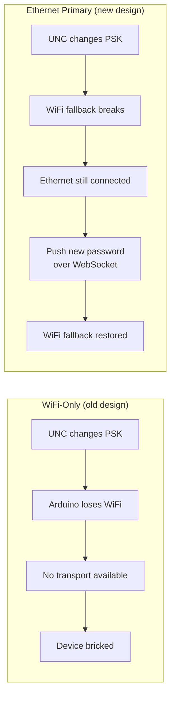
```mermaid
flowchart LR
    subgraph Before["WiFi-Only (old design)"]
        direction TB
        B1["UNC changes PSK"]
        B2["Arduino loses WiFi"]
        B3["No transport available"]
        B4["Device bricked"]
        B1 --> B2 --> B3 --> B4
    end

    subgraph After["Ethernet Primary (new design)"]
        direction TB
        A1["UNC changes PSK"]
        A2["WiFi fallback breaks"]
        A3["Ethernet still connected"]
        A4["Push new password<br>over WebSocket"]
        A5["WiFi fallback restored"]
        A1 --> A2 --> A3 --> A4 --> A5
    end
```

The only scenario that still requires physical access is if **both** the Ethernet jack goes dead **and** the WiFi password is stale.

#### API key rotation steps

1. Generate a new API key.
2. Update the server-side env var on the orchestrator to accept **both** old and new keys temporarily.
3. Push the new key to the Arduino via `set_config` (over WebSocket or HTTP fallback).
4. After the Arduino acknowledges, remove the old key from the server.

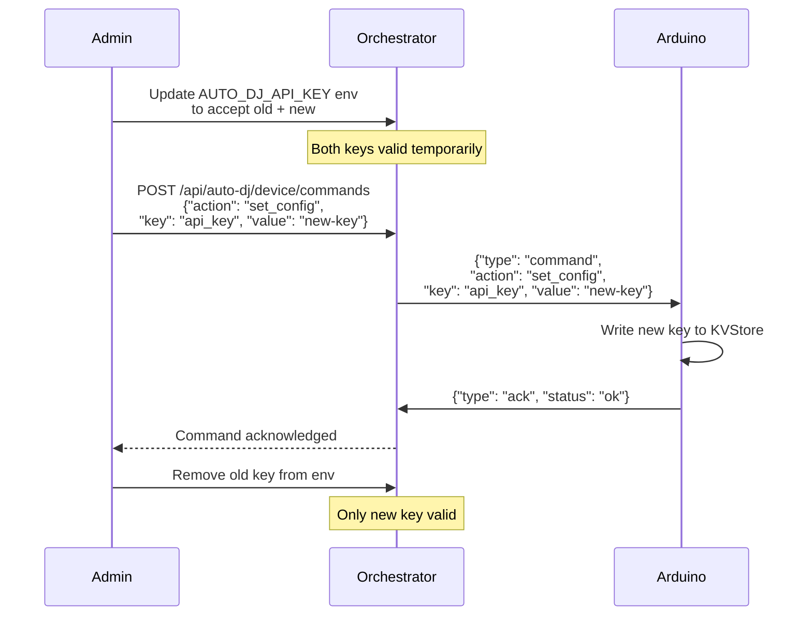
```mermaid
sequenceDiagram
    participant Admin
    participant Server as Orchestrator
    participant Arduino

    Admin->>Server: Update AUTO_DJ_API_KEY env<br/>to accept old + new
    Note over Server: Both keys valid temporarily

    Admin->>Server: POST /api/auto-dj/device/commands<br/>{"action": "set_config",<br/>"key": "api_key", "value": "new-key"}
    Server->>Arduino: {"type": "command",<br/>"action": "set_config",<br/>"key": "api_key", "value": "new-key"}
    Arduino->>Arduino: Write new key to KVStore
    Arduino->>Server: {"type": "ack", "status": "ok"}
    Server-->>Admin: Command acknowledged

    Admin->>Server: Remove old key from env
    Note over Server: Only new key valid
```

### 4.8 Credential Fallback and Recovery (Arduino)

The Arduino firmware keeps **both** the KVStore credential and the compile-time default. On connection failure after N attempts with the stored credential, it falls back to the compile-time default:

```cpp
// Pseudocode
if (!connectWith(kvstore.wifi_pass, MAX_ATTEMPTS)) {
    Serial.println("[WiFi] Stored credential failed, trying compiled default");
    if (!connectWith(WIFI_PASS_DEFAULT, MAX_ATTEMPTS)) {
        Serial.println("[WiFi] Both credentials failed");
    }
}
```

This ensures that a bad credential push doesn't permanently brick the WiFi fallback -- a firmware reflash with the correct default can always restore access.

### 4.9 Security Considerations

- **Transport security**: All communication is over TLS. The orchestrator and Backend-Service use standard Node.js HTTPS. Arduino uses BearSSL via `SSLClient` (Ethernet) or `WiFiSSLClient` (WiFi).
- **Orchestrator auth**: When targeting Backend-Service, the orchestrator authenticates using the system user's PAT. When targeting tubafrenzy, it uses the `X-Auto-DJ-Key` header. Both go through the respective server's standard authentication.
- **Arduino storage security**: KVStore writes to flash in plaintext. Physical access to the board could expose credentials. This is acceptable -- physical access to the studio already implies access to the mixing board, network, and everything else.
- **Command authentication**: Arduino management commands are authenticated by the `X-Auto-DJ-Key` header. Key rotation ([Section 4.7](#47-credential-rotation-protocol-arduino)) mitigates compromise risk.
- **Command validation**: The Arduino must validate all command payloads. Reject unknown actions, enforce maximum string lengths, and never execute arbitrary code from the server.
- **Activation authorization**: Auto-DJ activation requires `flowsheet:write` permission, ensuring only authorized DJs can start auto-DJ mode.

---

## 5. wxyc-shared Type Specification

### 5.1 Current Code Generation Pipeline

The `api.yaml` file in `wxyc-shared` is the single source of truth for API types. Code generation produces:

- **TypeScript** (`openapi-generator-cli` → `src/generated/models/`): consumed by Backend-Service, dj-site, management server, admin UI
- **Python** (`datamodel-codegen` → Pydantic v2): consumed by request-o-matic, library-metadata-lookup
- **Swift**: consumed by wxyc-ios-64 (via existing code generation pipeline)
- **Kotlin**: consumed by WXYC-Android (via existing code generation pipeline)

The `tsup` build produces independently importable entry points:

| Entry point | Import path | Contents |
|-------------|------------|----------|
| `src/index.ts` | `@wxyc/shared` | Root re-exports |
| `src/dtos/index.ts` | `@wxyc/shared/dtos` | DTOs + extensions (unions, type guards) |
| `src/auth-client/index.ts` | `@wxyc/shared/auth-client` | Auth client (React "use client") |
| `src/auth-client/auth.ts` | `@wxyc/shared/auth-client/auth` | Pure auth (server-side, no React) |
| `src/validation/index.ts` | `@wxyc/shared/validation` | Validation schemas |
| `src/test-utils/index.ts` | `@wxyc/shared/test-utils` | Test utilities |

Breaking change detection: `scripts/check-breaking-changes.js` compares the generated types against the previous version.

### 5.2 New Types for api.yaml

The following OpenAPI 3.0 schema blocks are designed to be added to `api.yaml` under `components/schemas`. They formalize the WebSocket message types from [Section 3.8.2](#382-message-types) and the auto-DJ activation API from [Section 3.4](#34-auto-dj-activation-api).

#### 5.2.1 WebSocket Message Envelope

```yaml
AutoDJWebSocketMessage:
  oneOf:
    - $ref: '#/components/schemas/AutoDJHeartbeat'
    - $ref: '#/components/schemas/AutoDJCommand'
    - $ref: '#/components/schemas/AutoDJAck'
    - $ref: '#/components/schemas/AutoDJRelayState'
    - $ref: '#/components/schemas/AutoDJErrorReport'
  discriminator:
    propertyName: type
    mapping:
      heartbeat: '#/components/schemas/AutoDJHeartbeat'
      command: '#/components/schemas/AutoDJCommand'
      ack: '#/components/schemas/AutoDJAck'
      relay_state: '#/components/schemas/AutoDJRelayState'
      error: '#/components/schemas/AutoDJErrorReport'
```

#### 5.2.2 AutoDJHeartbeat

```yaml
AutoDJHeartbeat:
  type: object
  required:
    - type
    - state
    - transport
    - relay_on
    - uptime_s
    - free_ram
    - firmware_version
    - config_hash
    - loop_max_ms
    - reconnect_count
    - errors_since_boot
  properties:
    type:
      type: string
      enum: [heartbeat]
    state:
      type: string
      enum: [BOOTING, IDLE, REPORTING]
      description: Arduino state machine state (simplified -- no longer manages shows)
    transport:
      type: string
      enum: [ethernet, wifi]
    relay_on:
      type: boolean
      description: Current relay contact state (advisory)
    uptime_s:
      type: integer
    wifi_rssi:
      type: integer
      nullable: true
    free_ram:
      type: integer
    last_error:
      type: string
      nullable: true
    firmware_version:
      type: string
    config_hash:
      type: string
    loop_max_ms:
      type: integer
    reconnect_count:
      type: integer
    errors_since_boot:
      type: integer
```

#### 5.2.3 AutoDJCommand

```yaml
AutoDJCommand:
  type: object
  required:
    - type
    - id
    - action
  properties:
    type:
      type: string
      enum: [command]
    id:
      type: string
      description: Unique command ID for ack correlation
    action:
      $ref: '#/components/schemas/AutoDJCommandAction'
    key:
      type: string
      description: Config key (only for set_config)
    value:
      type: string
      description: Config value (only for set_config)
```

#### 5.2.4 AutoDJAck

```yaml
AutoDJAck:
  type: object
  required:
    - type
    - id
    - status
  properties:
    type:
      type: string
      enum: [ack]
    id:
      type: string
      description: The id from the command being acknowledged
    status:
      type: string
      enum: [ok, error, unknown_command]
    error:
      type: string
      description: Error message (only when status is error)
```

#### 5.2.5 AutoDJRelayState

```yaml
AutoDJRelayState:
  type: object
  required:
    - type
    - relay_on
    - timestamp
  properties:
    type:
      type: string
      enum: [relay_state]
    relay_on:
      type: boolean
      description: Whether the AUX relay contact is closed (channel active)
    timestamp:
      type: integer
      description: Unix timestamp of the state change
```

#### 5.2.6 AutoDJErrorReport

```yaml
AutoDJErrorReport:
  type: object
  required:
    - type
    - level
    - module
    - code
    - message
    - state
    - uptime_s
    - free_ram
    - count
  properties:
    type:
      type: string
      enum: [error]
    level:
      $ref: '#/components/schemas/AutoDJErrorLevel'
    module:
      type: string
      description: Source module (e.g., network_manager, relay_monitor)
    code:
      $ref: '#/components/schemas/AutoDJErrorCode'
    message:
      type: string
    state:
      type: string
      enum: [BOOTING, IDLE, REPORTING]
    uptime_s:
      type: integer
    free_ram:
      type: integer
    count:
      type: integer
      description: Occurrences since last report

AutoDJErrorLevel:
  type: string
  enum: [warning, error, fatal]

AutoDJErrorCode:
  type: string
  enum:
    - HTTP_TIMEOUT
    - JSON_PARSE
    - WIFI_DISCONNECT
    - WS_DISCONNECT
    - TLS_HANDSHAKE
    - NTP_FAIL
    - KVSTORE_WRITE
    - RELAY_READ
```

#### 5.2.7 AutoDJDeviceStatus

For the admin API -- aggregates the latest heartbeat with connection state and device identity.

```yaml
AutoDJDeviceStatus:
  type: object
  required:
    - connected
    - transport
    - last_heartbeat_at
    - firmware_version
  properties:
    connected:
      type: boolean
    transport:
      type: string
      enum: [ethernet, wifi, none]
    last_heartbeat_at:
      type: string
      format: date-time
      nullable: true
    last_heartbeat:
      $ref: '#/components/schemas/AutoDJHeartbeat'
    pending_commands:
      type: integer
      description: Number of unacknowledged commands in the queue
    firmware_version:
      type: string
    device_id:
      type: string
      description: MAC address or other unique identifier
```

#### 5.2.8 AutoDJCommandAction Enum

```yaml
AutoDJCommandAction:
  type: string
  enum:
    - set_config
    - restart
    - ping
```

Note: `pause`, `resume`, and `end_show` are removed -- the Arduino no longer manages shows. Auto-DJ lifecycle is controlled via the activation API ([Section 3.4](#34-auto-dj-activation-api)).

#### 5.2.9 AutoDJStatus

For the auto-DJ activation API ([Section 3.4](#34-auto-dj-activation-api)) -- the response from `GET /auto-dj/status`.

```yaml
AutoDJStatus:
  type: object
  required:
    - status
  properties:
    status:
      type: string
      enum: [active, inactive]
    show_id:
      type: integer
      description: Active show ID (only when status is active)
    started_at:
      type: string
      format: date-time
      description: When the auto-DJ show started
    subscription_mode:
      type: string
      enum: [websocket, polling]
      description: How the orchestrator receives now-playing data
    last_track:
      $ref: '#/components/schemas/AutoDJLastTrack'
    entries_posted:
      type: integer
      description: Number of entries posted in the current show
    relay_state:
      type: string
      enum: [on, off, unknown]
      description: Most recent advisory relay state from Arduino

AutoDJLastTrack:
  type: object
  required:
    - artist
    - title
    - album
    - posted_at
  properties:
    artist:
      type: string
    title:
      type: string
    album:
      type: string
    posted_at:
      type: string
      format: date-time
```

### 5.3 TypeScript Extensions

The new schemas live in `api.yaml` as `components/schemas` and are code-generated into `src/generated/models/`. Hand-written TypeScript utilities go in a new `src/auto-dj/` directory, following the pattern of `src/dtos/extensions.ts`.

#### New files

**`src/auto-dj/extensions.ts`**:

```typescript
import type {
    AutoDJHeartbeat,
    AutoDJCommand,
    AutoDJAck,
    AutoDJRelayState,
    AutoDJErrorReport,
} from '../generated/models';

// Discriminated union of all Arduino management WebSocket message types
export type AutoDJWebSocketMessage =
    | AutoDJHeartbeat
    | AutoDJCommand
    | AutoDJAck
    | AutoDJRelayState
    | AutoDJErrorReport;

// Type guards
export function isHeartbeat(msg: AutoDJWebSocketMessage): msg is AutoDJHeartbeat {
    return msg.type === 'heartbeat';
}

export function isCommand(msg: AutoDJWebSocketMessage): msg is AutoDJCommand {
    return msg.type === 'command';
}

export function isAck(msg: AutoDJWebSocketMessage): msg is AutoDJAck {
    return msg.type === 'ack';
}

export function isRelayState(msg: AutoDJWebSocketMessage): msg is AutoDJRelayState {
    return msg.type === 'relay_state';
}

export function isErrorReport(msg: AutoDJWebSocketMessage): msg is AutoDJErrorReport {
    return msg.type === 'error';
}
```

**`src/auto-dj/index.ts`**:

```typescript
// Re-export generated schemas
export type {
    AutoDJHeartbeat,
    AutoDJCommand,
    AutoDJAck,
    AutoDJRelayState,
    AutoDJErrorReport,
    AutoDJDeviceStatus,
    AutoDJStatus,
    AutoDJLastTrack,
    AutoDJCommandAction,
    AutoDJErrorLevel,
    AutoDJErrorCode,
    AutoDJWebSocketMessage as AutoDJWebSocketMessageSchema,
} from '../generated/models';

// Re-export extensions (union type + type guards)
export {
    type AutoDJWebSocketMessage,
    isHeartbeat,
    isCommand,
    isAck,
    isRelayState,
    isErrorReport,
} from './extensions';
```

**New entry point** in `tsup.config.ts`:

```typescript
// Add to the entry array:
'src/auto-dj/index.ts'
```

**New export** in `package.json`:

```json
"./auto-dj": {
    "import": "./dist/auto-dj/index.js",
    "types": "./dist/auto-dj/index.d.ts"
}
```

Consumers import via `@wxyc/shared/auto-dj`.

### 5.4 Arduino Contract

The Arduino cannot consume npm packages. ArduinoJson code must manually match the schemas defined in `api.yaml`. This is a manual contract, not an automated import.

**Rule**: If you change a schema in `api.yaml`, you must update the corresponding ArduinoJson filter documents and struct definitions in the Arduino code.

| api.yaml Schema | Arduino File | What to Update |
|----------------|-------------|----------------|
| `AutoDJHeartbeat` | `management_client.cpp` | `sendHeartbeat()` JSON construction |
| `AutoDJCommand` | `management_client.cpp` | `processCommand()` JSON parsing + filter document |
| `AutoDJAck` | `management_client.cpp` | `sendAck()` JSON construction |
| `AutoDJRelayState` | `management_client.cpp` | `sendRelayState()` JSON construction |
| `AutoDJErrorReport` | `management_client.cpp` | `sendError()` JSON construction |

Note: The Arduino no longer implements AzuraCast polling or flowsheet clients. Those responsibilities have moved to the auto-DJ orchestrator.

### 5.5 Consumer Matrix

| Consumer | Language | Types Used |
|----------|---------|------------|
| Auto-DJ orchestrator | TypeScript | All types: `AutoDJStatus`, `AutoDJLastTrack`, `AutoDJWebSocketMessage` union, `AutoDJDeviceStatus`, `AutoDJCommandAction` |
| dj-site (virtual switch) | TypeScript | `AutoDJStatus` |
| dj-site (device dashboard) | TypeScript | `AutoDJDeviceStatus`, `AutoDJHeartbeat` |
| Arduino | C++ (ArduinoJson) | `AutoDJHeartbeat`, `AutoDJCommand`, `AutoDJAck`, `AutoDJRelayState`, `AutoDJErrorReport` (manual contract) |
| Backend-Service | TypeScript | None (consumed via its own flowsheet API; no auto-DJ types needed) |
| tubafrenzy | Java | None (consumed via its own HTTP API; no auto-DJ types needed) |

The `is_automation` field on `DJ`/`NewDJ` schemas will also propagate to:
- **Swift** (wxyc-ios-64) via existing code generation
- **Kotlin** (WXYC-Android) via existing code generation

A follow-up PR to each mobile app is needed to handle this field (e.g., filtering Auto DJ from DJ lists, displaying automated shows differently). See [Open Question 14](#8-open-questions).

### 5.6 AsyncAPI Consideration

OpenAPI 3.0 doesn't natively describe WebSocket protocols. The schemas are added to `api.yaml` as `components/schemas` only (no path definitions for WebSocket messages). The message direction and lifecycle are documented in prose with Mermaid sequence diagrams ([Section 3.8](#38-websocket-arduino-management-channel)).

If a formal WebSocket contract is needed later, AsyncAPI 2.x can reference these same schemas. For now, the WebSocket has exactly one consumer (the Arduino), and the prose documentation is sufficient.

---

## 6. Flowsheet Pipeline

### 6.1 Auto-DJ Module Architecture (Orchestrator)

The orchestrator is a standalone TypeScript service that manages the AzuraCast subscription, track change detection, flowsheet writing (to Backend-Service and/or tubafrenzy based on the `FLOWSHEET_BACKEND` flag), and Arduino device management. It replaces the Arduino's `FlowsheetBackend` abstraction from the original design, running the same dual-backend logic server-side.

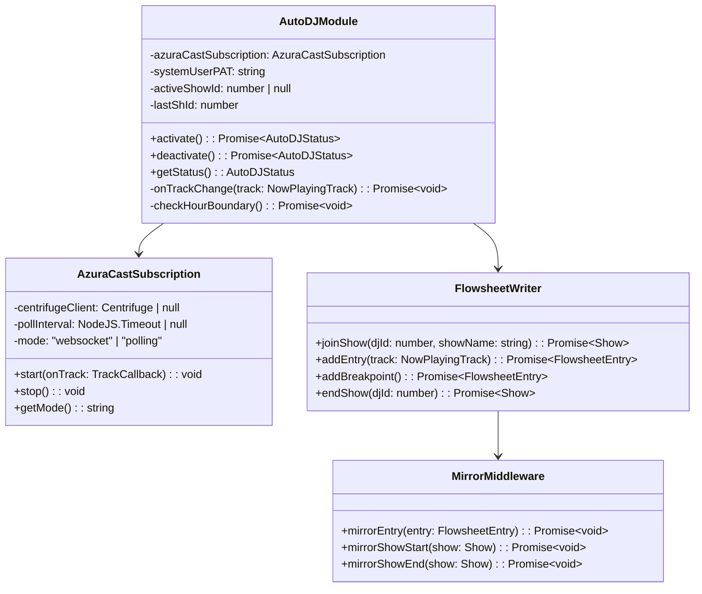
```mermaid
classDiagram
    class AutoDJModule {
        -azuraCastSubscription: AzuraCastSubscription
        -systemUserPAT: string
        -activeShowId: number | null
        -lastShId: number
        +activate(): Promise~AutoDJStatus~
        +deactivate(): Promise~AutoDJStatus~
        +getStatus(): AutoDJStatus
        -onTrackChange(track: NowPlayingTrack): Promise~void~
        -checkHourBoundary(): Promise~void~
    }

    class AzuraCastSubscription {
        -centrifugeClient: Centrifuge | null
        -pollInterval: NodeJS.Timeout | null
        -mode: "websocket" | "polling"
        +start(onTrack: TrackCallback): void
        +stop(): void
        +getMode(): string
    }

    class FlowsheetWriter {
        +joinShow(djId: number, showName: string): Promise~Show~
        +addEntry(track: NowPlayingTrack): Promise~FlowsheetEntry~
        +addBreakpoint(): Promise~FlowsheetEntry~
        +endShow(djId: number): Promise~Show~
    }

    class MirrorMiddleware {
        +mirrorEntry(entry: FlowsheetEntry): Promise~void~
        +mirrorShowStart(show: Show): Promise~void~
        +mirrorShowEnd(show: Show): Promise~void~
    }

    AutoDJModule --> AzuraCastSubscription
    AutoDJModule --> FlowsheetWriter
    FlowsheetWriter --> MirrorMiddleware
```

**`AzuraCastSubscription`**: Manages the Centrifugo WebSocket connection (via `centrifuge-js`) or HTTP polling fallback. Emits track change events when `sh_id` changes.

**`FlowsheetWriter`**: Calls the flowsheet API internally using the auto-DJ system user's PAT. Handles show lifecycle (join, entries, breakpoints, end).

**`MirrorMiddleware`**: Replicates each write to tubafrenzy's MySQL database via SSH tunnel. Translates JSON entries to tubafrenzy's form-encoded format.

### 6.2 Track Change Flow

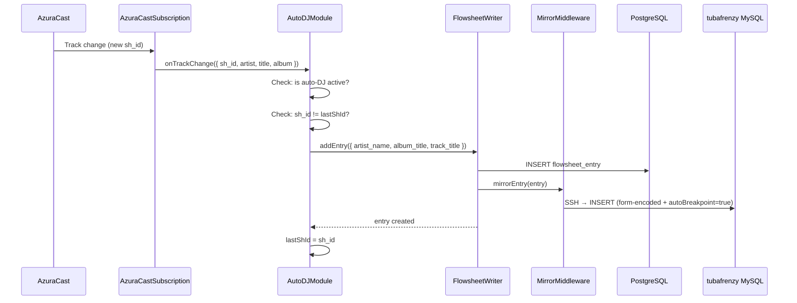
```mermaid
sequenceDiagram
    participant AZ as AzuraCast
    participant Sub as AzuraCastSubscription
    participant Module as AutoDJModule
    participant Writer as FlowsheetWriter
    participant Mirror as MirrorMiddleware
    participant PG as PostgreSQL
    participant TF as tubafrenzy MySQL

    AZ->>Sub: Track change (new sh_id)
    Sub->>Module: onTrackChange({ sh_id, artist, title, album })
    Module->>Module: Check: is auto-DJ active?
    Module->>Module: Check: sh_id != lastShId?
    Module->>Writer: addEntry({ artist_name, album_title, track_title })
    Writer->>PG: INSERT flowsheet_entry
    Writer->>Mirror: mirrorEntry(entry)
    Mirror->>TF: SSH → INSERT (form-encoded + autoBreakpoint=true)
    Writer-->>Module: entry created
    Module->>Module: lastShId = sh_id
```

### 6.3 Show Lifecycle

The orchestrator manages the show lifecycle through Backend-Service's flowsheet API:

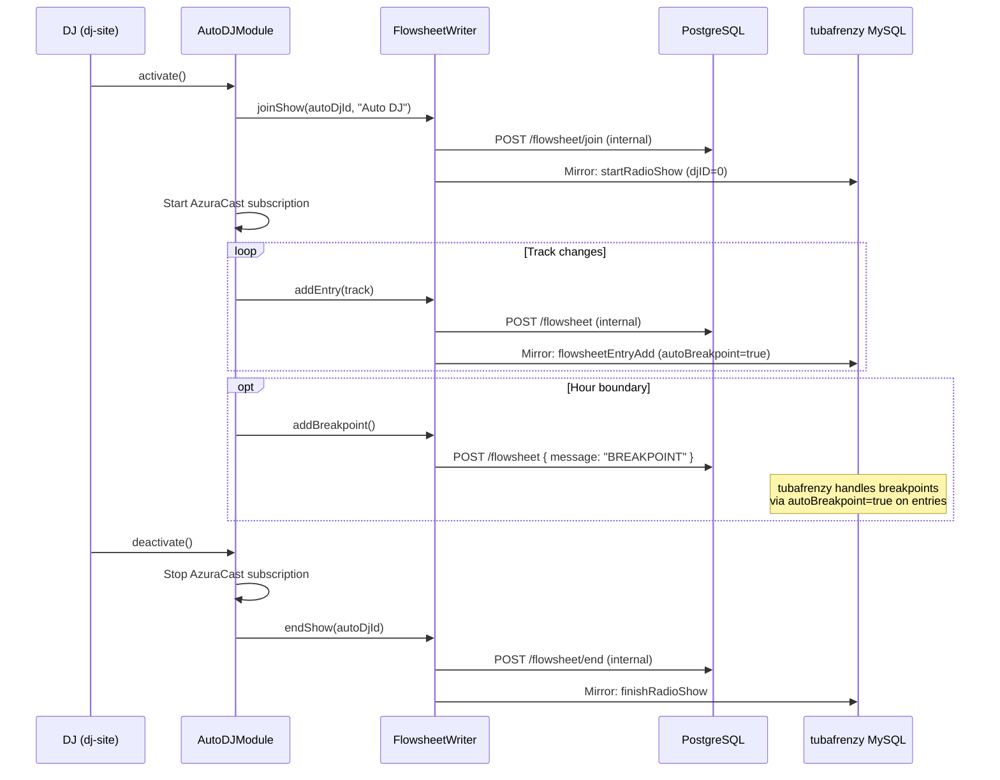
```mermaid
sequenceDiagram
    participant DJ as DJ (dj-site)
    participant Module as AutoDJModule
    participant Writer as FlowsheetWriter
    participant PG as PostgreSQL
    participant TF as tubafrenzy MySQL

    DJ->>Module: activate()
    Module->>Writer: joinShow(autoDjId, "Auto DJ")
    Writer->>PG: POST /flowsheet/join (internal)
    Writer->>TF: Mirror: startRadioShow (djID=0)
    Module->>Module: Start AzuraCast subscription

    loop Track changes
        Module->>Writer: addEntry(track)
        Writer->>PG: POST /flowsheet (internal)
        Writer->>TF: Mirror: flowsheetEntryAdd (autoBreakpoint=true)
    end

    opt Hour boundary
        Module->>Writer: addBreakpoint()
        Writer->>PG: POST /flowsheet { message: "BREAKPOINT" }
        Note over TF: tubafrenzy handles breakpoints<br/>via autoBreakpoint=true on entries
    end

    DJ->>Module: deactivate()
    Module->>Module: Stop AzuraCast subscription
    Module->>Writer: endShow(autoDjId)
    Writer->>PG: POST /flowsheet/end (internal)
    Writer->>TF: Mirror: finishRadioShow
```

### 6.4 Testing Strategy

#### Auto-DJ module tests (Vitest or Jest)

| Scenario | Test Focus |
|----------|-----------|
| **Activation** | `activate()` creates show via flowsheet API, starts AzuraCast subscription, returns `AutoDJStatus` |
| **Deactivation** | `deactivate()` stops subscription, ends show, returns summary |
| **Track change** | New `sh_id` triggers flowsheet entry write + mirror |
| **Duplicate `sh_id`** | Same `sh_id` does not create duplicate entry |
| **Hour boundary** | Breakpoint entry inserted at hour change for PostgreSQL; `autoBreakpoint=true` passed to mirror |
| **Idempotent activation** | Second `activate()` while active returns current status |
| **Conflict: live DJ** | `POST /flowsheet/join` from live DJ triggers auto-deactivation |
| **Orphaned show** | On module startup, detect and clean up stale auto-DJ show |
| **AzuraCast unavailable** | Subscription falls back to HTTP polling; entries still flow |
| **Mirror failure** | Mirror failure does not block PostgreSQL write (best-effort) |

#### AzuraCast subscription tests

| Scenario | Test Focus |
|----------|-----------|
| **Centrifugo connect** | `centrifuge-js` client connects, subscribes to channel, receives initial data |
| **Track change event** | Centrifugo push with new `sh_id` fires callback |
| **Reconnection** | Disconnection triggers reconnect with `recover: true`; missed tracks replayed |
| **Fallback to polling** | WebSocket unavailable → falls back to HTTP polling every 20s |
| **Safety-net poll** | 60s without WebSocket message triggers HTTP poll |

#### Mirror middleware tests

| Scenario | Test Focus |
|----------|-----------|
| **Entry mirror** | JSON entry translated to form-encoded tubafrenzy format |
| **Show start mirror** | Show join translated to `startRadioShow` with `djID=0` |
| **Show end mirror** | Show end translated to `finishRadioShow` with `mode=signoffConfirm` |
| **SSH tunnel failure** | Mirror failure logged but does not block caller |

#### Arduino management tests (FakeWebSocket / FakeClient)

The Arduino's role is reduced to relay state reporting and management. Tests focus on:

| Direction | Message Type | Test Focus |
|-----------|-------------|------------|
| Arduino → Server | `AutoDJHeartbeat` | All fields populated correctly; `relay_on` reflects actual state; telemetry counters increment |
| Arduino → Server | `AutoDJRelayState` | Sent on relay transitions; `relay_on` and `timestamp` correct |
| Arduino → Server | `AutoDJAck` | `id` matches command; `status` reflects outcome |
| Arduino → Server | `AutoDJErrorReport` | `count` accumulates repeat errors |
| Server → Arduino | `AutoDJCommand` | Unknown actions produce `unknown_command` ack; `set_config` writes to KVStore (mock); `restart` triggers reset |

#### Server-side management tests (Vitest or Jest)

| Scenario | Test Focus |
|----------|-----------|
| **Heartbeat ingestion** | Server receives `AutoDJHeartbeat` → updates `AutoDJDeviceStatus` → admin API reflects new status |
| **Relay state ingestion** | Server receives `AutoDJRelayState` → updates relay state → `GET /auto-dj/status` reflects it |
| **Command delivery** | Admin POSTs `{"action": "set_config", ...}` → command appears on WebSocket |
| **Ack processing** | Server receives ack → command dequeued → `pending_commands` decrements |
| **Connection lifecycle** | Valid `X-Auto-DJ-Key` → accepted; invalid → 401; drop → offline; reconnect → online |
| **Stale heartbeat** | No heartbeat for >60s → device marked offline |

#### Shared test fixtures

The `api.yaml` schemas ([Section 5.2](#52-new-types-for-apiyaml)) serve as the contract between Arduino and server. Both sides test against the same type definitions.

```
api.yaml (source of truth)
    |
    ├── openapi-generator-cli ──► TypeScript types ──► Auto-DJ module, management server, dj-site
    |                                                   (compile-time type checking)
    |
    ├── Type guards ([Section 5.3](#53-typescript-extensions)) ──► isHeartbeat(), isRelayState(), etc.
    |                                  (runtime validation in TypeScript)
    |
    └── Manual contract ([Section 5.4](#54-arduino-contract)) ──► Arduino ArduinoJson code
                                          (human-verified against schema)
```

Canonical JSON fixtures for each message type should be maintained as shared test data files:

| Fixture | Arduino Test Uses It As | Server Test Uses It As |
|---------|------------------------|----------------------|
| `heartbeat.json` | `FakeWebSocket` outbound: assert serialized output matches | Inbound: parse and assert device status updates |
| `command.json` | `FakeWebSocket` inbound: assert parsed fields and side effects | Outbound: assert serialization matches |
| `ack.json` | `FakeWebSocket` outbound: assert serialized output matches | Inbound: assert command dequeue |
| `relay_state.json` | `FakeWebSocket` outbound: assert serialized output matches | Inbound: assert relay state updates |
| `error_report.json` | `FakeWebSocket` outbound: assert serialized output matches | Inbound: assert Sentry relay and alert logic |

A CI check in `wxyc-shared` (`scripts/check-breaking-changes.js`) detects breaking schema changes before they reach downstream consumers.

---

## 7. Implementation Roadmap

The architecture pivot reorders the implementation phases. The auto-DJ orchestrator and dj-site virtual switch are Phase 1 -- they deliver the core auto-DJ functionality without any hardware. Arduino hardware integration becomes a later phase.

### 7.1 Phase 0: Automatic DST (Arduino Firmware)

**No remote infrastructure required.** Firmware-only change for human-readable local times.

**What this does NOT affect**: Flowsheet timestamps are UTC epoch milliseconds and are correct year-round. `currentHourMs()` is unaffected.

**What this does affect**: Serial debug logs, heartbeat telemetry, and admin UI display of human-readable local times.

Add `isDST(epochSeconds)` implementing the US Eastern time rule (Energy Policy Act of 2005):

- DST begins: second Sunday of March at 2:00 AM EST
- DST ends: first Sunday of November at 2:00 AM EDT

Pure function of epoch seconds -- no network dependency, testable on desktop with GoogleTest.

| File | Change |
|------|--------|
| `utils.h` / `utils.cpp` | Add `isDST()` and `localEpoch()` |
| `test/test_dst.cpp` | Parameterized boundary tests |

### 7.2 Phase 1: Orchestrator + dj-site Virtual Switch

**This is the core deliverable.** The auto-DJ orchestrator and dj-site virtual switch deliver full auto-DJ functionality without any hardware changes.

#### 7.2.1 wxyc-shared Schema Updates

- Add `AutoDJStatus`, `AutoDJLastTrack`, `AutoDJRelayState` to `api.yaml` ([Section 5.2](#52-new-types-for-apiyaml))
- Add `is_automation` to `DJ` and `NewDJ` schemas
- Add `@wxyc/shared/auto-dj` entry point
- Code generation produces TypeScript types for Backend-Service and dj-site

#### 7.2.2 Auto-DJ System Identity

- Create Better Auth user (`auto-dj@wxyc.org`, role: `dj`) ([Section 4.3](#43-auto-dj-system-identity-set-up))
- Register DJ record (`is_automation: true`)
- Mint PAT and store in orchestrator config
- Add `is_automation` column to DJ table in database

#### 7.2.3 Auto-DJ Module (Orchestrator)

- Implement `AutoDJModule` ([Section 6.1](#61-auto-dj-module-architecture-orchestrator))
- Implement `AzuraCastSubscription` with Centrifugo WebSocket (via `centrifuge-js`) + HTTP polling fallback ([Section 3.3](#33-azuracast-centrifugo-websocket))
- Implement `FlowsheetWriter` that calls the flowsheet API internally
- Implement activation/deactivation API endpoints ([Section 3.4](#34-auto-dj-activation-api))
- Implement conflict resolution: live DJ starts show → auto-deactivate ([Section 2.3](#23-conflict-resolution))
- Implement hour-boundary breakpoint insertion
- Tests: activation flow, track change detection, conflict resolution, orphaned show cleanup

#### 7.2.4 Mirror Middleware (Orchestrator)

- Implement SSH tunnel connection to tubafrenzy MySQL
- Mirror flowsheet entries (translate JSON → form-encoded, set `autoBreakpoint=true`)
- Mirror show start/end
- Tests: entry translation, show lifecycle, SSH failure handling

#### 7.2.5 dj-site Virtual Switch

- Add auto-DJ toggle to the flowsheet view
- Call `POST /auto-dj/activate` and `POST /auto-dj/deactivate`
- Show auto-DJ status (active/inactive, current track, entries posted)
- RTK Query integration for status polling

#### 7.2.6 Phase 1 Deliverable

At the end of Phase 1:

- DJs can activate/deactivate auto-DJ via dj-site
- AzuraCast tracks flow to both PostgreSQL and tubafrenzy
- No hardware changes required
- The existing Arduino firmware (which polls AzuraCast and writes to tubafrenzy directly) can be left running in parallel during the transition, then decommissioned

### 7.3 Phase 2: Arduino Firmware Update (Relay Reporter)

**Depends on Phase 1.** Updates the Arduino firmware to remove flowsheet writing and AzuraCast polling, retaining only relay state reporting and management.

#### 7.3.1 Remove Flowsheet and AzuraCast Code

- Remove `flowsheet_client.cpp/.h` (tubafrenzy writes)
- Remove `azuracast_client.cpp/.h` (now-playing polling)
- Remove show state machine logic (`STARTING_SHOW`, `AUTO_DJ_ACTIVE`, `ENDING_SHOW` states)
- Simplify to: `BOOTING` → `IDLE` → `REPORTING`

#### 7.3.2 Add Relay State Reporting

- Implement `POST /api/auto-dj/relay-state` on state transitions ([Section 3.7](#37-arduino-relay-state-reporting))
- Report relay state in heartbeats ([Section 3.8.2](#382-message-types))

#### 7.3.3 Orchestrator: Relay State Endpoint

- Add `POST /api/auto-dj/relay-state` endpoint
- Store latest relay state, surface in `GET /auto-dj/status`

### 7.4 Phase 3: Arduino Hardware Integration

**Depends on Phase 2.** Adds Ethernet, persistent storage, and management channel to the Arduino.

This phase consolidates the original Phases 1-3 from the pre-pivot design, now that the Arduino's scope is reduced.

#### 7.4.1 Persistent Storage (KVStore)

Use `KVStore` (TDBStore on QSPI flash) for key-value persistence.

**Keys to persist** (reduced from original -- no flowsheet-related keys):

| Key | Type | Purpose |
|-----|------|---------|
| `wifi_ssid` | `char[64]` | Remotely updatable WiFi SSID |
| `wifi_pass` | `char[128]` | Remotely updatable WiFi password |
| `api_key` | `char[128]` | Remotely updatable management API key |
| `utc_offset` | `int32_t` | Manual timezone override |

#### 7.4.2 Ethernet Shield Integration

**Hardware**: Arduino Ethernet Shield 2 (W5500, SPI).

**Software TLS**: `SSLClient` (BearSSL wrapper) over `EthernetClient`.

**Network abstraction** (`NetworkManager`): Same design as original Phase 2 -- Ethernet primary, WiFi fallback.

**Studio prerequisites**:

1. Verify live Ethernet jack in WXYC studio (contact UNC ITS)
2. Register Ethernet shield MAC address
3. Confirm outbound port 443 access on wired VLAN

#### 7.4.3 WebSocket Management Channel

- Implement `ManagementClient` on Arduino ([Section 3.8](#38-websocket-arduino-management-channel))
- WebSocket over Ethernet (primary), HTTP polling over WiFi (fallback)
- Heartbeats every 30s, relay state on transitions
- Accept commands: `set_config`, `restart`, `ping`

#### 7.4.4 Management Server (Orchestrator)

- WebSocket endpoint (`/api/auto-dj/ws`)
- HTTP fallback endpoints (`/api/auto-dj/heartbeat`, `/api/auto-dj/commands`)
- Device status API (`/api/auto-dj/device/status`, `/api/auto-dj/device/commands`)
- Heartbeat tracking and stale device detection

### 7.5 Phase 4: Remote Credential Rotation

**Depends on Phase 3.** With Ethernet as the primary transport, credential rotation is less risky.

| Credential | Urgency |
|-----------|---------|
| `wifi_pass` | **Low** -- only affects fallback transport |
| `api_key` | **Moderate** -- used for management auth |

**Protocol**: See Sections [4.7](#47-credential-rotation-protocol-arduino) and [4.8](#48-credential-fallback-and-recovery-arduino).

### 7.6 Phase 5: OTA Firmware Updates

**Depends on Phases 3 + 4.** For firmware changes that can't be expressed as config updates.

Same design as the original Phase 5: manifest check → download over Ethernet → QSPI staging → SHA-256 verify → flash swap.

**Prerequisites**: Phase 3 (management channel), Phase 4 (credential infrastructure), hardware research ([Open Question 7](#8-open-questions)).

### 7.7 Phase Summary

Phase 1 (orchestrator + dj-site) is the priority and has no hardware dependencies. Arduino phases follow.

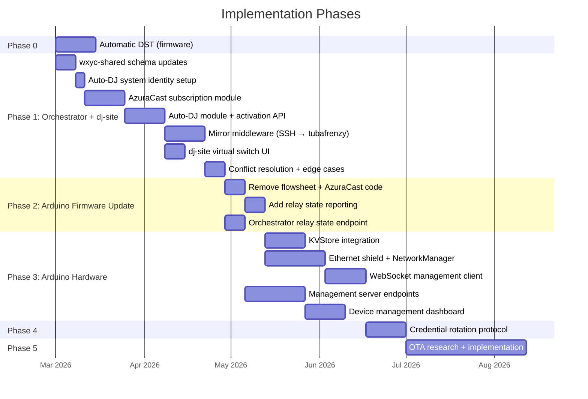
```mermaid
gantt
    title Implementation Phases
    dateFormat YYYY-MM-DD
    axisFormat %b %Y

    section Phase 0
    Automatic DST (firmware)               :p0, 2026-03-01, 14d

    section Phase 1: Orchestrator + dj-site
    wxyc-shared schema updates             :p1a, 2026-03-01, 7d
    Auto-DJ system identity setup          :p1b, after p1a, 3d
    AzuraCast subscription module          :p1c, after p1b, 14d
    Auto-DJ module + activation API        :p1d, after p1c, 14d
    Mirror middleware (SSH → tubafrenzy)   :p1e, after p1d, 14d
    dj-site virtual switch UI              :p1f, after p1d, 7d
    Conflict resolution + edge cases       :p1g, after p1e, 7d

    section Phase 2: Arduino Firmware Update
    Remove flowsheet + AzuraCast code      :p2a, after p1g, 7d
    Add relay state reporting              :p2b, after p2a, 7d
    Orchestrator relay state endpoint      :p2c, after p1g, 7d

    section Phase 3: Arduino Hardware
    KVStore integration                    :p3a, after p2b, 14d
    Ethernet shield + NetworkManager       :p3b, after p2b, 21d
    WebSocket management client            :p3c, after p3b, 14d
    Management server endpoints            :p3d, after p2c, 21d
    Device management dashboard            :p3e, after p3d, 14d

    section Phase 4
    Credential rotation protocol           :p4a, after p3c, 14d

    section Phase 5
    OTA research + implementation          :p5a, after p4a, 42d
```

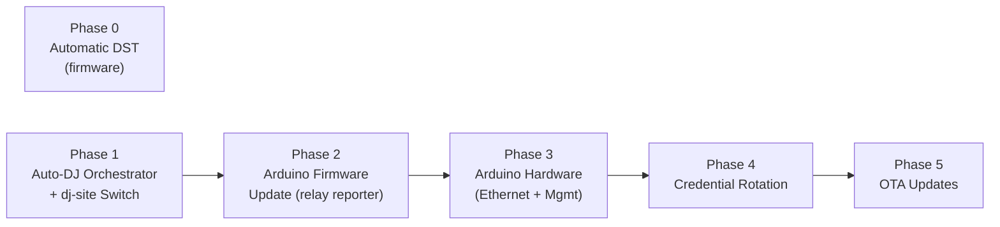
```mermaid
flowchart LR
    P0["Phase 0<br>Automatic DST<br>(firmware)"]

    P1["Phase 1<br>Auto-DJ Orchestrator<br>+ dj-site Switch"]

    P2["Phase 2<br>Arduino Firmware<br>Update (relay reporter)"]

    P3["Phase 3<br>Arduino Hardware<br>(Ethernet + Mgmt)"]

    P4["Phase 4<br>Credential Rotation"]

    P5["Phase 5<br>OTA Updates"]

    P1 --> P2
    P2 --> P3
    P3 --> P4
    P4 --> P5
```

| Phase | Outcome | Depends on |
|-------|---------|-----------|
| **0: Automatic DST** | Human-readable local times in Arduino logs | Nothing |
| **1: Orchestrator + dj-site** | Full auto-DJ functionality: virtual switch, AzuraCast subscription, dual-database writes, conflict resolution | Nothing (no hardware dependency) |
| **2: Arduino Firmware Update** | Arduino becomes relay state reporter; legacy flowsheet code removed | Phase 1 |
| **3: Arduino Hardware** | Ethernet primary transport, persistent storage, WebSocket management, device dashboard | Phase 2 |
| **4: Credential Rotation** | Remotely update Arduino credentials without reflashing | Phase 3 |
| **5: OTA Updates** | Remotely deploy new firmware over Ethernet | Phase 4 |

---

## 8. Open Questions

### Resolved

1. ~~**Server choice:**~~ **Resolved.** The auto-DJ orchestrator is a standalone service (deployed on Railway). It hosts both the AzuraCast subscription/flowsheet logic and the Arduino management server. Backend-Service remains the flowsheet API + auth. See [Appendix A](#appendix-a-server-choice-analysis).

2. ~~**Centrifugo authentication:**~~ **Resolved.** The now-playing WebSocket endpoint (`/api/live/nowplaying/websocket`) is public -- no authentication token required ([source](https://www.azuracast.com/docs/developers/now-playing-data/)). See [Section 3.3](#33-azuracast-centrifugo-websocket).

3. ~~**Backend-Service `autoBreakpoint` equivalent:**~~ **Resolved.** Backend-Service requires explicit breakpoint entries. The orchestrator handles this; the mirror middleware sets `autoBreakpoint=true` for tubafrenzy. See [Section 6.3](#63-show-lifecycle).

4. ~~**wxyc-shared entry point:**~~ **Decided** -- `@wxyc/shared/auto-dj`. See [Section 5.3](#53-typescript-extensions).

5. ~~**AsyncAPI:**~~ **Decided** -- OpenAPI component schemas only. Protocol documented in prose with Mermaid diagrams. See [Section 5.6](#56-asyncapi-consideration).

6. ~~**Backend-Service `show_id` tracking:**~~ **Resolved.** Backend-Service tracks the active show per DJ internally. The orchestrator does not need to pass `show_id` on every flowsheet write.

### Open

7. **Studio Ethernet jack:** Is there a live Ethernet jack in the WXYC studio? If not, request activation from UNC ITS. Prerequisite for Phase 3.

8. **Ethernet VLAN firewall rules:** Does the wired campus VLAN allow persistent outbound TCP on port 443? Does it have longer NAT idle timeouts than UNC-PSK WiFi? Affects WebSocket viability for Arduino management (Phase 3).

9. **Centrifugo channel name:** The channel format is `station:<shortcode>`. For WXYC this is likely `station:main` or `station:wxyc` -- verify by inspecting AzuraCast's admin panel or `/api/stations`. **Partially resolved**: format confirmed, exact shortcode needs verification. Needed for Phase 1.

10. **Centrifugo reconnection (orchestrator):** `centrifuge-js` handles reconnection with exponential backoff automatically. Verify that `recover: true` replays missed messages correctly with our AzuraCast version. The `centrifuge-js` library should handle this transparently.

11. **Mirror middleware transport:** How does the mirror middleware connect to tubafrenzy's MySQL? Options: SSH tunnel (most likely, since tubafrenzy is on Kattare shared hosting), direct MySQL connection (if network allows), or HTTP API calls to tubafrenzy's existing endpoints. SSH tunnel is the assumed approach.

12. **Heartbeat storage:** How long to retain Arduino heartbeat history? A rolling window (e.g., 7 days) is sufficient. Only relevant for Phase 3.

13. **KVStore vs. LittleFS:** Mbed OS offers both. KVStore is simpler (flat key-value). Only relevant for Phase 3+.

14. **`is_automation` flag in mobile apps:** The `is_automation` column on `DJ`/`NewDJ` will propagate to Swift and Kotlin via code generation. A follow-up PR to each mobile app is needed. Track as a separate task.

15. **Giga R1 OTA bootloader support:** Hardware research needed before Phase 5.

16. **SSLClient trust anchors:** BearSSL requires compiled-in root CA certificates. Only relevant for Phase 3.

17. **Max auto-DJ show duration:** What's a reasonable maximum before warning? 12 hours? 24 hours? Configurable via orchestrator env var.

18. **Conflict resolution with tubafrenzy DJs:** When a DJ starts a show via tubafrenzy (not dj-site), how does the orchestrator detect this to auto-deactivate? The mirror middleware must watch for new shows in both directions, or the legacy Arduino firmware must signal this transition.

---

## Appendix A: Server Choice Analysis

| | tubafrenzy | Backend-Service | Standalone (Hono/Fastify) |
|--|-----------|----------------|--------------------------|
| **WebSocket support** | Possible via Tomcat 9's JSR 356, but no existing WebSocket usage | Native with `ws` package; Express is already async | Native; lightweight |
| **Auth** | `X-Auto-DJ-Key` already checked | Better Auth for admin; can add API key check for Arduino | Needs its own auth |
| **Centrifugo client** | Java client exists (`centrifuge-java`) | `centrifuge-js` works in Node.js | `centrifuge-js` works in Node.js |
| **Pro** | Already the Arduino's primary target | Actively maintained; modern stack; WebSocket is natural fit | Decoupled; independently deployable |
| **Con** | Legacy Java 8; WebSocket in a JSP app is awkward | Arduino would need a second server dependency | Another service to deploy and maintain |
| **Deployment** | Kattare shared hosting (limited) | EC2 (existing) | Railway (easy, but another bill) |

**Conclusion (updated)**: With the architecture pivot, the auto-DJ orchestrator is a **standalone service** deployed separately (e.g., Railway). It handles AzuraCast subscription, flowsheet writing (to Backend-Service and/or tubafrenzy based on `FLOWSHEET_BACKEND` flag), and Arduino device management. Backend-Service remains the flowsheet API + auth server. The orchestrator validates admin JWTs via Backend-Service's JWKS endpoint (same pattern as wxyc-archive-search).

## Appendix B: AzuraCast Centrifugo Integration Details

AzuraCast embeds [Centrifugo](https://centrifugal.dev/) for real-time updates. It exposes two public endpoints for now-playing data ([source](https://www.azuracast.com/docs/developers/now-playing-data/)):

| Protocol | Endpoint | Direction |
|----------|---------|-----------|
| **WebSocket** | `wss://<host>/api/live/nowplaying/websocket` | Bidirectional (subscribe + receive) |
| **SSE** | `https://<host>/api/live/nowplaying/sse?cf_connect=<JSON>` | Server → client only |

The orchestrator uses the WebSocket endpoint via `centrifuge-js` ([Section 3.3](#33-azuracast-centrifugo-websocket)). In the original design, the Arduino subscribed directly; in the revised architecture, the orchestrator is the consumer.

### Protocol Details

**Subscription format** ([source](https://www.azuracast.com/docs/developers/now-playing-data/)):

```json
{"subs": {"station:<shortcode>": {"recover": true}}}
```

The `recover: true` flag enables Centrifugo's [history recovery](https://centrifugal.dev/docs/server/history_and_recovery) -- on reconnect, the server replays messages missed during the disconnection window.

**Initial data on connect**: Centrifugo sends cached publications immediately on subscription. The `connect` message includes the current now-playing state, so the orchestrator has accurate data from the moment of connection -- no need to wait for the next track change or make a separate HTTP request ([source](https://gist.github.com/Moonbase59/d42f411e10aff6dc58694699010307aa)).

**Channel naming**: The channel format is `station:<shortcode>` where the shortcode is the station's URL-safe identifier in AzuraCast. For WXYC, this needs to be verified by inspecting the AzuraCast admin panel or querying `/api/stations` (see [Open Question 9](#8-open-questions)).

**Authentication**: The now-playing WebSocket endpoint is public. No JWT token, API key, or other authentication is required.

**Centrifugo version note**: AzuraCast updated to Centrifugo v5 in early 2024, which changed the SSE/WebSocket message format. The current format sends initial cached publications in the `connect` response. Older AzuraCast installations may use a different format. The examples in this document and in [Section 3.3](#33-azuracast-centrifugo-websocket) reflect the current (post-2024) format.

### Historical Context: Relay Alternative

The original design considered having the Arduino subscribe to Centrifugo directly, with a relay through the management server as a fallback. With the architecture pivot, this question is moot -- the orchestrator subscribes to Centrifugo using `centrifuge-js`, which runs natively in Node.js with no memory constraints or reconnection complexity. The Arduino no longer consumes AzuraCast data at all.
