# Remote Access Roadmap

> **Note:** This document has been superseded by the comprehensive [Networking Specification](networking-spec.md), which covers all network traffic (both flowsheet backends, management WebSocket, AzuraCast relay, credentials, and `wxyc-shared` type contracts). The roadmap here is preserved for git history. For the authoritative protocol reference and implementation plan, see `networking-spec.md`.

This document lays out a phased plan for making the Auto DJ Arduino Switch remotely manageable. It builds on the parameter inventory in [remote-administration.md](remote-administration.md).

## Problem Statement

The device sits inside the WXYC studio, wired into the mixing board. Today, every configuration change -- including the annual UNC-PSK password rotation -- requires someone to walk to the studio with a laptop, connect via USB, and reflash the firmware. There is no way to check whether the device is alive, inspect its state, or intervene remotely. For a device designed to run unattended, this is untenable.

### Constraints

| Constraint | Detail |
|-----------|--------|
| **Network** | UNC campus networks are behind NAT with no inbound port access. The Arduino cannot host a server reachable from outside campus. All remote access must be outbound-initiated. |
| **Hardware** | Arduino Giga R1 WiFi (STM32H747XI). 1 MB SRAM, 2 MB internal flash, 16 MB QSPI flash. No persistent storage is used today. |
| **Ethernet** | An Arduino Ethernet Shield 2 (W5500, SPI-based) can be mounted on the Giga R1's Mega-compatible headers. The W5500 has a hardware TCP/IP stack. The studio needs a live Ethernet jack (verify with UNC ITS). |
| **WiFi** | Built-in WiFi (UNC-PSK, WPA2). `WiFi.begin()` blocks for up to 36 seconds on reconnection (known Giga R1 firmware bug). A global `WiFiSSLClient` crashes the board; the current code creates and destroys one per HTTP call as a workaround. |
| **TLS** | The W5500 handles TCP but not TLS. Software TLS is required for HTTPS over Ethernet (via `SSLClient` + BearSSL or Mbed TLS). The STM32H747's Cortex-M7 at 480 MHz has ample power for this. `WiFiSSLClient` handles TLS in the WiFi module's firmware and is unaffected. |
| **Existing infra** | The device already makes outbound HTTPS calls to `remote.wxyc.org` (AzuraCast) and `www.wxyc.info` (tubafrenzy). |
| **Authentication** | The device authenticates to tubafrenzy via an `X-Auto-DJ-Key` header. There is no reverse authentication (the device does not verify commands from a server). |

### Transport Strategy: Ethernet Primary, WiFi Fallback

Ethernet eliminates the WiFi stack's instability problems and enables persistent connections (WebSocket) that are impractical over WiFi. WiFi remains as a fallback if the Ethernet cable is unplugged or the jack goes dead.

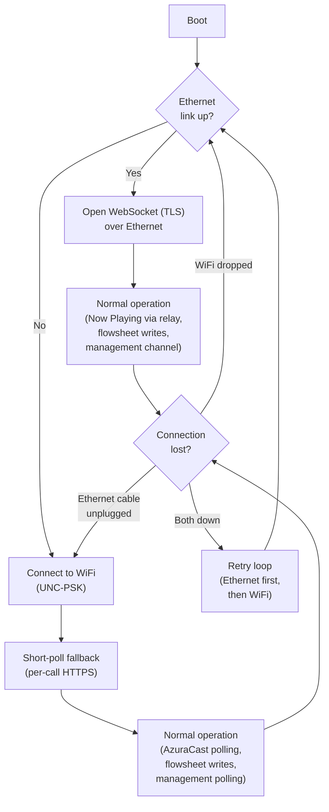

This means:

- **Ethernet + WebSocket** is the primary path. Persistent bidirectional connection. Commands arrive instantly. Heartbeats flow continuously.
- **WiFi + short polling** is the fallback. Uses the proven per-call `WiFiSSLClient` pattern that avoids the crash bug. Higher latency (up to 60 seconds) but reliable within the constraints of the WiFi stack.
- **WiFi password rotation** drops from "device is bricked" to "fallback path is degraded." The primary transport (Ethernet) doesn't use credentials that rotate.

---

## Phase 0: Automatic DST

**No remote infrastructure required.** This is a firmware-only fix that eliminates two manual interventions per year and corrects the 8-month timestamp drift documented in [remote-administration.md](remote-administration.md#timezone).

### What Changes

Add a `isDST(epochSeconds)` function implementing the US Eastern time rule:

- DST begins: second Sunday of March at 2:00 AM EST (clocks spring forward to 3:00 AM EDT)
- DST ends: first Sunday of November at 2:00 AM EDT (clocks fall back to 1:00 AM EST)

The function returns `true` during EDT, `false` during EST. `currentHourMs()` applies `UTC_OFFSET_SECONDS + (isDST ? 3600 : 0)`.

### Testability

`isDST()` is a pure function of epoch seconds -- no hardware dependency. It belongs in `utils.h`/`utils.cpp` alongside `currentHourMs()`, with desktop GoogleTest coverage for boundary cases (the exact transition seconds in March and November, hour before/after, New Year's, summer, winter).

### Scope

| File | Change |
|------|--------|
| `utils.h` / `utils.cpp` | Add `isDST()`, update `currentHourMs()` signature or offset logic |
| `config.h` | Optionally add `DST_ENABLED` flag (default `true`) for deployments outside US Eastern |
| `test/test_dst.cpp` | New test file with parameterized boundary tests |

---

## Phase 1: Persistent Storage

**Prerequisite for all remote configuration.** Today the device stores nothing to non-volatile memory. A power cycle loses the active `radioShowID` (orphaning the show on tubafrenzy), and all configuration is baked into the firmware binary.

This phase can be developed in parallel with Phase 2 (Ethernet integration). They are independent workstreams that both must land before Phase 3.

### What the Giga R1 Offers

The STM32H747 has **2 MB of internal flash** and the Giga R1 board adds **16 MB of QSPI flash**. The Arduino Mbed OS platform supports:

- **`FlashIAPBlockDevice`** -- block-level access to internal flash (wear-aware, but no filesystem)
- **`QSPIFBlockDevice`** -- block-level access to the external QSPI flash
- **`KVStore` (TDBStore)** -- a key-value store built on top of either block device, with wear leveling and power-loss safety

`KVStore` is the right abstraction. It provides `get(key, buffer, size)` / `set(key, value, size)` with atomic writes and CRC integrity checks. It is included in Mbed OS and requires no external library.

### What to Persist

| Key | Type | Purpose |
|-----|------|---------|
| `radioShowID` | `int32_t` | Recover in-progress show after power cycle |
| `wifi_ssid` | `char[64]` | Remotely updatable WiFi SSID (fallback transport) |
| `wifi_pass` | `char[128]` | Remotely updatable WiFi password (fallback transport) |
| `api_key` | `char[128]` | Remotely updatable API key |
| `poll_interval_ms` | `uint32_t` | Remotely tunable polling interval |
| `utc_offset` | `int32_t` | Manual timezone override (if DST auto-detection is disabled) |

At boot, the firmware reads from KVStore. If a key is missing (first boot), it falls back to the compile-time `#define` from `config.h` / `secrets.h` and writes the default to KVStore. Subsequent boots use the stored value. Remote config updates write new values to KVStore; the firmware picks them up on the next boot or immediately if the parameter is hot-reloadable.

### Architecture

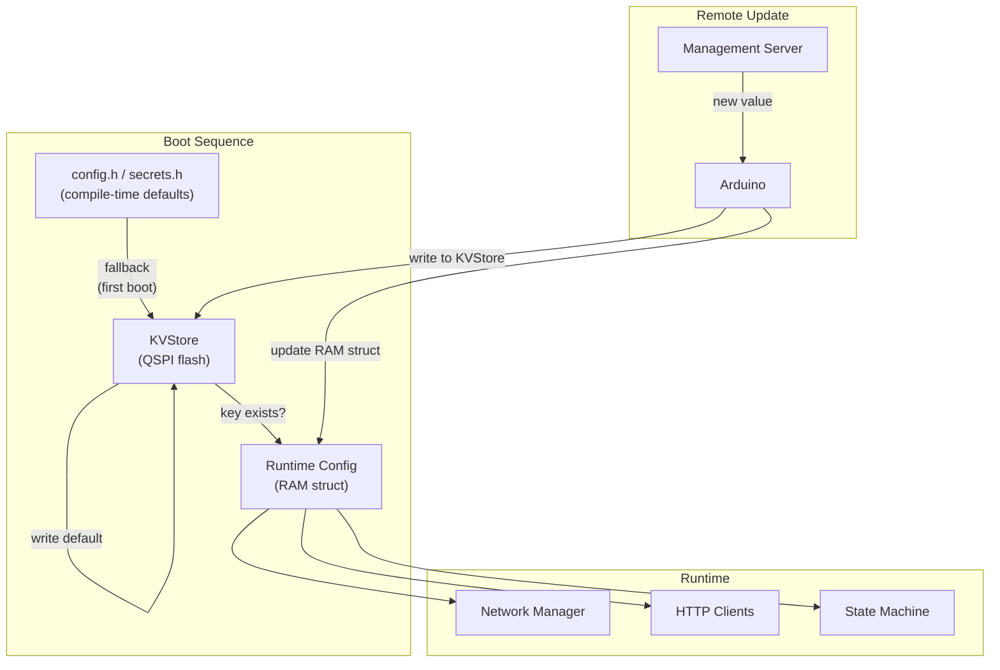

### Runtime Config Struct

Replace scattered `#define` usage with a single struct loaded at boot:

```cpp
struct RuntimeConfig {
    char wifiSsid[64];
    char wifiPass[128];
    char apiKey[128];
    uint32_t pollIntervalMs;
    int32_t utcOffsetSeconds;
    int32_t radioShowID;  // -1 = no active show
    // ... extend as needed
};
```

All modules (`WifiManager`, `FlowsheetClient`, etc.) receive a `const RuntimeConfig&` instead of individual `#define` values. This is a refactor of the constructor signatures but does not change behavior.

### Scope

| File | Change |
|------|--------|
| `config_store.h` / `config_store.cpp` | New module: KVStore wrapper with `load()`, `save(key)`, `reset()` |
| `config.h` | Compile-time values become defaults only |
| `auto-dj-arduino-switch.ino` | Load config at boot; pass `RuntimeConfig` to modules |
| `wifi_manager.h` / `flowsheet_client.h` / `azuracast_client.h` | Accept config struct instead of raw strings |

---

## Phase 2: Ethernet Shield Integration

**Adds the primary network transport.** This phase introduces the Ethernet Shield 2, software TLS, and a network abstraction layer that lets the rest of the firmware use either transport interchangeably.

This phase can be developed in parallel with Phase 1 (persistent storage). They are independent workstreams that both must land before Phase 3.

### Hardware Setup

The Arduino Ethernet Shield 2 uses the W5500 chip over SPI. It mounts directly on the Giga R1's Mega-compatible headers.

| Pin | Function | Notes |
|-----|----------|-------|
| D10 | Ethernet CS (chip select) | Default for Ethernet Shield 2; conflicts with nothing in the current sketch (relay is D2, LED is D3) |
| D11 | SPI MOSI | Shared SPI bus |
| D12 | SPI MISO | Shared SPI bus |
| D13 | SPI SCK | Shared SPI bus (also LED_BUILTIN on some boards, but not on Giga R1) |

The shield also has an SD card slot (CS on D4), which can be ignored or used for local logging in the future.

### Software TLS

The W5500 handles TCP but not TLS. Two options for adding TLS:

| Library | Approach | Tradeoffs |
|---------|----------|-----------|
| **SSLClient** (OPEnSLab-NGO) | BearSSL wrapper over any Arduino `Client` | Drop-in replacement for `WiFiSSLClient`; well-tested; needs trust anchors (root CA certs) compiled in |
| **Mbed TLS** (native) | `mbedtls_ssl_*` API directly | Already in Mbed OS; more flexible; lower-level API, more code to write |

`SSLClient` is the pragmatic choice. It wraps `EthernetClient` the same way `WiFiSSLClient` wraps the WiFi module's TLS, so the HTTP client code (`ArduinoHttpClient`) works identically with either transport.

```cpp
// WiFi transport (existing)
WiFiSSLClient ssl;
HttpClient http(ssl, host, 443);

// Ethernet transport (new, same API)
EthernetClient eth;
SSLClient ssl(eth, TAs, NUM_TAs, A0);  // TAs = trust anchors, A0 = entropy pin
HttpClient http(ssl, host, 443);
```

### Network Abstraction

Introduce a `NetworkManager` that owns both transports and exposes a unified interface. The rest of the firmware doesn't need to know which transport is active.

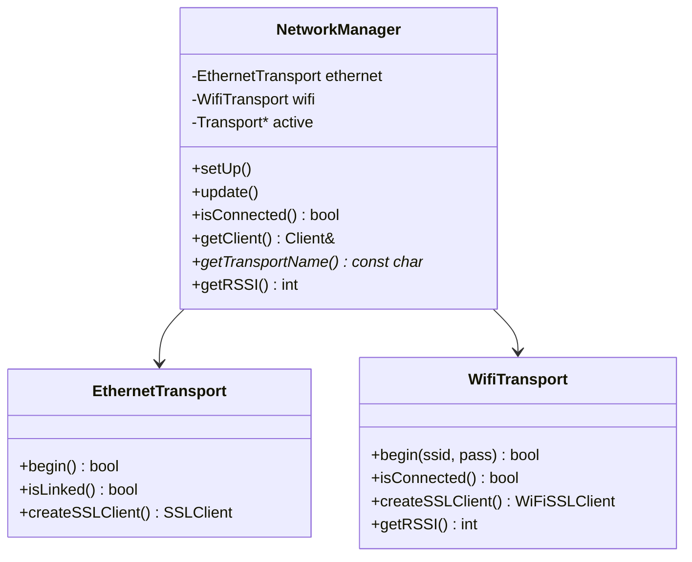

**Failover logic in `NetworkManager::update()`:**

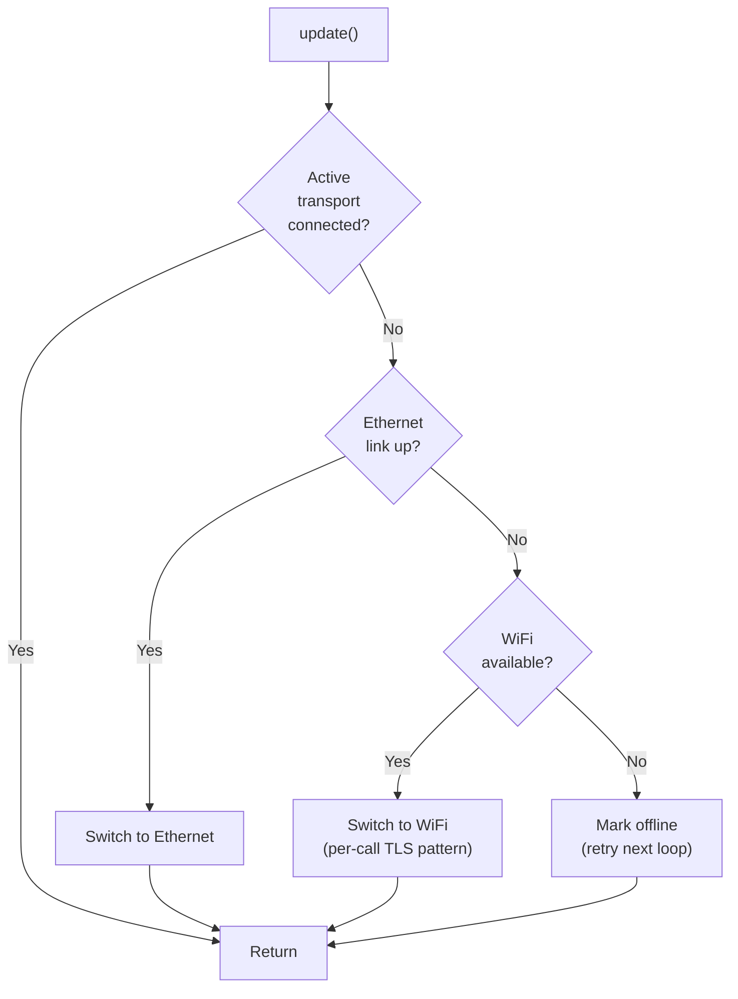

### Migrating HTTP Clients

`AzuraCastClient` and `FlowsheetClient` currently create `WiFiSSLClient` as a local variable in every method. With the network abstraction, they instead ask the `NetworkManager` for a `Client&`:

```cpp
// Before (WiFi-only)
bool AzuraCastClient::poll() {
    WiFiSSLClient ssl;
    HttpClient http(ssl, host, port);
    // ...
}

// After (transport-agnostic)
bool AzuraCastClient::poll(NetworkManager& net) {
    Client& client = net.createClient();  // returns SSLClient or WiFiSSLClient
    HttpClient http(client, host, port);
    // ...
}
```

The per-call client creation pattern is preserved. Over Ethernet this is unnecessary (the W5500 is stable), but it maintains a uniform interface and avoids creating a separate code path per transport.

### NTP Over Ethernet

`WiFi.getTime()` provides NTP time automatically. When Ethernet is the active transport, NTP must be handled explicitly. Options:

- **`NTPClient` library** (by Fabrice Weinberg): works with `EthernetUDP`. Simple API: `ntpClient.getEpochTime()`.
- **Manual UDP**: Send an NTP request to `pool.ntp.org`, parse the 48-byte response. More control, fewer dependencies.

`NTPClient` is sufficient. The `NetworkManager` can expose a `getTime()` method that delegates to `WiFi.getTime()` or `NTPClient::getEpochTime()` depending on the active transport.

### Studio Prerequisites

Before this phase can be implemented:

1. **Verify that the WXYC studio has a live Ethernet jack.** University buildings typically have wall jacks, but they may be deactivated. Contact UNC ITS to activate one if needed.
2. **Register the Ethernet shield's MAC address** with UNC ITS (same process as WiFi: [unc.edu/mydevices](https://unc.edu/mydevices)). The W5500's MAC is printed on the shield or can be set in software.
3. **Confirm outbound access on port 443** from the wired VLAN. Campus wired networks sometimes have different firewall rules than WiFi.

### Scope

| File | Change |
|------|--------|
| `network_manager.h` / `network_manager.cpp` | New module: dual-transport manager with failover |
| `ethernet_transport.h` / `ethernet_transport.cpp` | New module: W5500 + SSLClient setup |
| `wifi_manager.h` / `wifi_manager.cpp` | Refactor into `wifi_transport.h/.cpp`; same logic, new interface |
| `azuracast_client.h/.cpp` | Accept `NetworkManager&` instead of creating `WiFiSSLClient` directly |
| `flowsheet_client.h/.cpp` | Same refactor as AzuraCast client |
| `auto-dj-arduino-switch.ino` | Replace `WifiManager` with `NetworkManager`; update NTP logic |
| `config.h` | Add `ETHERNET_CS_PIN`, `ETHERNET_MAC` defaults |

---

## Phase 3: WebSocket Management Channel + AzuraCast Relay

With Ethernet providing a stable transport, the management channel can use a persistent WebSocket instead of short polling. This gives near-instant command delivery, continuous heartbeat streaming, and real-time Now Playing updates relayed from AzuraCast.

The management server subscribes to AzuraCast's Centrifugo feed (`wss://remote.wxyc.org/api/live/nowplaying/websocket`, channel `station:main`) using a Centrifugo client library (e.g., `centrifuge-js` for Node.js) and pushes `now_playing` messages to the Arduino over the same WebSocket. This eliminates the 20-second polling latency in the `AUTO_DJ_ACTIVE` state when on Ethernet, while preserving direct AzuraCast polling as a WiFi fallback.

### Why WebSocket Works Over Ethernet (But Not WiFi)

| Factor | Ethernet | WiFi |
|--------|----------|------|
| **Persistent connections** | Stable. The W5500's hardware TCP stack maintains connections reliably. | Unstable. Global `WiFiSSLClient` crashes the Giga R1; connections must be created and destroyed per call. |
| **Reconnection** | Near-instant (cable replug). | Blocks for up to 36 seconds (`WiFi.begin()` firmware bug). |
| **NAT keepalive** | Campus wired VLANs often have longer idle timeouts. | UNC-PSK may aggressively time out idle TCP connections. |

When the Arduino is on Ethernet, it opens a WebSocket to the management server. When it falls back to WiFi, it degrades to short polling (the Phase 2 architecture from the previous revision of this document).

### Protocol

The WebSocket connection carries JSON messages in both directions:

**Arduino to server (heartbeat):**

```json
{
    "type": "heartbeat",
    "state": "AUTO_DJ_ACTIVE",
    "transport": "ethernet",
    "uptime_s": 86402,
    "wifi_rssi": null,
    "free_ram": 524288,
    "radio_show_id": 12345,
    "last_track": {
        "artist": "Yo La Tengo",
        "title": "Autumn Sweater",
        "posted_at": 1708400000
    },
    "last_error": null,
    "firmware_version": "1.2.0",
    "config_hash": "a3f2c8",
    "loop_max_ms": 45,
    "reconnect_count": 2,
    "tracks_detected": 147,
    "tracks_posted": 145,
    "errors_since_boot": 8
}
```

| Field | Description |
|-------|-------------|
| `loop_max_ms` | Peak `loop()` duration since last heartbeat (detects blocking operations) |
| `reconnect_count` | Total network reconnections since boot (transport switches, WiFi drops) |
| `tracks_detected` | Cumulative AzuraCast track changes detected since boot |
| `tracks_posted` | Cumulative flowsheet entries posted since boot (difference = post failures) |
| `errors_since_boot` | Total error events since boot (summary; details in `error` messages) |

**Server to Arduino (command):**

```json
{
    "type": "command",
    "id": "abc123",
    "action": "set_config",
    "key": "poll_interval_ms",
    "value": "30000"
}
```

**Arduino to server (acknowledgment):**

```json
{
    "type": "ack",
    "id": "abc123",
    "status": "ok"
}
```

**Server to Arduino (now playing relay):**

Relayed from AzuraCast's Centrifugo feed whenever a track change occurs. The message is intentionally flat (no nested objects) so the Arduino can parse it with an ArduinoJson filter document under 256 bytes.

```json
{
    "type": "now_playing",
    "sh_id": 48291,
    "artist": "Yo La Tengo",
    "title": "Autumn Sweater",
    "album": "I Can Hear the Heart Beating as One",
    "is_live": false
}
```

**Arduino to server (error report):**

Structured error events that the management server can relay to Sentry (or another error tracking service). The Arduino cannot call the Sentry API directly -- it lacks the SDK and the overhead would be substantial -- so it sends lightweight error messages over the existing WebSocket, and the server enriches and forwards them.

```json
{
    "type": "error",
    "level": "error",
    "module": "azuracast_client",
    "code": "HTTP_ERROR",
    "message": "HTTP 503 polling AzuraCast",
    "state": "AUTO_DJ_ACTIVE",
    "uptime_s": 86402,
    "free_ram": 491520,
    "count": 3
}
```

| Field | Type | Description |
|-------|------|-------------|
| `level` | `string` | Sentry severity level: `"error"`, `"warning"`, or `"info"` |
| `module` | `string` | Source module (e.g., `"azuracast_client"`, `"flowsheet_client"`, `"wifi_manager"`) |
| `code` | `string` | Machine-readable error code (e.g., `HTTP_ERROR`, `JSON_PARSE`, `WIFI_DISCONNECT`, `NTP_FAIL`) |
| `message` | `string` | Human-readable description |
| `state` | `string` | State machine state at time of error |
| `uptime_s` | `int` | Device uptime for correlation |
| `free_ram` | `int` | Heap at time of error (memory pressure indicator) |
| `count` | `int` | Number of consecutive occurrences (batched to avoid flooding; resets on success) |

The server groups these into Sentry events tagged with `device:auto-dj-arduino`, `module`, and `transport`. Consecutive identical errors are batched on the Arduino side (increment `count`, send periodically) to avoid flooding the WebSocket.

### Supported Commands

| Action | Parameters | Effect | Hot-reload? |
|--------|-----------|--------|-------------|
| `set_config` | `key`, `value` | Write a config parameter to KVStore | Depends on key (see below) |
| `pause` | -- | Suspend flowsheet posting; state machine stays in IDLE | Yes |
| `resume` | -- | Resume normal operation | Yes |
| `end_show` | -- | Force-end the current show | Yes |
| `restart` | -- | Software reset via `NVIC_SystemReset()` | N/A |
| `ping` | -- | Arduino sends an immediate heartbeat in response | Yes |

**Hot-reload behavior by config key:**

| Config key | Hot-reloadable? | Notes |
|-----------|----------------|-------|
| `poll_interval_ms` | Yes | Takes effect on next poll cycle |
| `wifi_ssid` / `wifi_pass` | No | Requires restart; only affects the WiFi fallback transport |
| `api_key` | Yes | Takes effect on next HTTP request |
| `utc_offset` | Yes | Takes effect on next `currentHourMs()` call |

### Connection Lifecycle

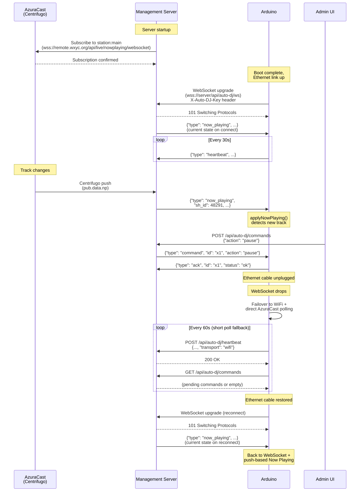

### Keepalive

NAT gateways and campus firewalls kill idle TCP connections, typically after 60-300 seconds. The WebSocket must stay active:

- **Heartbeat interval (30s)** acts as an application-level keepalive. The server expects a heartbeat at least this often; absence triggers a "device offline" alert.
- **WebSocket ping/pong frames** as a transport-level keepalive. Most WebSocket libraries handle these automatically. If the server doesn't receive a pong within 10 seconds, it considers the connection dead.

### Server-Side Endpoints

| Method | Path | Purpose | Transport |
|--------|------|---------|-----------|
| `GET` (upgrade) | `/api/auto-dj/ws` | WebSocket management channel | Ethernet primary |
| `POST` | `/api/auto-dj/heartbeat` | Heartbeat (fallback) | WiFi fallback |
| `GET` | `/api/auto-dj/commands` | Command poll (fallback) | WiFi fallback |
| `POST` | `/api/auto-dj/commands` | Admin enqueues a command | Admin UI |
| `GET` | `/api/auto-dj/status` | Latest heartbeat + connection state | Admin UI |

All endpoints are authenticated via the `X-Auto-DJ-Key` header (Arduino-facing) or session auth (admin-facing).

### Arduino-Side Implementation

Add a `ManagementClient` module with two modes:

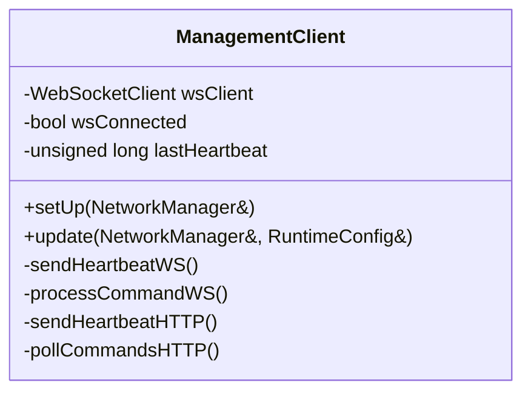

`update()` checks the active transport:
- **Ethernet**: maintain the WebSocket connection. Call `wsClient.poll()` (non-blocking) to receive commands and `now_playing` messages. Send heartbeats on a 30-second timer.
- **WiFi**: use per-call HTTPS. POST heartbeat and GET commands on a 60-second timer, following the same per-call `WiFiSSLClient` pattern used by the other clients.

When `update()` receives a `now_playing` message, it calls `azuracast.applyNowPlaying()` (see below).

### AzuraCast Dual-Mode: Push (Ethernet) vs. Poll (WiFi)

The `AzuraCastClient` gains an `applyNowPlaying()` method that accepts push data from the management WebSocket. This uses the same `sh_id` comparison logic as the existing `poll()` method.

```cpp
// New method on AzuraCastClient
bool applyNowPlaying(int shId, const String& artist, const String& title,
                     const String& album, bool isLive);
```

Returns `true` if the track changed (new `sh_id`), exactly like `poll()`. The state machine in `AUTO_DJ_ACTIVE` does not need to know whether the data came from a push or a poll -- it just checks the return value and posts a flowsheet entry if `true`.

**Dual-mode state machine in `AUTO_DJ_ACTIVE`:**

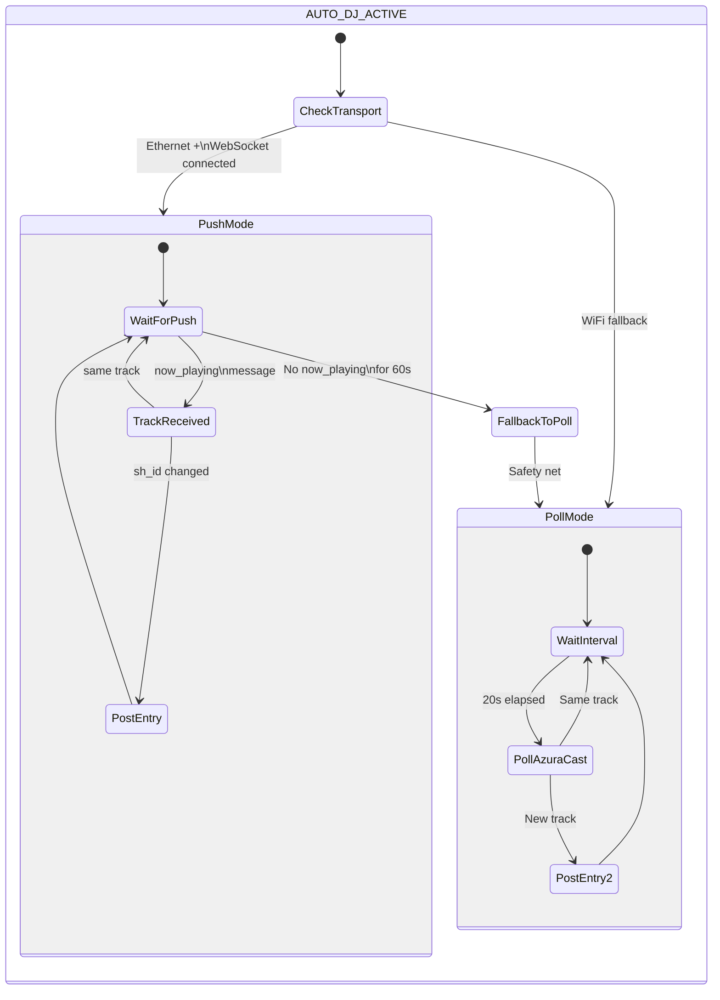

- **Ethernet (push mode)**: `ManagementClient::update()` receives `now_playing` messages from the server and calls `azuracast.applyNowPlaying()`. No direct AzuraCast HTTP polling occurs. If no `now_playing` message arrives within 60 seconds while on Ethernet, the Arduino falls back to direct polling as a safety net (the management server or Centrifugo subscription may have failed silently).
- **WiFi (poll mode)**: The existing `azuracast.poll()` behavior is unchanged. Direct HTTPS to `remote.wxyc.org` every 20 seconds, with per-call `WiFiSSLClient`.

The `loop()` integration:

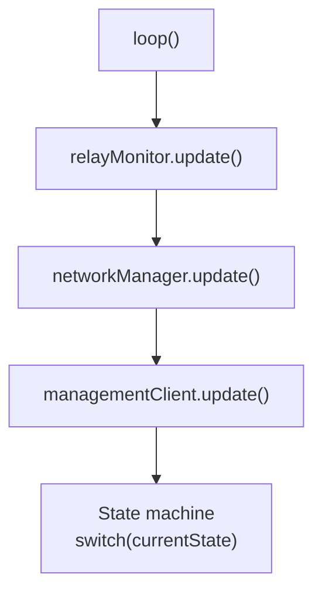

### Server Choice

Either tubafrenzy (Java/Tomcat) or Backend-Service (Express/Node.js) could host these endpoints. With WebSocket and Centrifugo relay now in play, the comparison shifts:

| | tubafrenzy | Backend-Service | Standalone service |
|--|-----------|----------------|-------------------|
| **WebSocket support** | Possible via Tomcat 9's JSR 356, but the codebase has no existing WebSocket usage | Native with `ws` or Socket.IO; Express is already async | Native in Hono/Fastify |
| **Centrifugo client** | No official Java 8 client library; would need raw WebSocket + manual protocol handling | `centrifuge-js` (official JS client) works natively in Node.js | Same `centrifuge-js` support |
| **Pro** | Already the Arduino's primary target; same auth mechanism | Actively maintained; modern stack; WebSocket + Centrifugo are natural fits | Decoupled; independently deployable |
| **Con** | Legacy Java 8; adding WebSocket to a JSP app is awkward; no Centrifugo client | Arduino would need a second server dependency | Yet another service to deploy and monitor |
| **Auth** | `X-Auto-DJ-Key` header already checked by `validateControlRoomAccess()` | Would need to add API key auth or reuse the same mechanism | Same |

The Centrifugo relay requirement **strengthens the case against tubafrenzy**. There is no official Centrifugo client for Java 8, so subscribing to AzuraCast's real-time feed would require raw WebSocket handling and manual Centrifugo protocol implementation. Both Backend-Service (Node.js) and a standalone service can use `centrifuge-js` directly.

With the addition of WebSocket and AzuraCast relay, **Backend-Service** or a **standalone lightweight service** (e.g., a small Hono or Fastify app on Railway) are the practical choices. The Arduino already makes HTTPS calls to two different hosts (AzuraCast and tubafrenzy); a third is not a significant increase in complexity.

### Scope

| Component | Change |
|-----------|--------|
| **Arduino** | New `management_client.h/.cpp` module with WebSocket + HTTP fallback modes |
| **Arduino** | `AzuraCastClient`: add `applyNowPlaying()` method for push-based updates; dual-mode logic in `AUTO_DJ_ACTIVE` |
| **Server** | WebSocket endpoint (`/api/auto-dj/ws`) |
| **Server** | Centrifugo subscription to AzuraCast (`station:main`) via `centrifuge-js`; relay `now_playing` messages to Arduino |
| **Server** | Push current Now Playing state on WebSocket connect/reconnect |
| **Server** | HTTP fallback endpoints (`/api/auto-dj/heartbeat`, `/api/auto-dj/commands`) |
| **Server** | Persistent command queue (database table or in-memory with TTL) |
| **Server** | Admin API for viewing status and issuing commands |
| **Arduino libraries** | Add `ArduinoWebsockets` (Gil Maimon) or equivalent |

---

## Phase 4: Remote Credential Rotation

With Phases 1-3 in place, credential rotation becomes a matter of sending the right `set_config` command. Ethernet as the primary transport significantly reduces the urgency of this phase -- the WiFi password is only used by the fallback transport.

### What's Changed With Ethernet

| Credential | Before (WiFi-only) | After (Ethernet primary) |
|-----------|--------------------|-----------------------|
| `wifi_pass` | **Critical.** Annual UNC-PSK rotation bricks the device. | **Low urgency.** Only affects the fallback transport. Device stays online via Ethernet even if WiFi password is stale. |
| `api_key` | Critical. Key rotation bricks the device. | **Still critical.** Used for both flowsheet writes and management authentication regardless of transport. |

### The Chicken-and-Egg Problem (Mitigated)

With WiFi as the only transport, updating `wifi_pass` required sending the command before UNC changed the PSK -- miss the window and physical access is required. With Ethernet as the primary transport, this problem is largely eliminated:

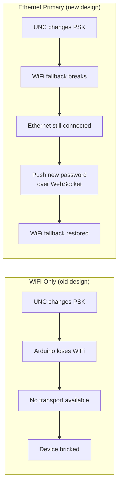

The only scenario that still requires physical access is if **both** the Ethernet jack goes dead **and** the WiFi password is stale. This is a much narrower failure mode.

### Credential Fallback

Even with the reduced urgency, the firmware should keep **both** the KVStore credential and the compile-time default credential for WiFi. On WiFi connection failure after N attempts with the stored credential, it falls back to the compile-time default:

```cpp
// Pseudocode
if (!connectWith(kvstore.wifi_pass, MAX_ATTEMPTS)) {
    Serial.println("[WiFi] Stored credential failed, trying compiled default");
    if (!connectWith(WIFI_PASS_DEFAULT, MAX_ATTEMPTS)) {
        Serial.println("[WiFi] Both credentials failed");
    }
}
```

### API Key Rotation

API key rotation remains important and follows the same protocol regardless of transport:

1. Generate a new API key.
2. Update `AUTO_DJ_API_KEY` on the server (accept both old and new key temporarily).
3. Push the new key to the Arduino via `set_config` (over WebSocket or HTTP).
4. After the Arduino acknowledges, remove the old key from the server.

### Security Considerations

- **Transport security:** All communication is over TLS (BearSSL via `SSLClient` on Ethernet, `WiFiSSLClient` on WiFi). Credentials are encrypted in transit.
- **Storage security:** KVStore writes to flash in plaintext. An attacker with physical access to the board could read the flash. This is acceptable -- physical access to the studio already implies access to the mixing board, network, and everything else.
- **Command authentication:** Commands are authenticated by the same `X-Auto-DJ-Key` header used for flowsheet operations. A compromised API key would allow both flowsheet manipulation and device control. Key rotation (described above) mitigates this.
- **Command validation:** The Arduino must validate all command payloads. Reject unknown actions, enforce maximum string lengths, and never execute arbitrary code from the server.

---

## Phase 5: Pull-Based OTA Firmware Updates

For changes that can't be expressed as config updates -- new features, bug fixes, protocol changes -- the device needs to update its own firmware. Ethernet makes this significantly more reliable: downloading a multi-hundred-KB binary over a stable wired connection is far safer than over WiFi.

### How It Works

1. A new firmware binary (`.bin`) is hosted on a server (e.g., GitHub Releases, an S3 bucket, or a static file on tubafrenzy).
2. A version manifest file at a known URL contains the latest version number and binary URL.
3. The Arduino checks the manifest on command (`check_update`) or on a periodic schedule (e.g., daily).
4. If the manifest version is newer than the running firmware version, the Arduino downloads the binary to the 16 MB QSPI flash (staging area), verifies its integrity, and writes it to the boot flash.
5. The Arduino reboots into the new firmware.

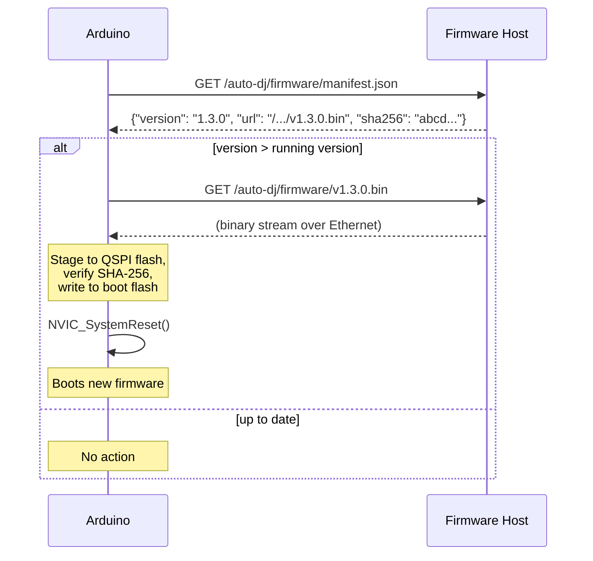

### Safety

OTA is the riskiest operation. A bad firmware update bricks the device until someone can physically reflash it. Safeguards:

| Safeguard | Purpose |
|-----------|---------|
| **SHA-256 verification** | Reject corrupted or tampered binaries. Mbed OS includes `mbedtls` for this. |
| **Version check** | Never downgrade unless explicitly commanded |
| **QSPI staging** | Download to the 16 MB QSPI flash first, verify, then copy to boot flash. Avoids partial writes to the boot partition. |
| **Dual-bank boot** | The STM32H747 has two flash banks; write to the inactive bank and swap on success (if supported by the Mbed OS bootloader) |
| **Watchdog timer** | If the new firmware crashes in a boot loop, the watchdog resets to the previous bank after N failures |
| **Manual trigger** | OTA is initiated by a `check_update` command, not automatically |
| **Rollback command** | A `rollback_firmware` command reverts to the previous version |
| **Ethernet preferred** | OTA downloads only proceed over Ethernet. Downloading a large binary over the unstable WiFi stack is too risky. If only WiFi is available, the `check_update` command returns an error suggesting the operator restore Ethernet first. |

### Prerequisites

- Phase 1 (persistent storage) for storing the current firmware version and boot state
- Phase 3 (management channel) for triggering update checks via command
- A CI pipeline that builds the firmware binary and publishes it (GitHub Actions already runs; extend it to produce and upload `.bin` artifacts on tagged releases)

### Scope

This phase is the most complex and is explicitly deferred. It requires:

- Understanding the Giga R1's bootloader and dual-bank flash layout
- Implementing a streaming HTTP download with QSPI flash write
- SHA-256 verification (Mbed OS includes `mbedtls`)
- A watchdog timer (addresses the existing README limitation)
- CI changes to build and publish `.bin` artifacts

---

## Phase Summary

Phases 1 and 2 are independent and can be developed in parallel. Phase 3 depends on both. Phases 4 and 5 build sequentially on Phase 3.

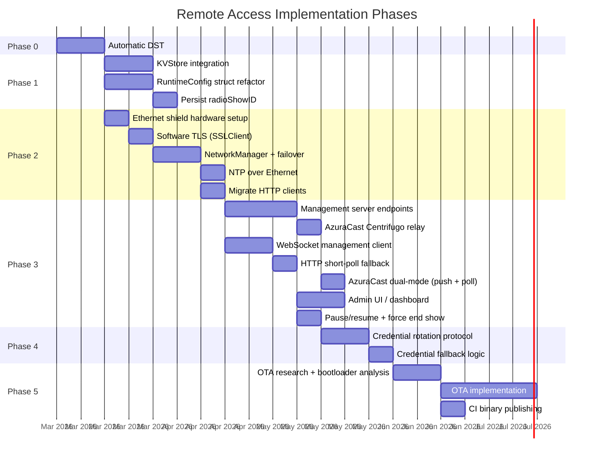

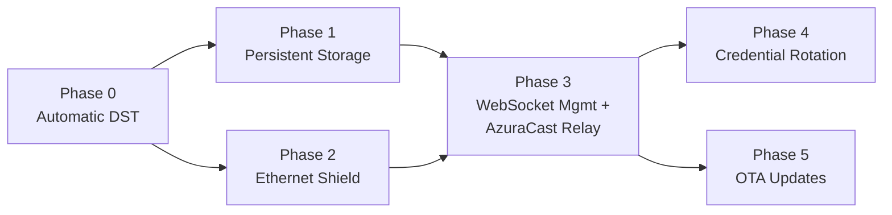

| Phase | Outcome | Depends on |
|-------|---------|-----------|
| **0: Automatic DST** | Correct timestamps year-round, no manual intervention | Nothing |
| **1: Persistent Storage** | Survive power cycles; runtime config struct replaces `#define` soup | Phase 0 (should land first, but no hard dependency) |
| **2: Ethernet Shield** | Stable primary transport; WiFi becomes fallback; network abstraction layer | Phase 0 (should land first, but no hard dependency) |
| **3: WebSocket Management + AzuraCast Relay** | Real-time remote visibility and control; instant command delivery over Ethernet; push-based Now Playing updates via AzuraCast Centrifugo relay; graceful degradation to HTTP polling over WiFi | Phases 1 + 2 |
| **4: Credential Rotation** | Remotely update WiFi password and API key without reflashing | Phase 3 |
| **5: OTA Updates** | Remotely deploy new firmware over Ethernet | Phases 1 + 3 |

## Open Questions

1. **Studio Ethernet jack:** Is there a live Ethernet jack in the WXYC studio? If not, request activation from UNC ITS. This is a hard prerequisite for Phase 2.

2. **Ethernet VLAN firewall rules:** Does the wired campus VLAN allow persistent outbound TCP on port 443? Does it have longer NAT idle timeouts than UNC-PSK WiFi? This affects WebSocket viability.

3. **Server choice:** With WebSocket in the picture, Backend-Service (Express/Node.js) is a more natural fit than tubafrenzy (Java 8/Tomcat). Alternatively, a standalone lightweight service (Hono or Fastify on Railway) could host just the management endpoints. This decision should be made before Phase 3 implementation begins.

4. **Admin UI scope:** A full dashboard, or just an API that station managers can query via `curl` / a simple status page? The initial implementation should be minimal -- a JSON API and a single-page status view.

5. **Heartbeat storage:** How long to retain heartbeat history? A rolling window (e.g., 7 days) is sufficient for debugging. Older data has no operational value.

6. **KVStore vs. LittleFS:** Mbed OS offers both. KVStore is simpler (flat key-value), LittleFS is a full filesystem. For this use case, KVStore is sufficient unless Phase 5 (OTA) needs a filesystem to stage binaries on the QSPI flash.

7. **Giga R1 OTA bootloader support:** Does the Arduino Mbed OS GIGA board package support dual-bank booting and safe firmware swaps? This needs hardware-level research before Phase 5 can be scoped concretely.

8. **SSLClient trust anchors:** BearSSL requires compiled-in root CA certificates. Which CAs sign the certificates for `remote.wxyc.org`, `www.wxyc.info`, and the management server? These need to be included in the firmware and updated if the servers change CAs.

9. **AzuraCast Centrifugo channel name:** Verify that `station:main` is the correct channel name for WXYC's AzuraCast instance. The AzuraCast docs say the channel format is `station:STATION_NAME` where the station name is the URL stub. Check the station's short name in the AzuraCast admin panel at `remote.wxyc.org`.

10. **Initial Now Playing state on connect:** The management server should push the current Now Playing state immediately when the Arduino connects via WebSocket (not wait for the next Centrifugo event). This avoids a window where the Arduino has no track data after a reconnect. The server needs to cache the last received Centrifugo message for this.

11. **Centrifugo reconnection behavior:** Test the automatic reconnection behavior of `centrifuge-js` against `remote.wxyc.org`. If AzuraCast restarts or the Centrifugo connection drops, does the client library reconnect and resubscribe transparently? What is the retry backoff?

12. **Sentry integration scope:** Should the management server relay Arduino error events to Sentry directly, or should it store them and let a separate process batch-forward them? Direct relay is simpler but couples the management server to Sentry. A Sentry DSN would need to be configured on the server side.
