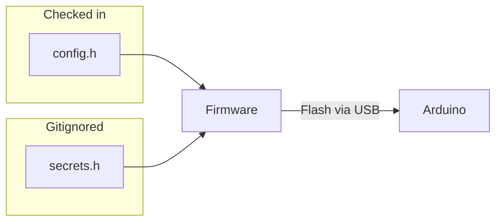

# Remote Administration

The Auto DJ Arduino Switch is deployed inside the WXYC studio, wired into the mixing board. Every configuration change today requires physical access and a firmware reflash. This document outlines what is configurable, what should be remotely administrable, and why.

## Current Configuration Model

All configuration lives in two compile-time header files:



Any change -- a rotated API key, the annual WiFi password change, a timezone adjustment -- requires someone to walk to the studio with a laptop, connect USB, and reflash. For a device designed to operate unattended, this is a significant operational burden.

## Parameters

### Credentials

These are the most operationally urgent candidates for remote updates. Both change on external schedules outside our control.

| Parameter | Current value | Why it changes |
|-----------|--------------|----------------|
| `WIFI_SSID` | `UNC-PSK` | Could change if the university restructures its network |
| `WIFI_PASS` | *(secret)* | UNC rotates the PSK password annually |
| `AUTO_DJ_API_KEY` | *(secret)* | Must match the server-side env var; any rotation bricks the device |

### Timezone

The device currently hardcodes Eastern Standard Time year-round. This is the single most visible bug in normal operation: during Eastern Daylight Time (mid-March through early November), every show start time and hourly breakpoint is off by one hour.

| Parameter | Current value | Issue |
|-----------|--------------|-------|
| `UTC_OFFSET_SECONDS` | `-18000` (UTC-5, EST) | No DST adjustment; wrong 8 months of the year |

An automatic DST rule (second Sunday in March, first Sunday in November) would eliminate two manual interventions per year and fix the timestamp drift without any remote action needed.

### Polling and Retry Behavior

These timing parameters control how aggressively the device polls AzuraCast and how it handles failures. Adjusting them remotely would be useful during server maintenance windows, degraded network conditions, or testing.

| Parameter | Current value | Purpose |
|-----------|--------------|---------|
| `POLL_INTERVAL_MS` | `20000` (20s) | How often to check AzuraCast for new tracks |
| `MAX_RETRIES` | `3` | Attempts before giving up on startShow/endShow |
| `RETRY_BACKOFF_MS` | `2000` | Base delay for exponential retry backoff |
| `HTTP_RESPONSE_TIMEOUT_MS` | `10000` (10s) | Per-request HTTP timeout |
| `WIFI_RETRY_INTERVAL_MS` | `5000` (5s) | Delay between WiFi reconnect attempts |

### Server Endpoints

If either AzuraCast or tubafrenzy moves to a different host, changes ports, or updates its API paths, the device needs to know. Pointing the device at a staging server for testing is also a common need.

| Parameter | Current value | Purpose |
|-----------|--------------|---------|
| `AZURACAST_HOST` | `remote.wxyc.org` | AzuraCast now-playing API |
| `AZURACAST_PORT` | `443` | |
| `AZURACAST_PATH` | `/api/nowplaying_static/main.json` | |
| `TUBAFRENZY_HOST` | `www.wxyc.info` | Flowsheet write API |
| `TUBAFRENZY_PORT` | `443` | |
| `TUBAFRENZY_PATH_START_SHOW` | `/playlists/startRadioShow` | |
| `TUBAFRENZY_PATH_ADD_ENTRY` | `/playlists/flowsheetEntryAdd` | |
| `TUBAFRENZY_PATH_END_SHOW` | `/playlists/finishRadioShow` | |

### Auto DJ Identity

These fields are written directly into the flowsheet database when a show starts. They rarely change, but there is no mechanism to update them without reflashing.

| Parameter | Current value | Purpose |
|-----------|--------------|---------|
| `AUTO_DJ_ID` | `0` | DJ ID written to the show record |
| `AUTO_DJ_NAME` | `Auto DJ` | Full name field |
| `AUTO_DJ_HANDLE` | `AutoDJ` | Handle/username field |
| `AUTO_DJ_SHOW_NAME` | `Auto DJ` | Show name in the flowsheet |

### Flowsheet API Parameters

These values are hardcoded in `flowsheet_client.cpp` rather than in `config.h`. They are tightly coupled to the tubafrenzy server API, but would need to be updated if that API changes.

| Parameter | Current value | Location | Purpose |
|-----------|--------------|----------|---------|
| `releaseType` | `otherRelease` | `flowsheet_client.cpp:126` | Release type sent with every flowsheet entry |
| `autoBreakpoint` | `true` | `flowsheet_client.cpp:127` | Tells tubafrenzy to insert hourly breakpoints automatically |
| `mode` | `signoffConfirm` | `flowsheet_client.cpp:144` | Skips the JSP confirmation UI when ending a show |

### Hardware Timing

These values are hardcoded in the sketch and module implementations. They are minor but could be relevant for debugging hardware-specific issues.

| Parameter | Current value | Location | Purpose |
|-----------|--------------|----------|---------|
| Serial wait timeout | `3000` ms | `auto-dj-arduino-switch.ino:69` | How long to wait for serial port at boot |
| Heartbeat blink period | `1000` ms | `auto-dj-arduino-switch.ino:95` | Built-in LED blink rate (1 Hz) |
| Initial WiFi connect timeout | `30000` ms | `wifi_manager.cpp` | Max wait during first connection in `setup()` |
| WiFi chip settling delay | `100` ms | `wifi_manager.cpp` | Delay between `WiFi.disconnect()` and `WiFi.begin()` |
| Reconnect poll granularity | `250` ms | `wifi_manager.cpp` | Poll interval inside the reconnect wait loop |
| Reconnect attempt timeout | `5000` ms | `wifi_manager.cpp` | Per-attempt timeout during reconnection (separate from `WIFI_RETRY_INTERVAL_MS`) |

### Pin Assignments

These are physical wiring decisions that can only change if the hardware is rewired. Remote administration is not applicable, but they are listed here for completeness.

| Parameter | Current value | Purpose |
|-----------|--------------|---------|
| `RELAY_PIN` | `2` | Mixing board AUX relay contact (INPUT_PULLUP) |
| `STATUS_LED_PIN` | `3` | External status LED |
| `DEBOUNCE_MS` | `50` | Relay debounce window |

### Operational Controls

These don't exist today but would be valuable for remote administration.

| Control | Use case |
|---------|----------|
| **Pause/resume** | Temporarily stop posting entries during station events, maintenance, or testing -- without physically unplugging the device |
| **Status query** | Check current state machine state, WiFi RSSI, uptime, last track posted, last error -- without serial access |
| **Force end show** | Remotely end a stuck show if the state machine gets wedged |

## Priority

```mermaid
quadrantChart
    title Effort vs. operational impact
    x-axis Low effort --> High effort
    y-axis Low impact --> High impact
    quadrant-1 Do next
    quadrant-2 Do first
    quadrant-3 Reconsider
    quadrant-4 Plan carefully
    Automatic DST: [0.25, 0.85]
    Pause/resume: [0.35, 0.60]
    Status endpoint: [0.40, 0.70]
    Credential updates: [0.65, 0.90]
    Poll interval tuning: [0.30, 0.40]
    Server endpoints: [0.55, 0.45]
    Force end show: [0.45, 0.50]
    Retry parameters: [0.25, 0.30]
    DJ identity fields: [0.20, 0.20]
    Flowsheet API params: [0.15, 0.15]
    Hardware timing: [0.10, 0.10]
